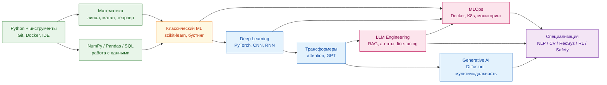
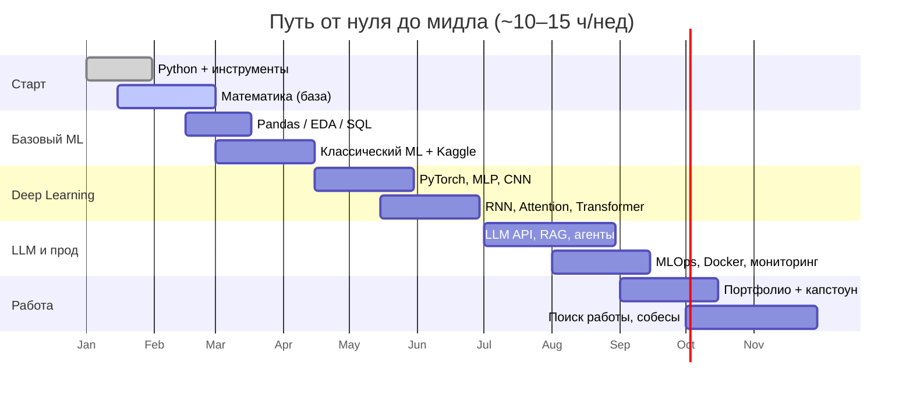
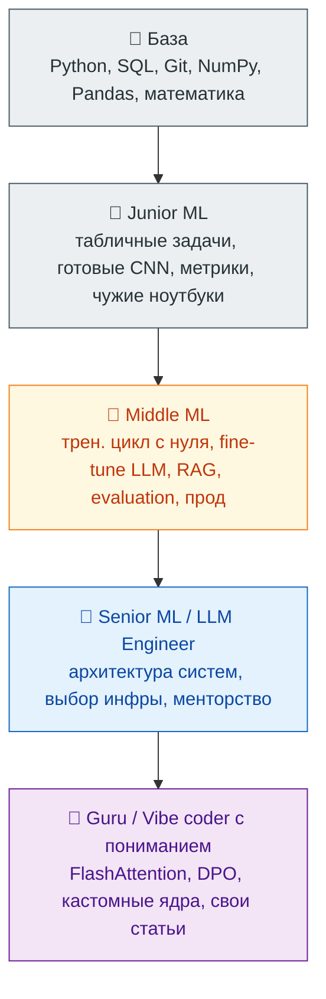
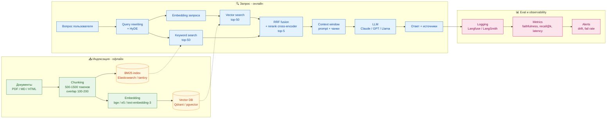
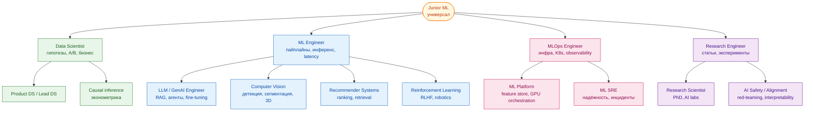
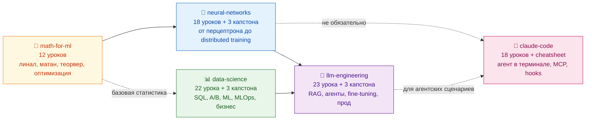

---

## 🧪 Задачи для Самостоятельной Практики

Практические задания по всем ключевым темам Data Science. Каждая задача — реальный бизнес-сценарий с чётким условием, синтетическим датасетом и критериями оценки.

📁 [Задания → practice-tasks/](practice-tasks/) | 📁 [Разборы → practice-solutions/](practice-solutions/)

| # | Тема | Сложность | Задание | Разбор |
|---|------|-----------|---------|--------|
| 01 | 🔍 EDA | ⭐⭐ | [task-01-eda.md](practice-tasks/task-01-eda.md) | [solution-01-eda.md](practice-solutions/solution-01-eda.md) |
| 02 | 🛠️ Feature Engineering | ⭐⭐⭐ | [task-02-features.md](practice-tasks/task-02-features.md) | [solution-02-features.md](practice-solutions/solution-02-features.md) |
| 03 | ⚙️ Preprocessing | ⭐⭐ | [task-03-preprocessing.md](practice-tasks/task-03-preprocessing.md) | [solution-03-preprocessing.md](practice-solutions/solution-03-preprocessing.md) |
| 04 | 📈 Visualization | ⭐⭐ | [task-04-visualization.md](practice-tasks/task-04-visualization.md) | [solution-04-visualization.md](practice-solutions/solution-04-visualization.md) |
| 05 | 🤖 Model Training | ⭐⭐⭐ | [task-05-modeling.md](practice-tasks/task-05-modeling.md) | [solution-05-modeling.md](practice-solutions/solution-05-modeling.md) |
| 06 | 📏 Evaluation | ⭐⭐⭐ | [task-06-evaluation.md](practice-tasks/task-06-evaluation.md) | [solution-06-evaluation.md](practice-solutions/solution-06-evaluation.md) |
| 07 | 🔗 Pipelines | ⭐⭐⭐ | [task-07-pipelines.md](practice-tasks/task-07-pipelines.md) | [solution-07-pipelines.md](practice-solutions/solution-07-pipelines.md) |
| 08 | ⏱️ Time Series | ⭐⭐⭐⭐ | [task-08-timeseries.md](practice-tasks/task-08-timeseries.md) | [solution-08-timeseries.md](practice-solutions/solution-08-timeseries.md) |
| 09 | 📝 NLP | ⭐⭐⭐ | [task-09-nlp.md](practice-tasks/task-09-nlp.md) | [solution-09-nlp.md](practice-solutions/solution-09-nlp.md) |
| 10 | 🏆 Финальный проект | ⭐⭐⭐⭐⭐ | [task-10-final.md](practice-tasks/task-10-final.md) | [solution-10-final.md](practice-solutions/solution-10-final.md) |


---

## 📊 Лучшие Практики и Сниппеты Data Science

Готовые к использованию сниппеты кода и лучшие практики для всех этапов DS проекта.

📁 [Перейти в папку ds-best-practices/](ds-best-practices/)

| # | Тема | Описание | Ссылка |
|---|------|----------|--------|
| 01 | 🔍 EDA | Полный разведочный анализ данных, профилирование, визуализация распределений | [eda-snippets.md](ds-best-practices/eda-snippets.md) |
| 02 | 🛠️ Feature Engineering | Target encoding, временные признаки, взаимодействия, отбор признаков | [feature-engineering.md](ds-best-practices/feature-engineering.md) |
| 03 | ⚙️ Preprocessing | Импутация пропусков, масштабирование, кодирование, выбросы, дисбаланс | [preprocessing.md](ds-best-practices/preprocessing.md) |
| 04 | 📈 Visualization | Matplotlib, Seaborn, Plotly — ROC, confusion matrix, кластеры, SHAP | [visualization.md](ds-best-practices/visualization.md) |
| 05 | 🤖 Model Training | Train/Val/Test split, кросс-валидация, Optuna, OOF, MLflow | [model-training.md](ds-best-practices/model-training.md) |
| 06 | 📏 Evaluation | Classification/Regression метрики, Bootstrap CI, анализ ошибок | [evaluation.md](ds-best-practices/evaluation.md) |
| 07 | 🔗 Pipelines | sklearn Pipeline, кастомные трансформеры, сохранение моделей | [pipelines.md](ds-best-practices/pipelines.md) |
| 08 | ⏱️ Time Series | Признаки для TS, Walk-Forward CV, Prophet, обнаружение аномалий | [time-series.md](ds-best-practices/time-series.md) |
| 09 | 📝 NLP | TF-IDF, Word2Vec, BERT эмбеддинги, классификация текста, LDA | [nlp-snippets.md](ds-best-practices/nlp-snippets.md) |
| 10 | 🚀 Deployment | FastAPI сервис, Docker, дрейф данных, батчевые предсказания, A/B тест | [deployment.md](ds-best-practices/deployment.md) |
# 🤖 Machine Learning Roadmap: от базы до гуру вайбкодинга

> **Карта обучения машинному обучению (Machine Learning, Deep Learning, LLM, Generative AI, MLOps)** — от первого `import numpy` до уровня инженера, который понимает, **как ИИ работает внутри**, и может писать прод‑системы, а не только дёргать API.

[](https://opensource.org/licenses/MIT)
[](#)
[](#)

**Ключевые слова:** машинное обучение, глубокое обучение, ML roadmap, LLM, нейросети, PyTorch, transformers, RAG, AI агенты, MLOps, fine‑tuning, prompt engineering, vibe coding, generative AI, Hugging Face, дата‑сайентист, ML инженер, как стать ML инженером, обучение машинному обучению с нуля.

---

Главный русскоязычный канал по ML/AI/Big Data — [**@ai_machinelearning_big_data**](https://t.me/+vgdHgaV7FuVmOTIy). Релизы моделей в день выхода, разборы статей с arXiv простым языком, готовый код, прод‑кейсы из Яндекса, Сбера, OpenAI, Anthropic, вакансии и бенчмарки. Если подписываетесь только на один ресурс по ИИ — пусть это будет он.

---

## ⚡ Быстрый старт: что сделать на этой неделе

Если вы только зашли и не знаете, с чего начать — вот ровно 7 шагов на ближайшие 7 дней. Без них всё остальное в roadmap не сработает.

1. **Поставьте Python 3.12+, VS Code (или Cursor), Git.** 30 минут.
2. **Заведите GitHub-аккаунт и создайте репозиторий `ml-journey`.** В нём будут все ваши учебные проекты. 15 минут.
3. **Зарегистрируйтесь на [Kaggle](https://www.kaggle.com)** и пройдите [Intro to Machine Learning](https://www.kaggle.com/learn/intro-to-machine-learning) (4 часа, бесплатно).
4. **Подпишитесь на 3 канала из подборки ниже** — `@ai_machinelearning_big_data`, плюс 2 на выбор.
5. **Откройте ноутбук Colab** и запустите свой первый `import torch; torch.tensor([1,2,3])`. Это снимает страх.
6. **Запланируйте 10 часов в неделю в календаре** — конкретные слоты, не «как получится».
7. **Расскажите кому-нибудь, что учитесь ML.** Соцсеть, друг, чат. Публичное обязательство работает.

> 💡 Если вы сделали эти 7 шагов — поздравляю, вы уже впереди 80% тех, кто «собирается учить ML».

---

## 👥 Если вы… (3 типовых старта)

**🧑‍💻 Если вы разработчик (2+ лет опыта):**
Пропускайте Python, идите сразу в математику (если её не было) и классический ML. Ваше преимущество — вы умеете писать код в проде. Сильная сторона на собеседовании — MLOps и интеграция моделей. Целевая позиция через 6 месяцев: **ML Engineer**, не Data Scientist.

**🧑‍🎓 Если вы студент или меняете профессию:**
Идите по roadmap последовательно. Не торопитесь, дайте 12 месяцев. Главное — портфолио и Kaggle-сабмиты. Целевая позиция: **Junior Data Scientist / ML Engineer**. Стажировка в течение обучения почти обязательна.

**🔬 Если вы из науки / аналитики (физика, биология, экономика):**
У вас уже есть математика и работа с данными — это огромный плюс. Учите Python и инженерную часть (Git, Docker, FastAPI). Ваша ниша — **Research Engineer / Applied Scientist**: позиции, где платят за глубокое понимание моделей, а не за «навайбкодить эндпоинт».

---

## 🪞 Честные ожидания: что вам не расскажут на инфо-курсах

Прежде чем вкладываться в год обучения, прочитайте это. Эти 7 вещей сэкономят вам месяцы разочарования.

1. **«ML за 3 месяца» — это маркетинг.** Реальный путь до уверенного джуна — 9–18 месяцев систематической практики. До мидла — ещё 1.5–2 года работы. Кто обещает быстрее — продаёт мечту, а не профессию.

2. **80% работы — это не модели.** Это данные, ETL, SQL, споры с продуктом, документация и баги. Если любите только «обучать нейросети» — будете несчастливы в проде.

3. **Хайп ≠ работа.** Большинство вакансий — это не GPT-агенты, а табличный ML, рекомендации, классификация, регрессия. Скучнее, чем в твиттере, но именно за это платят.

4. **Математика нужна меньше, чем думают теоретики, и больше, чем хотят практики.** Не нужен матан уровня PhD. Нужны живые интуиции про градиент, вероятность, линал. Без них вы — «оператор библиотек».

5. **Портфолио важнее диплома.** Никого не интересует, есть ли у вас сертификат Coursera. Интересует, что лежит на GitHub и что вы можете объяснить на собесе.

6. **LLM не делает джунов сениорами.** Он делает джунов **продуктивнее**, но решения принимает человек. Без понимания основ вы превратитесь в «нажимателя Tab в Copilot», и это первое, что автоматизируют.

7. **Выгорание реальное.** ML — марафон, где много отказов, тупиков и переделок. Без режима сна, спорта и отдыха вы выгорите за 6–12 месяцев и потеряете год.

> 🎯 Хорошая новость: если знать всё это заранее и не строить иллюзий — путь становится **проще и предсказуемее**, чем у тех, кто верит инфо-цыганам.

---

## 🎯 TL;DR

Этот roadmap — не «список курсов на год». Это **карта местности**, по которой вы прокладываете свой маршрут. Цель — не «пройти курс», а **уметь делать**: тренировать модели, поднимать инференс, строить RAG, дообучать LLM, мониторить прод, понимать статьи и читать чужой код.

Ориентир по времени при ~10–15 часов в неделю:

- **0–3 мес:** Python + математика + классический ML → первые модели на табличных данных.
- **3–6 мес:** Deep Learning, CV, NLP → собственные нейросети на PyTorch.
- **6–12 мес:** LLM, transformers, RAG, fine‑tuning, AI‑агенты → прикладные проекты.
- **12+ мес:** MLOps, прод, scaling, специализация → джуниор → мидл уровень в реальной работе.

---

## 🗺️ Карта roadmap одним взглядом

Эта диаграмма — общий вид пути. Стрелки показывают зависимости: что нужно знать, чтобы войти в следующий блок. Не маршрут «строго слева направо», а граф: блоки 4–6 можно проходить параллельно.



> 💡 Читать диаграмму так: до DL не имеет смысла бросаться, пока не закрыта математика и Python. До LLM — пока нет понимания трансформера. MLOps можно начинать параллельно с любым DL-блоком, как только появится первая модель, которую хочется выкатить.

## 🧭 5 правил выживания

1. **Кода больше, чем теории.** Каждая тема закрывается своим артефактом: ноутбуком, репозиторием, демо.
2. **Не учите всё сразу.** Один трек за раз. PyTorch **или** TensorFlow. LangChain **или** LlamaIndex. Потом второе.
3. **Воспроизводите статьи руками.** Прочитал статью → реализовал упрощённую версию → понял. Без этого вы её не знаете.
4. **Стройте портфолио с первого месяца.** GitHub, Hugging Face, технический блог. Без портфолио вас не наймут даже джуниором.
5. **Метрика важнее модели.** Сначала придумайте, как измерить успех, потом обучайте. Иначе вы оптимизируете шум.

---

## ⏱️ Тайминг по фазам (10–15 ч/нед)

Реалистичные ожидания: при 10–15 часах в неделю путь от нуля до уверенного джуна — 9–12 месяцев. До мидла — ещё год работы. Диаграмма ниже — ориентир, а не дедлайн: ваша скорость зависит от стартовой базы.



> 🎯 Если идёте интенсивнее (25+ часов в неделю), уплотните до 5–6 месяцев. С работой и семьёй — растяните до 18 месяцев. Главное — **не бросать**.

## 🗺️ Структура: 7 треков

| # | Трек | Что освоите | Длительность |
|---|------|-------------|--------------|
| 1 | **Фундамент** | Python, математика, статистика, инструменты | 4–6 нед |
| 2 | **Классический ML** | scikit‑learn, табличные данные, метрики, валидация | 4–6 нед |
| 3 | **Deep Learning** | PyTorch, NN, CV, NLP, тренировочный цикл | 6–8 нед |
| 4 | **LLM и трансформеры** | Внутренности GPT, fine‑tuning, RAG, агенты | 6–10 нед |
| 5 | **Generative AI** | Diffusion, мультимодальность, prompt engineering | 4–6 нед |
| 6 | **MLOps и прод** | Docker, K8s, CI/CD, мониторинг, vLLM, serving | 4–6 нед |
| 7 | **Специализация** | CV / NLP / RecSys / RL / Safety — на выбор | 8+ нед |

---

## 🧱 Трек 1 — Фундамент (Python + математика)

**Цель:** перестать бояться формул и научиться писать код, который читают другие.

**Темы:**

- Python: типы, функции, классы, dataclasses, генераторы, `async/await`, type hints.
- Стек данных: `numpy`, `pandas`, `polars`, `matplotlib`, `seaborn`, `plotly`.
- Математика: линейная алгебра (векторы, матрицы, SVD), производные, градиенты, цепное правило.
- Теорвер и статистика: распределения, ЦПТ, MLE, доверительные интервалы, A/B тесты, p‑value.
- Инструменты: Jupyter, VS Code, Git, GitHub, виртуальные окружения (`uv`, `poetry`, `conda`).

**Артефакт:** ноутбук с EDA на реальном датасете (Kaggle / Open Data) + краткий отчёт «что я увидел в данных».

**Готов к следующему треку, когда:**

- Можете объяснить разницу между корреляцией и причинно‑следственной связью.
- Не путаете `loc` и `iloc` в pandas.
- Знаете, что такое градиент, и как он вычисляется для простой функции вручную.

---

## 📊 Трек 2 — Классический ML

**Цель:** научиться решать задачи без нейросетей. Большинство реальных задач в индустрии — это табличные данные.

**Темы:**

- Подготовка данных: пропуски, выбросы, feature engineering, encoding, скейлинг.
- Алгоритмы: линейная и логистическая регрессии, KNN, деревья решений, Random Forest, **градиентный бустинг (XGBoost, LightGBM, CatBoost)**.
- Кластеризация и снижение размерности: K‑Means, DBSCAN, PCA, t‑SNE, UMAP.
- Метрики: precision/recall/F1, ROC‑AUC, PR‑AUC, MAE/RMSE, MAPE — **и когда какую брать**.
- Валидация: train/val/test, K‑Fold, stratified, time‑series split, data leakage.
- Интерпретируемость: feature importance, SHAP, partial dependence.

**Артефакт:** end‑to‑end Kaggle‑соревнование (любое классическое — Titanic не считается). Финал — отчёт с метриками, ошибками модели и идеями улучшений.

**Готов к следующему треку, когда:**

- Понимаете, почему `ROC‑AUC` может вводить в заблуждение на дисбалансе.
- Знаете, что такое data leakage, и 3 способа его словить.
- Можете объяснить, почему градиентный бустинг бьёт нейросети на табличных данных.

---

## 🧠 Трек 3 — Deep Learning

**Цель:** перестать смотреть на нейросети как на чёрный ящик. Уметь писать тренировочный цикл с нуля.

**Темы:**

- PyTorch: тензоры, autograd, `nn.Module`, `DataLoader`, `optimizer`, `loss`.
- Базовые сети: MLP, CNN, RNN/LSTM/GRU.
- Тренировочный цикл: train/eval, чекпоинты, ранняя остановка, learning rate scheduler.
- Регуляризация: dropout, weight decay, batch norm, layer norm, data augmentation.
- Оптимизаторы: SGD, momentum, Adam, AdamW. Что делает warmup.
- CV: ResNet, EfficientNet, transfer learning, fine‑tuning.
- NLP до трансформеров: word2vec, GloVe, embeddings, seq2seq.

**Артефакт:** **mini‑GPT (~10M параметров) с нуля на PyTorch** + бенчмарк против `torch.nn.MultiheadAttention`. Это закроет понимание attention раз и навсегда.

**Готов к следующему треку, когда:**

- Можете написать тренировочный цикл с нуля без копипасты.
- Знаете, почему vanishing gradients ломают глубокие сети и что с этим делают.
- Понимаете разницу между batch norm и layer norm, и почему трансформеры используют именно layer norm.

---

## 🚀 Трек 4 — LLM и трансформеры

**Цель:** понимать, как работают GPT‑подобные модели **внутри**, и уметь их применять в проде.

**Темы:**

- **Архитектура трансформера:** attention, self‑attention, multi‑head, positional encoding (sinusoidal, RoPE, ALiBi).
- **Внутренности:** KV‑cache, MQA/GQA, FlashAttention, speculative decoding, continuous batching, paged attention (vLLM).
- **Tokenization:** BPE, WordPiece, SentencePiece. Почему `tiktoken` важен.
- **Pre‑training → SFT → RLHF/DPO:** как из «чтения интернета» получается ChatGPT.
- **Prompt engineering:** few‑shot, chain‑of‑thought, ReAct, structured output (JSON mode, function calling).
- **RAG:** chunking, embeddings, vector DB (Qdrant, Weaviate, pgvector), re‑ranking, hybrid search.
- **Fine‑tuning:** LoRA, QLoRA, PEFT, DPO. Когда дообучать, а когда хватит промпта.
- **AI‑агенты:** ReAct, tool use, function calling, MCP (Model Context Protocol), multi‑agent.

**Артефакт:** **свой RAG‑сервис** на корпусе документов (книги / документация / Telegram‑архив) + дообучение open‑source модели (Llama / Qwen / Mistral 7B) через LoRA на собственном датасете.

**Готов к следующему треку, когда:**

- Объясняете KV‑cache на пальцах, и как он влияет на latency и память.
- Понимаете, в чём разница между PPO и DPO.
- Знаете, когда RAG лучше fine‑tuning, и наоборот.

---

## 🎨 Трек 5 — Generative AI и мультимодальность

**Цель:** уметь генерировать изображения, видео, аудио — и понимать, как это работает.

**Темы:**

- **Diffusion models:** DDPM, DDIM, Latent Diffusion (Stable Diffusion), Flow Matching, DiT (Sora‑like).
- **Управление генерацией:** classifier‑free guidance, ControlNet, LoRA для диффузии, IP‑Adapter.
- **VLM (Vision‑Language Models):** CLIP, BLIP, LLaVA, Qwen‑VL, нативные мультимодальные (Gemini, GPT‑4o).
- **Аудио:** Whisper, TTS, voice cloning, audio diffusion.
- **Prompt engineering для генеративки:** стиль, композиция, негативные промпты.

**Артефакт:** свой Stable Diffusion XL, дообученный через LoRA на собственном датасете (стиль / лицо / объект), + Gradio‑демо на Hugging Face Spaces.

---

## ⚙️ Трек 6 — MLOps и production

**Цель:** довести модель до прода и не разбудить дежурного ночью.

**Темы:**

- Docker, docker‑compose, multi‑stage builds.
- Kubernetes: pods, services, deployments, HPA. Helm‑чарты.
- CI/CD: GitHub Actions, тесты моделей, автоматический деплой.
- Serving: **vLLM**, **TGI** (Hugging Face), **TensorRT‑LLM**, **llama.cpp**, **Ollama** (для LLM); BentoML, Ray Serve (для классики).
- Мониторинг: метрики качества, drift detection, latency, токены/сек. Evidently, Grafana + Prometheus.
- Эксперименты: **Weights & Biases**, **MLflow**, версионирование данных (**DVC**).
- LLM‑observability: **LangSmith**, **Langfuse**, **Arize Phoenix**.

**Артефакт:** свой LLM‑сервис в Docker → Kubernetes → с автоскейлингом, мониторингом и health‑checks. Метрики: tokens/sec, p99 latency, % ошибок.

---

## 🔁 Жизненный цикл ML-системы в проде

ML — не «обучил и забыл». Это замкнутый цикл: данные стареют, метрики деградируют, требования меняются. Сильный ML-инженер думает не «как обучить модель», а **как держать систему живой год**.

```mermaid
flowchart LR
    subgraph DataLayer [Слой данных]
        DS[Источники<br/>БД / API / стримы] --> ETL[ETL/ELT<br/>Airflow / dbt]
        ETL --> DW[(DWH / Lake<br/>Parquet / Iceberg)]
        DW --> FS[Feature Store<br/>Feast]
    end

    subgraph Training [Обучение]
        FS --> EXP[Эксперименты<br/>MLflow / W&B]
        EXP --> TRAIN[Тренировка<br/>PyTorch / sklearn]
        TRAIN --> EVAL[Offline eval<br/>+ ablations]
        EVAL --> REG[Model Registry<br/>версия + метаданные]
    end

    subgraph Serving [Прод-инференс]
        REG --> DEPLOY[Деплой<br/>Docker / K8s]
        DEPLOY --> CANARY[Canary / Shadow<br/>5% трафика]
        CANARY --> PROD[Production<br/>FastAPI / vLLM / Triton]
    end

    subgraph Monitor [Мониторинг]
        PROD --> LOGS[Logs / Traces<br/>OpenTelemetry]
        LOGS --> DRIFT[Data drift<br/>PSI, Evidently]
        LOGS --> METR[Качество<br/>online metrics]
        DRIFT --> ALERT{Алерт?}
        METR --> ALERT
        ALERT -->|да| RETRAIN[Retrain trigger]
        RETRAIN --> EXP
    end

    classDef data fill:#e8f5e9,stroke:#2e7d32,color:#1b5e20
    classDef train fill:#fff8e1,stroke:#f57f17,color:#bf360c
    classDef serve fill:#e3f2fd,stroke:#1565c0,color:#0d47a1
    classDef mon fill:#fce4ec,stroke:#c2185b,color:#880e4f

    class DS,ETL,DW,FS data
    class EXP,TRAIN,EVAL,REG train
    class DEPLOY,CANARY,PROD serve
    class LOGS,DRIFT,METR,ALERT,RETRAIN mon
```



> 🎯 Цикл, который замыкается в retrain — это то, чего нет у джунов. На senior-собеседовании ML system design половина баллов — за умение нарисовать вот эту картинку для конкретной задачи.

## 🎯 Трек 7 — Специализация (на выбор 1–2)

К этому моменту у вас есть фундамент. Дальше — **глубина** в одной из областей:

- **NLP / LLM Engineer** — fine‑tuning, RAG в проде, агенты, LLM‑evaluation.
- **Computer Vision** — детекция, сегментация, диффузия, видео, 3D, медицинский CV.
- **Recommender Systems** — collaborative filtering, two‑tower, ранкеры, RecSys в проде.
- **Reinforcement Learning** — Q‑learning, policy gradients, PPO, RLHF, агенты в средах.
- **AI Safety / Alignment** — red‑teaming, evaluation, interpretability, guardrails.
- **MLOps / Platform** — инфраструктура для ML‑команды, GPU‑оркестрация, feature stores.

---

## 📐 Уровни: junior → middle → senior → guru

| Уровень | Что умеет |
|---------|-----------|
| **Junior ML** | Решает табличные задачи, тренирует CNN на готовых датасетах, понимает метрики, читает чужие ноутбуки. |
| **Middle ML** | Пишет тренировочный цикл с нуля, дообучает LLM, поднимает RAG, понимает evaluation, делает прод. |
| **Senior ML / LLM Engineer** | Архитектура ML‑систем, выбор моделей и инфраструктуры, mentoring, исследовательские развилки. |
| **Guru / Vibe coder с пониманием** | Объясняет, как работает FlashAttention; реализует DPO, speculative decoding, кастомные ядра. Пишет свои статьи / open‑source. |

---

## 🏔️ Пирамида уровней: что отличает грейды

Каждый следующий уровень включает все навыки предыдущих и добавляет качественно новые: ответственность, архитектурные решения, влияние на команду.



## 💰 Лучшие платные курсы

- **[Stepik — C# с нуля до профи](https://stepik.org/a/282984/pay?promo=4b3c5f3000f16022)** — ООП, SOLID, LINQ, async/await, DI, EF Core, ASP.NET Core, Docker, Kubernetes. Если параллельно с ML вы укрепляете инженерный фундамент — это лучший русскоязычный курс по C#: всё, что казалось магией, становится рабочим инструментом.

> 💡 По ML платные курсы добавим по мере появления. Пока сильнейшая бесплатная база покрывает 90% потребностей — см. ниже.

---

## 📺 Полезные Telegram‑каналы (читать каждый день)

Подборка каналов, которые реально помогают держать руку на пульсе индустрии: свежие статьи, релизы моделей, разборы архитектур, вакансии и собеседования. Подписывайтесь точечно и читайте регулярно — это даёт больше, чем разовый «забег» по курсам.

### 🤖 Машинное обучение, нейросети и LLM

- **[@ai_machinelearning_big_data](https://t.me/ai_machinelearning_big_data)** — **главный русскоязычный канал по ML/AI/Big Data**. Свежие статьи, релизы моделей, разборы.
- **[Data Analysis / ML](https://t.me/data_analysis_ml)** — дата‑аналитика и ML без воды: туториалы, библиотеки, кейсы.
- **[Вистехно](https://t.me/vistehno)** — про технологии, AI и инженерную культуру.
- **[Machine Learning Interview](https://t.me/machinelearning_interview)** — задачи, разборы собесов и теоретические вопросы по ML.
- **[Data Science / IoT](https://t.me/datascienceiot)** — Data Science, индустриальные применения и IoT.
- **[Artificial Intelligence / DL](https://t.me/ArtificialIntelligencedl)** — обзоры статей по deep learning и AI.
- **[Machine Learning Test](https://t.me/Machinelearningtest)** — тесты, мини‑задачи и проверка знаний по ML.
- **[Machine Learning](https://t.me/machinee_learning)** — англоязычные новости и материалы по ML.
- **[Machine Learning RU](https://t.me/machinelearning_ru)** — русскоязычный канал по ML, статьи и инструменты.
- **[Neural Networks](https://t.me/neural)** — про нейронные сети, архитектуры и применения.
- **[Machine Learning Rus](https://t.me/machinelearning_rus)** — материалы по ML на русском, разборы и подборки.
- **[Big Data AI](https://t.me/bigdatai)** — Big Data, аналитика и AI‑инструменты для работы с данными.
- **[@ai_generative](https://t.me/ai_generative)** — генеративный AI: LLM, диффузионные модели, image/video/audio generation.

### 📚 Книги, базы данных и SQL

- **[Machine Learning Books](https://t.me/machinelearning_books)** — книги, гайды и учебные материалы по ML/AI.
- **[SQL Hub](https://t.me/sqlhub)** — SQL, оптимизация запросов и работа с реляционными БД.
- **[Databases](https://t.me/databases_tg)** — про базы данных: реляционные, NoSQL, аналитические.

### 💼 Вакансии и карьера

- **[Data Science / ML Jobs](https://t.me/datascienceml_jobs)** — вакансии в Data Science и ML, удалёнка и офис.
- **[Machine Learning Jobs](https://t.me/Machinelearning_Jobs)** — отдельная лента ML‑вакансий: junior, middle, senior, research.

### 📁 Папки и оптовая подписка

- **[📁 Большая папка ML/AI каналов](https://t.me/addlist/u15AMycxRMowZmRi)** — кураторская подборка лучших каналов по машинному обучению, нейросетям, LLM и MLOps. Подписаться оптом.

> 💡 Совет: не подписывайтесь на 200 каналов. Возьмите 5–7 ключевых, читайте каждый день 15 минут — этого хватит, чтобы быть в курсе индустрии. Остальные держите в отдельной папке и заглядывайте раз в неделю.

---

## 🆓 Лучшие бесплатные курсы по ML / DL / LLM

Этого списка хватит, чтобы стать ML‑инженером без единой копейки. Главное — **доходить до конца** и делать домашки.

### 🟢 Старт: математика и Python

- **[Khan Academy — Linear Algebra / Calculus / Probability](https://www.khanacademy.org/math)** — бесплатно, на пальцах, идеально для входа.
- **[3Blue1Brown — Essence of Linear Algebra / Neural Networks](https://www.3blue1brown.com/)** — визуальные интуитивные ролики. Обязательно.
- **[CS50P — Introduction to Python (Harvard)](https://cs50.harvard.edu/python/)** — лучший вводный курс по Python.

### 🟡 Classical ML

- **[Andrew Ng — Machine Learning Specialization (Coursera)](https://www.coursera.org/specializations/machine-learning-introduction)** — классика, аудит бесплатно.
- **[StatQuest with Josh Starmer (YouTube)](https://www.youtube.com/@statquest)** — ML и статистика на пальцах с песнями. Серьёзно — лучший канал для интуиции.
- **[Open Machine Learning Course (ODS.ai / mlcourse.ai)](https://mlcourse.ai/)** — главный русскоязычный открытый курс по ML.
- **[ШАД — Школа анализа данных Яндекса (открытые материалы)](https://academy.yandex.ru/handbook/ml)** — учебник по ML от Яндекса, бесплатно.

### 🔴 Deep Learning

- **[fast.ai — Practical Deep Learning for Coders](https://course.fast.ai/)** — top‑down подход: сначала работает, потом разбираемся. Лучший практический курс.
- **[Andrew Ng — Deep Learning Specialization (Coursera)](https://www.coursera.org/specializations/deep-learning)** — фундамент.
- **[Andrej Karpathy — Neural Networks: Zero to Hero (YouTube)](https://karpathy.ai/zero-to-hero.html)** — **обязательно к просмотру**. От `micrograd` до `nanoGPT` своими руками.
- **[CS231n — Stanford CV](http://cs231n.stanford.edu/)** — классический курс по computer vision.
- **[Dive into Deep Learning (d2l.ai)](https://d2l.ai/)** — бесплатный интерактивный учебник с кодом.
- **[Deep Learning School (МФТИ)](https://www.dlschool.org/)** — лучший русскоязычный курс по DL.

### 🟣 LLM, трансформеры и Generative AI

- **[Hugging Face — NLP Course](https://huggingface.co/learn/nlp-course)** — официальный курс по работе с трансформерами через библиотеку Transformers. Полное прохождение pipeline от токенизации до деплоя.
- **[Hugging Face — Deep RL Course](https://huggingface.co/learn/deep-rl-course)** — RL с практикой.
- **[Hugging Face — Diffusion Models Course](https://huggingface.co/learn/diffusion-course)** — как работают Stable Diffusion и Flux.
- **[Hugging Face — Audio Course](https://huggingface.co/learn/audio-course)** — Whisper, TTS, обработка звука.
- **[Hugging Face — Agents Course](https://huggingface.co/learn/agents-course)** — официальный курс по AI‑агентам, smolagents, LangGraph. Самый актуальный материал 2025.
- **[DeepLearning.AI — Short Courses](https://www.deeplearning.ai/short-courses/)** — десятки бесплатных коротких курсов от Andrew Ng в партнёрстве с OpenAI, Anthropic, LangChain, LlamaIndex.
- **[Full Stack Deep Learning — LLM Bootcamp](https://fullstackdeeplearning.com/llm-bootcamp/)** — двухдневный буткамп по построению LLM‑приложений. Полностью бесплатно на YouTube.
- **[Stanford CS25 — Transformers United](https://web.stanford.edu/class/cs25/)** — гостевые лекции от авторов главных работ по трансформерам (включая авторов «Attention Is All You Need»).
- **[Maxime Labonne — LLM Course (GitHub)](https://github.com/mlabonne/llm-course)** — структурированный roadmap по LLM с тетрадями для fine‑tuning, quantization, evaluation. Один из самых популярных open‑source курсов 2024–2025.

### 🟠 Prompt engineering, RAG, AI‑агенты

- **[Anthropic — Prompt Engineering Interactive Tutorial](https://github.com/anthropics/prompt-eng-interactive-tutorial)** — официальный туториал от Anthropic по работе с Claude. Лучший источник по prompt engineering.
- **[Anthropic — Courses (GitHub)](https://github.com/anthropics/courses)** — полный набор бесплатных курсов: API Fundamentals, Prompt Engineering, Real World Prompting, Tool Use, Model Context Protocol.
- **[OpenAI Cookbook](https://cookbook.openai.com/)** — сотни рабочих примеров от OpenAI: prompt engineering, function calling, embeddings, RAG.
- **[Microsoft — Generative AI for Beginners](https://github.com/microsoft/generative-ai-for-beginners)** — 21 урок с кодом по построению GenAI‑приложений. Полностью бесплатно.
- **[Microsoft — AI Agents for Beginners](https://github.com/microsoft/ai-agents-for-beginners)** — официальный курс Microsoft по AI‑агентам, 10+ уроков с примерами.
- **[LangChain Academy](https://academy.langchain.com/)** — бесплатные курсы по LangChain и LangGraph: Introduction to LangGraph, Intro to LangSmith.
- **[Prompt Engineering Guide (DAIR.AI)](https://www.promptingguide.ai/)** — сводный каталог техник промптинга, бесплатно онлайн.

### 🟤 MLOps, production и инфраструктура

- **[Made With ML — MLOps Course](https://madewithml.com/courses/mlops/)** — полный курс по доведению ML до прода: design, develop, deploy, iterate. Бесплатно.
- **[Full Stack Deep Learning](https://fullstackdeeplearning.com/)** — производственный ML от Berkeley. Все лекции на YouTube бесплатно.
- **[MLOps Zoomcamp (DataTalks.Club)](https://github.com/DataTalksClub/mlops-zoomcamp)** — практический буткамп по MLOps. Бесплатно, с домашками и сертификатом.
- **[Machine Learning Engineering for Production (MLOps) Specialization](https://www.coursera.org/specializations/machine-learning-engineering-for-production-mlops)** — Andrew Ng + Robert Crowe, бесплатный аудит.
- **[Designing Machine Learning Systems — Chip Huyen (заметки и материалы)](https://huyenchip.com/ml-interviews-book/)** — бесплатные материалы автора главной книги по ML‑системам.

### ⚫ Reinforcement Learning и продвинутые темы

- **[David Silver — Reinforcement Learning Course (DeepMind, UCL)](https://www.davidsilver.uk/teaching/)** — классический курс по RL от автора AlphaGo. Все лекции на YouTube.
- **[Spinning Up in Deep RL (OpenAI)](https://spinningup.openai.com/)** — официальное введение в Deep RL от OpenAI. Теория + рабочий код.

> 🎯 **Как использовать список:** не пытайтесь пройти всё. Возьмите по 1 курсу из каждого блока, который актуален вашему текущему треку. Пройдите до конца — с домашками и проектом. Потом возвращайтесь за следующим.

---

## ❓ FAQ

**Сколько нужно математики, чтобы войти в ML?**
Линейная алгебра на уровне умножения матриц, производные и градиенты, базовый теорвер и статистика. Дифференциальную геометрию учить **не нужно**. Если плаваете — Khan Academy + 3Blue1Brown за месяц закроют.

**PyTorch или TensorFlow?**
PyTorch — де‑факто стандарт в 2025. Начинайте с него. JAX — для исследований, если пойдёте глубоко в research.

**Брать ли платный курс или хватит бесплатных?**
Бесплатных курсов выше хватит на путь от нуля до middle. Платные курсы оправданы, если вам нужна структура, дедлайны и ментор. Сертификат сам по себе не нанимает — нанимает портфолио.

**Сколько времени до первого оффера?**
6–12 месяцев интенсивной работы (15+ часов в неделю) с фокусом на портфолио. Меньше — нереалистично. Больше — нормально, если параллельно работаете.

**Что делать, если статьи на arXiv пока непонятны?**
Это нормально. Читайте сначала разборы (Lilian Weng, Jay Alammar, paperswithcode.com), потом саму статью. Через 30 прочитанных статей пойдёт легче.

**LLM — это пузырь, или будущее?**
LLM — это инструмент, который останется. Конкретные продукты вокруг них могут меняться, но навык работы с трансформерами, RAG, агентами и fine‑tuning будет востребован минимум 5–10 лет.

---

## 🤝 Contributing

PR с уточнениями, обновлениями ссылок, новыми ресурсами и опытом приветствуются. Перед отправкой:

- Один PR — одна логическая правка.
- Сохраняйте тон: трезвый, прикладной, без маркетинга.
- Ресурсы добавляем только те, которые сами проверяли.

---

## 📄 License

MIT. Используйте, форкайте, адаптируйте под свои команды и студии.


---

## 🧠 Продвинутые темы (deep dive)

Этот блок — не «обязательная программа», а карта **специализаций**. Выбирайте 1–2 направления после трека 5–6, погружайтесь до уровня, на котором можете писать свои реализации, а не только дёргать API.

### 🔴 Внутренности трансформера: от математики до CUDA

- **Что должен уметь объяснить «гуру вайбкодинга»:**
  - Почему `attention` — это soft k-NN, а не «магия».
  - Что такое KV-cache, как он экономит compute и почему ломается на длинных контекстах.
  - Чем отличаются **MHA / MQA / GQA**, зачем придумали **RoPE**, **ALiBi**, **YaRN**.
  - Что такое **FlashAttention** (1/2/3), почему быстрее наивного `softmax(QK^T)V`.
  - Как работает **speculative decoding**, **continuous batching**, **paged attention** (vLLM).
- **Артефакт:** свой mini-GPT (~10M параметров) с нуля на PyTorch + бенчмарк против `torch.nn.MultiheadAttention`.
- **Ресурсы:** Karpathy `nanoGPT` и `build-nanogpt`, статьи **Attention Is All You Need**, **GPT-2/3/4 tech reports**, блог Lilian Weng.

### 🔴 Alignment, RLHF, DPO и пост-тренинг LLM

- **Темы:** SFT → Reward Modeling → PPO/RLHF → DPO/IPO/KTO → Constitutional AI → RLAIF.
- **Понимать на пальцах:**
  - Почему «просто SFT» недостаточно для chat-моделей.
  - В чём математическая разница между PPO и DPO (и почему DPO выиграл по простоте).
  - Что такое **reward hacking**, **sycophancy**, **mode collapse** после RLHF.
- **Артефакт:** дообучение open-source модели (Llama / Qwen / Mistral 7B) через **LoRA + DPO** на своём датасете, сравнение метрик с базовой моделью.
- **Ресурсы:** **InstructGPT paper**, **DPO paper (Rafailov et al.)**, **Anthropic Constitutional AI**, библиотеки `trl`, `axolotl`, `unsloth`.

### 🔴 Diffusion models и генеративка изображений/видео

- **Темы:** DDPM → DDIM → Score-based models → Latent Diffusion (Stable Diffusion) → Flow Matching → Rectified Flow → DiT (Sora-like).
- **Понимать:** прямой/обратный процесс, **classifier-free guidance**, **ControlNet**, **LoRA для диффузии**, **IP-Adapter**.
- **Артефакт:** свой DDPM на MNIST/CIFAR с нуля + fine-tune Stable Diffusion XL через LoRA на собственном датасете (стиль, лицо, объект).
- **Ресурсы:** курс **fast.ai Part 2 (Diffusion from scratch)**, статьи **DDPM**, **LDM**, **DiT**, блог Sander Dieleman.

### 🔴 Мультимодальность и VLM

- **Темы:** CLIP → BLIP/BLIP-2 → LLaVA → Qwen-VL → GPT-4V → нативные мультимодальные модели (Gemini, GPT-4o).
- **Понимать:** как картинка превращается в токены, что такое **vision encoder + projector + LLM**, почему OCR-задачи всё ещё ломаются.
- **Артефакт:** свой VLM-стек: CLIP-эмбеддинги → projection layer → LLM, дообученный на узком домене (медснимки, мемы, схемы).

### 🔴 AI-агенты и tool use на проде

- **Темы:** ReAct → Toolformer → function calling → **MCP (Model Context Protocol)** → multi-agent (CrewAI, AutoGen, LangGraph) → computer use агенты (Claude Computer Use, OpenAI Operator).
- **Понимать:** почему **«один большой промпт» не масштабируется**, что такое **state machine для агента**, как ловить и чинить **infinite loops** и **hallucinated tools**.
- **Артефакт:** агент-аналитик, который сам ходит в БД, пишет SQL, строит графики и присылает отчёт в Telegram. С полноценным трейсингом через **LangSmith / Langfuse / Phoenix**.

### 🔴 Схема RAG-сервиса end-to-end

Перед погружением в детали — общая картинка, как устроен боевой RAG-сервис. Эту диаграмму полезно держать в голове, когда читаете любую главу про retrieval, reranking или агентов.



> 💡 Главные точки, где RAG обычно ломается: чанкинг (слишком мелко/крупно), отсутствие reranker'а, нет hybrid search, не меряют качество retrieval отдельно от качества генерации.

### 🔴 LLM evaluation — самое недооценённое

- **Темы:** academic benchmarks (MMLU, HellaSwag, GSM8K, HumanEval, BBH, MT-Bench, Arena-Hard) → **task-specific eval** → **LLM-as-a-Judge** → **golden datasets** → **A/B на проде**.
- **Понимать:** почему **«вайб-чек»** — это не evaluation, что такое **contamination**, как считать **pass@k**, **win rate**, **factuality**.
- **Артефакт:** свой eval-харнесс для конкретной задачи (RAG / classification / agent) с автоматическим прогоном на каждом коммите.
- **Инструменты:** `lm-evaluation-harness`, `OpenAI evals`, `promptfoo`, `DeepEval`, `Ragas`, `TruLens`.

### 🔴 Безопасность, jailbreaks, red-teaming

- **Темы:** prompt injection, indirect prompt injection, data exfiltration, jailbreaks (DAN, GCG, many-shot), **PII leakage**, **model stealing**, **membership inference**.
- **Понимать:** **OWASP Top-10 for LLM Applications**, разницу между **alignment** и **safety**, что такое **defence in depth** для LLM-приложений.
- **Артефакт:** red-team отчёт по своему RAG-сервису + набор guardrails (input/output фильтры, rate limits, PII-маски).
- **Ресурсы:** **OWASP LLM Top-10**, **Anthropic responsible scaling policy**, гайды **NIST AI RMF**.

### 🔴 Эффективность: квантование, distillation, edge

- **Темы:** PTQ vs QAT, GPTQ, AWQ, GGUF, bitsandbytes, **knowledge distillation**, **pruning**, **MoE**.
- **Понимать:** где теряется качество при int4/int8, когда выгоднее меньшая модель + RAG, чем большая «в лоб».
- **Артефакт:** свой LLM, запущенный на ноутбуке/телефоне через **llama.cpp** / **MLX** / **ONNX Runtime**, бенчмарк tokens/sec и качества.

---

## 📚 Must-read papers (минимальный канон)

Если вы можете рассказать **своими словами**, что в этих статьях и зачем — вы понимаете, как работает современный AI изнутри.

**Фундамент трансформеров и LLM:**

- **Attention Is All You Need** (Vaswani et al., 2017) — оригинал трансформера.
- **BERT** (Devlin et al., 2018) — masked LM, эпоха encoder-only.
- **GPT-2 / GPT-3 / GPT-4 technical reports** — scaling laws на практике.
- **Scaling Laws for Neural Language Models** (Kaplan et al., 2020) и **Chinchilla** (Hoffmann et al., 2022) — сколько данных vs параметров.
- **LoRA** (Hu et al., 2021) — почему дообучение стало дешёвым.
- **FlashAttention 1/2** (Dao et al.) — IO-aware attention.

**Alignment и пост-тренинг:**

- **InstructGPT** (Ouyang et al., 2022) — RLHF в проде.
- **Constitutional AI** (Bai et al., 2022) — Anthropic, RLAIF.
- **Direct Preference Optimization** (Rafailov et al., 2023) — DPO без reward model.
- **Self-Instruct** / **Alpaca** — синтетические данные для SFT.

**RAG, агенты, tool use:**

- **Retrieval-Augmented Generation** (Lewis et al., 2020).
- **ReAct** (Yao et al., 2022) — reasoning + acting.
- **Toolformer** (Schick et al., 2023).
- **Chain-of-Thought Prompting** (Wei et al., 2022) и **Tree of Thoughts**.

**Генеративка и мультимодальность:**

- **DDPM** (Ho et al., 2020) — denoising diffusion.
- **Latent Diffusion** (Rombach et al., 2022) — Stable Diffusion.
- **CLIP** (Radford et al., 2021).
- **DiT** (Peebles & Xie, 2023) — diffusion transformer (Sora-like).

**Состояние индустрии (читать обзоры раз в полгода):**

- **State of AI Report** (Nathan Benaich) — ежегодно.
- **Stanford AI Index Report** — ежегодно.
- **A Survey of Large Language Models** (Zhao et al.) — обновляется.

> 💡 Совет: читайте статьи **с кодом рядом**. Если статья без репозитория и реализации — её влияние обычно переоценено.

---

## 📖 Книги, которые реально меняют уровень

**Базовый ML/DL:**

- **«Hands-On Machine Learning with Scikit-Learn, Keras & TensorFlow»** — Aurélien Géron. Лучшая практическая книга для входа.
- **«Deep Learning»** — Goodfellow, Bengio, Courville. Теоретический фундамент. Бесплатно онлайн.
- **«Pattern Recognition and Machine Learning»** — Christopher Bishop. Для тех, кто хочет математику глубоко.
- **«The Elements of Statistical Learning»** — Hastie, Tibshirani, Friedman. Бесплатно онлайн, классика статистики.
- **«Probabilistic Machine Learning»** — Kevin Murphy (2 тома). Современная альтернатива Бишопу. Бесплатно онлайн.

**Продакшен и инженерия:**

- **«Designing Machine Learning Systems»** — Chip Huyen. Главная книга по ML-системам на проде.
- **«Machine Learning Engineering»** — Andriy Burkov. Прикладная, без воды.
- **«Building Machine Learning Powered Applications»** — Emmanuel Ameisen.
- **«Reliable Machine Learning»** — O'Reilly, SRE-подход к ML.

**LLM и Generative AI:**

- **«Build a Large Language Model (From Scratch)»** — Sebastian Raschka. Свой GPT с нуля построчно.
- **«Hands-On Large Language Models»** — Jay Alammar, Maarten Grootendorst.
- **«AI Engineering»** — Chip Huyen (2025) — про построение LLM-приложений.
- **«Generative Deep Learning»** — David Foster.

**Софт-скиллы и мышление:**

- **«The Hundred-Page Machine Learning Book»** — Andriy Burkov. Идеально для быстрого повторения.
- **«Storytelling with Data»** — Cole Nussbaumer Knaflic. Как доносить результаты до бизнеса.

---

## 🛠️ Боевой стек инструментов (cheat sheet)

Каждый инструмент — выучить до уровня «знаю команды наизусть и могу объяснить trade-offs».

**Данные и эксперименты:**

- **Обработка:** `pandas`, `polars`, `duckdb`, `pyarrow`, `dask`.
- **Визуализация:** `matplotlib`, `seaborn`, `plotly`, `altair`.
- **Эксперименты:** **Weights & Biases**, **MLflow**, **Neptune**, **ClearML**.
- **Версионирование данных:** **DVC**, **lakeFS**, **Delta Lake**.

**Модели и тренировка:**

- **Фреймворки:** `PyTorch` (де-факто стандарт), `JAX` (для исследований), `scikit-learn` (classic ML).
- **Высокий уровень:** `PyTorch Lightning`, `Hugging Face Transformers`, `Accelerate`.
- **Дообучение LLM:** `trl`, `peft`, `unsloth`, `axolotl`, `LLaMA-Factory`.
- **Распределённое:** `DeepSpeed`, `FSDP`, `Megatron-LM`.

**Инференс и серинг:**

- **LLM серинг:** **vLLM**, **TGI** (Hugging Face), **SGLang**, **TensorRT-LLM**, **llama.cpp**, **Ollama**, **LM Studio**.
- **Классические модели:** `BentoML`, `Ray Serve`, `Triton Inference Server`, `TorchServe`.
- **Edge / on-device:** **ONNX Runtime**, **CoreML**, **MLX** (Apple Silicon), **TensorFlow Lite**.

**LLM-приложения:**

- **Оркестрация:** **LangChain**, **LlamaIndex**, **LangGraph**, **Haystack**, **DSPy**.
- **Векторные БД:** **Qdrant**, **Weaviate**, **Milvus**, **pgvector**, **Chroma**, **FAISS**.
- **Observability:** **LangSmith**, **Langfuse**, **Arize Phoenix**, **Helicone**.
- **Evaluation:** **Ragas**, **DeepEval**, **promptfoo**, **TruLens**.
- **Guardrails:** **NeMo Guardrails**, **Guardrails AI**, **Llama Guard**.

**MLOps и инфраструктура:**

- **Оркестрация:** **Airflow**, **Prefect**, **Dagster**, **Kubeflow**.
- **Контейнеры/облако:** **Docker**, **Kubernetes**, **Terraform**, **AWS/GCP/Azure**.
- **Мониторинг:** **Evidently**, **WhyLabs**, **Grafana + Prometheus**.
- **Feature store:** **Feast**, **Tecton**.

> ⚠️ **Не учите всё сразу.** Берите 1 инструмент из каждой категории под текущий проект. Остальное — на bookmark.

---

## 🌐 Сообщества и где быть «в курсе»

**Англоязычные:**

- **Hugging Face** ([huggingface.co](https://huggingface.co)) — модели, датасеты, Spaces, форум.
- **Papers with Code** ([paperswithcode.com](https://paperswithcode.com)) — статьи + бенчмарки + код.
- **arXiv** ([arxiv.org](https://arxiv.org)) — секции `cs.LG`, `cs.CL`, `cs.CV`, `stat.ML`.
- **r/MachineLearning**, **r/LocalLLaMA** — Reddit, лучшие практические треды по open-source LLM.
- **EleutherAI Discord**, **Hugging Face Discord** — где сидят авторы статей.
- **AlphaSignal**, **The Batch (DeepLearning.AI)**, **Import AI** (Jack Clark), **Interconnects** (Nathan Lambert) — рассылки.

**Русскоязычные:**

- **ODS.ai** ([ods.ai](https://ods.ai)) — главное русскоязычное ML-сообщество, Slack + митапы.
- **Data Fest** — ежегодная конференция ODS.
- **Kaggle ru community** — Telegram-чаты по соревнованиям.
- **Telegram-каналы** — см. блок «Полезные Telegram-каналы» в начале README.

**Конференции (что смотреть на YouTube, если не попасть очно):**

- **NeurIPS**, **ICML**, **ICLR** — топ-3 академические.
- **ACL**, **EMNLP**, **NAACL** — NLP.
- **CVPR**, **ICCV**, **ECCV** — computer vision.
- **MLSys** — ML-системы и инфраструктура.
- **KDD** — applied data mining.
- **Data Council**, **MLOps World** — индустриальные.

---

## 🏆 Соревнования и портфолио

**Где набивать руку:**

- **Kaggle** — классика. Цель не «золото», а **публичные ноутбуки** с разбором решений топов.
- **Hugging Face competitions** — фокус на LLM/мультимодальность.
- **AIcrowd**, **DrivenData**, **Zindi** — задачи с социальным импактом.
- **Numerai**, **QuantConnect** — если интересен финтех.
- **LMSYS Chatbot Arena** — посылать свои fine-tuned модели на public eval.

**Что должно быть в портфолио к моменту найма на ML/LLM позицию:**

1. **3–5 end-to-end проектов** на GitHub: README с метриками, демо (HF Space / Streamlit / Gradio), воспроизводимый код.
2. **1 хардовый проект:** своя реализация чего-то нетривиального (mini-GPT, DDPM, RAG-сервис, агент) — **не туториал**.
3. **Технический блог** — 5–10 постов про свои эксперименты. Habr / Medium / личный сайт.
4. **Вклад в open-source** — хотя бы 1–2 merged PR в популярные репозитории (transformers, langchain, vllm и т.п.).
5. **Профиль на Hugging Face** — выложенные модели/датасеты/Spaces.

---

## 📊 Как измерять свой прогресс (без самообмана)

Простые контрольные вопросы для каждого уровня. Если не можете ответить **без гугла за 60 секунд** — уровень не пройден.

**Junior ML:**

- В чём разница между bias и variance? Как их балансировать?
- Когда L1 регуляризация лучше L2?
- Почему ROC-AUC может вводить в заблуждение на дисбалансе?
- Что такое data leakage и 3 способа его словить?

**Middle ML / DL:**

- Почему vanishing gradients ломают глубокие сети и что с этим делают?
- В чём идея batch norm и почему он не всегда работает в трансформерах?
- Что происходит при `model.eval()` в PyTorch?
- Чем отличается attention от self-attention? Что такое причинная маска?

**Senior / LLM Engineer:**

- Объясните KV-cache на пальцах. Как он влияет на latency и память?
- В чём математическая разница между PPO и DPO?
- Когда RAG лучше fine-tuning, и наоборот?
- Как бы вы построили eval для чат-бота поддержки **без** human annotators?
- Что вы сделаете, если у RAG-сервиса вдруг упало качество в проде?

**Guru (вайбкодер с пониманием):**

- Напишите псевдокод FlashAttention и объясните, где экономия.
- Почему DPO теоретически эквивалентен PPO при определённых условиях?
- Как реализовать speculative decoding с нуля?
- Спроектируйте архитектуру multi-tenant LLM-сервиса на 10k RPS с SLA 99.9%.

---

## 🗺️ Карьерные треки внутри ML

ML — это не одна профессия. Понимайте, **куда именно** вы целитесь.

- **Data Scientist** — гипотезы, A/B, статистика, бизнес-метрики. Меньше кода, больше коммуникации.
- **ML Engineer** — пайплайны, инференс, latency, надёжность. Ближе к backend.
- **MLOps / Platform Engineer** — инфраструктура для ML-команды. Kubernetes, observability, CI/CD моделей.
- **Research Engineer** — реализация статей, эксперименты с архитектурами. Мост между research и prod.
- **Research Scientist** — свои статьи, PhD-уровень. Топовые лабы: Anthropic, OpenAI, DeepMind, Meta FAIR.
- **LLM / GenAI Engineer** — новая роль. Промпты, RAG, агенты, fine-tuning. Самая горячая в 2024–2026.
- **Applied AI Engineer** — встраивание AI-фич в продукт. Гибрид product + ML + frontend/backend.
- **AI Safety / Alignment Researcher** — red-teaming, evaluation, interpretability. Anthropic, Apollo, METR.

> 🎯 Совет: на джуне нормально быть «универсалом». К мидлу выберите 1–2 трека и копайте вглубь. На сениоре T-shape: один трек глубоко + смежные на уровне «могу собеседовать».


---

## 🤖 Vibe coding: как кодить с Claude, ChatGPT и Copilot на уровне сениора

**Vibe coding** (термин Andrej Karpathy, 2025) — стиль разработки, где вы не пишете каждую строчку руками, а ведёте диалог с LLM: формулируете намерение, итеративно правите, читаете diff, гоняете тесты. Код пишет модель, инженер — главный архитектор, ревьюер и носитель контекста. На рынке 2026 это уже не «читерство», а базовый навык: компании оценивают, **насколько эффективно вы умеете работать в паре с AI**, а не просто «знаете Python».

Этот раздел — выжимка того, что реально работает в проде: какие модели и инструменты брать, как ставить задачи, где не наступить на грабли, и куда расти от «генерю функции» до «веду фичу с нуля с агентом».

### 🧠 Большие LLM для кода: что брать в 2026

| Модель | Сильные стороны | Где использовать | Контекст |
|---|---|---|---|
| **Claude Opus 4.x / Sonnet 4.x** (Anthropic) | Лучший «инженерный» рассуждатель, аккуратный с большими кодбазами, сильный tool use, низкая «галлюцинация» API | Рефакторинг, агенты, code review, долгие сессии в Claude Code | 200K+ токенов |
| **GPT-5 / o-series** (OpenAI) | Сильный reasoning, мультимодальность, отличные «one-shot» решения сложных алгоритмических задач | ChatGPT для архитектурных решений, Codex CLI, GitHub Copilot Chat | 256K+ |
| **Gemini 2.x Pro** (Google) | Гигантский контекст (1M+), хорош для анализа целых репозиториев | Чтение больших кодбаз, миграции, поиск по монорепе | 1M+ |
| **DeepSeek-V3 / R1**, **Qwen3-Coder** | Open-weight, можно крутить локально/в своём VPC, сильный код | Self-hosted, sensitive code, бюджетные сценарии | 128K+ |
| **Llama 3.x / 4.x** (Meta) | Open-weight база для fine-tuning, экосистема | On-prem, кастомные кодинг-модели | 128K |

> 💡 Правило большого пальца: **Claude — для долгой инженерной работы и агентов, GPT — для рассуждений и быстрых ответов, Gemini — когда нужно скормить весь репозиторий, open-weight — когда код нельзя отдавать наружу.**

### 🛠️ Инструменты vibe coding (рабочий стек)

**IDE-агенты и интегрированные среды:**
- **[Claude Code](https://www.anthropic.com/claude-code)** — CLI-агент от Anthropic, живёт в терминале, читает/пишет файлы, гоняет команды, держит контекст всего проекта. Топ для серьёзной работы.
- **[Cursor](https://cursor.com)** — IDE на форке VS Code, лучший автокомплит и agent-mode на рынке. Cmd+K для inline-правок, Cmd+L для чата с проектом, Composer для мультифайловых изменений.
- **[Windsurf](https://windsurf.com)** (бывший Codeium) — конкурент Cursor с Cascade-агентом, хорош для крупных рефакторингов.
- **[GitHub Copilot](https://github.com/features/copilot)** + **Copilot Chat / Workspace** — стандарт индустрии, теперь с агентным режимом и многомодельной поддержкой (Claude, GPT, Gemini).
- **[Aider](https://aider.chat)** — open-source CLI-агент с git-интеграцией, каждое изменение = коммит. Любимец инди-разработчиков.
- **[Cline](https://cline.bot)** / **[Roo Code](https://roocode.com)** — open-source агенты для VS Code, работают с любой моделью через API.

**Чат-интерфейсы для архитектуры и обсуждений:**
- **[Claude.ai](https://claude.ai)** — Projects (загрузка контекста), Artifacts (живые превью), Computer Use (агент управляет браузером).
- **[ChatGPT](https://chatgpt.com)** — Canvas для совместного редактирования, Code Interpreter, GPTs под задачу.
- **[T3 Chat](https://t3.chat)**, **[OpenRouter](https://openrouter.ai)** — мультимодельные интерфейсы, дешевле подписок.

**Для агентов и автоматизации:**
- **[LangChain](https://langchain.com)** / **[LlamaIndex](https://llamaindex.ai)** — фреймворки для RAG и агентов.
- **[CrewAI](https://crewai.com)**, **[AutoGen](https://microsoft.github.io/autogen/)** — мульти-агентные системы.
- **[MCP (Model Context Protocol)](https://modelcontextprotocol.io)** — стандарт от Anthropic для подключения инструментов к LLM. Уже поддержан Claude, OpenAI, Cursor.

### 🎯 Как ставить задачи LLM: prompting для кода

**Базовая структура промпта для серьёзной задачи:**

```
КОНТЕКСТ: Что за проект, стек, ограничения.
ЦЕЛЬ: Что нужно получить на выходе (функция/PR/архитектура).
ВВОД/ВЫВОД: Сигнатуры, типы, примеры.
ОГРАНИЧЕНИЯ: Производительность, зависимости, стиль.
ПРИМЕРЫ: 1–2 похожих куска из текущего кода.
КРИТЕРИЙ ГОТОВНОСТИ: Тесты проходят / соответствует ТЗ / ревью OK.
```

**Техники, которые реально работают:**

1. **Chain of Thought на старте.** «Сначала опиши план в 5 пунктах, потом пиши код» — резко снижает количество переделок.
2. **Few-shot из своего кода.** Вставьте 1–2 примера в вашем стиле — модель скопирует конвенции (naming, errors, logging).
3. **Reflection loop.** «Покажи код → найди 3 проблемы → исправь». Работает лучше, чем «напиши сразу идеально».
4. **Test-first.** «Сначала тесты, потом реализация». Заставляет модель уточнить контракт.
5. **Decomposition.** Большие задачи режьте на шаги. LLM теряется на «напиши мне приложение», но отлично делает «реализуй эндпоинт /api/users с такой-то схемой».
6. **Show, don't tell.** Дайте ссылку на файл, скриншот ошибки, лог стектрейса. Не пересказывайте — копируйте.
7. **Ограничьте контекст.** Не «вот весь репозиторий», а «вот эти 3 файла + интерфейс модуля X». Меньше шума → точнее ответ.

**Антипаттерны (вы теряете время, если так делаете):**
- «Напиши мне SaaS для X» без декомпозиции.
- Игнорировать ошибки, которые модель явно показывает в комментариях.
- Принимать первый ответ без чтения diff.
- Не давать модели запускать тесты/линтер (если есть агентный режим).
- Менять модель посреди задачи — теряется контекст рассуждений.

### 🔬 Реальные сценарии и боевые примеры (что делать каждый день)

Это не теория, а живой воркфлоу. Каждый сценарий — с готовым шаблоном промпта, который вы можете скопировать и подставить свои данные.

---

#### 1️⃣ Новая фича с нуля (от ТЗ до PR)

**Цепочка:** `План в Claude → схема БД и API → тесты → реализация по модулям → ревью diff → правки → коммит`. На фичу средней сложности уходит 2–4 часа вместо 1–2 дней.

**Шаблон промпта (этап «план»):**

```
Контекст: backend на FastAPI + Postgres + SQLAlchemy 2.0, async.
Задача: добавить эндпоинт /api/orders с фильтрацией по статусу,
сортировкой по дате и пагинацией (cursor-based).
Требования:
- авторизация через JWT (см. app/auth.py — приложу)
- 200 RPS на одну инстанс
- покрытие тестами ≥ 80%

Шаг 1: предложи план из 5–7 пунктов с декомпозицией на коммиты.
Шаг 2: укажи риски и edge-cases.
Шаг 3: жди моего ОК перед началом кода.
```

**Почему работает:** модель не бросается писать код, а сначала согласует архитектуру. Вы экономите 2 итерации переделок.

---

#### 2️⃣ Дебаг продового бага (Sherlock-mode)

**Что даёте Claude:** стектрейс + 2–3 ключевых файла + краткое описание поведения. Просите 3 гипотезы и план диагностики. В 70% случаев он угадывает причину с первого раза.

**Шаблон:**

```
Симптом: после деплоя версии 2.4.1 в проде растёт latency p99
с 200 мс до 1.2 с на эндпоинте /api/search.
CPU и память в норме. Ошибок 5xx нет.

Прикладываю:
- стектрейс из APM (см. ниже)
- diff между 2.4.0 и 2.4.1 (app/search/service.py)
- метрики БД за последние 24 часа

Дай 3 наиболее вероятные гипотезы (от сильной к слабой)
с обоснованием. Для каждой — конкретные команды/запросы для проверки.
Не пиши код, пока не выберем гипотезу.
```

**Pro tip:** если первая гипотеза не подтвердилась — не уходите в новый чат, скажите модели «гипотеза 1 отпала, вот данные эксперимента, обновляй приоритеты».

---

#### 3️⃣ Рефакторинг легаси на 2000+ строк

**Инструмент:** Cursor Composer или Claude Code — потому что нужны мультифайловые правки и удержание контекста.

**Шаблон:**

```
Файл: app/legacy/billing.py (2147 строк, написан в 2019, без тестов).
Цель: разнести на чистые слои (domain / service / repository / adapters),
сохранить публичный API (см. список функций в __all__),
покрыть тестами критичные пути (расчёт, налоги, возвраты).

План работы:
1. Сначала характеризационные тесты на текущее поведение (golden master).
2. Извлечение domain-моделей (dataclasses, без зависимостей).
3. Выделение repository (всё, что ходит в БД).
4. Service-слой (бизнес-логика).
5. Adapters (внешние API: Stripe, налоговая).

Работаем итерациями по 200–300 строк. После каждого шага:
- запускаешь тесты (pytest -x)
- показываешь diff
- ждёшь моего ОК перед следующим шагом.
```

**Ключевой момент:** характеризационные тесты в начале. Без них рефакторинг = русская рулетка.

---

#### 4️⃣ Чтение и понимание чужой кодбазы

**Инструмент:** Gemini 2.x Pro (1M контекст) или Claude Projects с загруженным репо. Альтернатива — Aider `/map` или Cursor `@codebase`.

**Воркфлоу:**

```
1. «Опиши архитектуру проекта в 1 абзаце + диаграмма (Mermaid)».
2. «Где обрабатывается логин пользователя? Покажи путь от роута до БД».
3. «Какие точки расширения есть в модуле X? Где обычно добавляют новые провайдеры?».
4. «Найди мёртвый код: функции, которые нигде не вызываются».
5. «Что сломается, если я переименую User.email в User.contact_email?».
```

За час разбираетесь в проекте, на изучение которого ушла бы неделя.

---

#### 5️⃣ Перевод между языками и фреймворками

**Типовые маршруты:** Python → Go (для перформанса), Express → FastAPI, React (CRA) → Next.js, REST → GraphQL, monolith → микросервисы.

**Шаблон:**

```
Перепиши модуль из Python (FastAPI) в Go (Gin), сохраняя:
- логику обработки заказов (см. orders.py)
- JSON-схему ответов (snake_case → snake_case через теги)
- семантику ошибок (HTTP-коды и тела)

Принципы перевода:
- идиоматичный Go (errors.Is, context, structured logging via slog)
- никаких прямых калек с Python (no exceptions, only error returns)
- генерация типов из OpenAPI, если есть

Покажи план перевода, потом перенос по файлам.
```

**Реальная экономия:** черновик 80% качества за 30 минут вместо 2 дней ручного переписывания.

---

#### 6️⃣ Тесты, доки, миграции (рутина, которую больше не пишем руками)

**Pytest на готовый код:**
```
Покрой тестами файл app/services/payment.py:
- 100% веток (branch coverage)
- параметризованные тесты для всех валидаций
- mock внешних API (Stripe) через respx
- snapshot-тесты для сериализаторов
Используй pytest-asyncio и factory-boy. Стиль — см. tests/conftest.py.
```

**Docstrings и README:**
```
Сгенерируй Google-style docstrings для всех публичных функций
файла X. Также добавь usage-секцию в README с 3 примерами.
```

**Alembic-миграция:**
```
Сгенерируй миграцию: добавить поле phone (varchar 20, nullable)
в users, индекс по phone, бэкфилл из profiles.phone_number
батчами по 10000 строк. Учти, что таблица 50M строк, миграция
должна быть online (без блокировок).
```

---

#### 7️⃣ Архитектурный спарринг

**Когда:** перед началом большой задачи, при выборе стека, при дизайне сложного компонента.

**Шаблон:**

```
Задача: построить real-time ленту уведомлений (web + mobile),
100K активных пользователей, p95 доставки ≤ 2 сек.

Текущий стек: Python, Postgres, Redis, AWS.
Команда: 3 backend, 2 mobile, без отдельных infra.

Предложи 3 архитектурных подхода:
1. Polling + Redis Streams
2. WebSocket + Pub/Sub (Redis или Kafka)
3. Push-сервис (Pusher / Ably / SNS+APNS/FCM)

Для каждого — стоимость, сложность, риски, время на MVP.
Не выбирай за меня, дай таблицу сравнения.
```

**Что НЕ делать:** не принимать первый ответ как истину. LLM — собеседник, а не оракул. Прогоните идею через коллегу.

---

#### 8️⃣ Code review своего PR перед отправкой

```
Сделай ревью моего PR (diff приложен).
Чек-лист:
1. Безопасность (SQL injection, XSS, secrets в коде).
2. Производительность (N+1 запросы, лишние аллокации).
3. Обработка ошибок (что произойдёт при таймауте/5xx от внешнего API?).
4. Тесты (что не покрыто? какие edge-cases пропущены?).
5. Читаемость (имена, длина функций, дублирование).
6. Совместимость API (ломаем ли мы клиентов?).

Выдай результат в формате: 🔴 блокеры / 🟡 нит-пики / 🟢 что хорошо.
```

Запускайте перед отправкой PR — получите ревью на 3–5 минут раньше, чем коллеги.

---

#### 9️⃣ Изучение новой технологии за вечер

```
Я backend-разработчик с 5 годами Python.
Хочу за вечер въехать в Rust на уровне «могу читать чужой код
и писать простой CLI».

План:
1. Карта концептов: что нового по сравнению с Python (ownership, borrowing, lifetimes, traits, enums-as-ADT).
2. 5 ключевых отличий, на которых спотыкаются Python-разработчики.
3. Мини-проект: переписать вот этот Python-скрипт (приложу) в Rust.
4. Чек-лист «понял/не понял» в конце.

Объясняй через аналогии с Python. Без воды.
```

---

#### 🔟 Pet-проект «вечер пятницы» (полный AI-воркфлоу)

```
Хочу за 3 часа сделать Telegram-бота, который:
- принимает голосовое сообщение
- транскрибирует через Whisper
- саммаризирует через Claude
- отправляет краткий текст обратно

Стек: Python + aiogram 3 + httpx.
Деплой: Fly.io (бесплатный tier).

Декомпозируй на 6 шагов по 30 минут. На каждом шаге:
- что сделать
- какой код написать (с тестом «работает / не работает»)
- частые грабли.

В конце — чек-лист продакшен-готовности (логи, ошибки, rate limits, секреты).
```

**Закон вайбкодинга:** если задача укладывается в один вечер с LLM — делайте сегодня, не откладывайте. Это лучший способ нарастить «насмотренность».

---

### ⚠️ Ограничения и подводные камни

- **Галлюцинации API.** Модель уверенно зовёт несуществующие методы. Спасает: давать актуальные доки в контекст, использовать tool use со встроенным веб-поиском.
- **Дрейф стиля.** Без few-shot из вашего кода LLM пишет «среднеинтернетный» код. Лечится загрузкой 1–2 эталонных файлов.
- **Безопасность.** Не отдавайте ключи, токены, PII даже в платных API. Используйте локальные модели (DeepSeek, Qwen, Llama) для чувствительного кода.
- **Каскад ошибок.** Если модель ошиблась в начале — она будет защищать ошибку. Лечится «откатись и подумай заново», новой сессией, сменой модели.
- **Context rot.** На длинных сессиях качество падает. Лечится сжатием контекста, переходом в новую сессию с кратким summary.
- **Юридические риски.** Лицензии генерируемого кода — серая зона. Для коммерческого продукта читайте политики провайдера.
- **Когнитивная атрофия.** Если только промптите и не думаете — навыки деградируют. Раз в неделю пишите что-то руками без LLM.

### 📚 Курсы и материалы по AI-инжинирингу и vibe coding

**Бесплатно (must-have):**
- **[Anthropic — Prompt Engineering Interactive Tutorial](https://github.com/anthropics/prompt-eng-interactive-tutorial)** — официальный курс от создателей Claude. Лучший старт по промптингу.
- **[Anthropic — Building with Claude (docs + cookbook)](https://docs.anthropic.com)** — официальные гайды, рецепты, tool use, агенты.
- **[Anthropic Skilljar Academy](https://anthropic.skilljar.com)** — бесплатные курсы по Claude Code, AI fluency, агентам.
- **[OpenAI Cookbook](https://cookbook.openai.com)** — рабочие примеры по GPT, function calling, RAG, fine-tuning.
- **[DeepLearning.AI — короткие курсы](https://learn.deeplearning.ai)** — десятки 1–2-часовых курсов: ChatGPT Prompt Engineering for Developers, LangChain, Building Agents, MCP и др. Бесплатно.
- **[Hugging Face — Agents Course](https://huggingface.co/learn/agents-course)** — полный курс по AI-агентам, бесплатно с сертификатом.
- **[Cursor Docs + Forum](https://docs.cursor.com)** — практические гайды по работе в Cursor.
- **[Aider — Tips & Best Practices](https://aider.chat/docs/usage/tips.html)** — концентрат опыта по работе с CLI-агентом.

**На русском:**
- **[@ai_machinelearning_big_data](https://t.me/ai_machinelearning_big_data)** — регулярные разборы новых релизов и техник.
- **[Хабр — тег «промпт-инжиниринг»](https://habr.com/ru/search/?q=промпт-инжиниринг)** — практические статьи от русскоязычного коммьюнити.
- YouTube-каналы: ищите разборы Claude Code, Cursor, агентных воркфлоу — экосистема растёт быстро.

**Платно (если готовы инвестировать):**
- **[Maven — AI Engineering cohorts](https://maven.com)** — короткие интенсивы от практиков (LLM в проде, RAG, агенты).
- **[Scrimba — AI Engineering Path](https://scrimba.com)** — интерактивные курсы по работе с LLM API.
- Книги: **«AI Engineering»** (Chip Huyen, 2025), **«Designing Machine Learning Systems»** (Chip Huyen), **«Prompt Engineering for LLMs»** (O'Reilly).

### 🏆 Уровни мастерства vibe coding

| Уровень | Что умеет | Сколько времени до него |
|---|---|---|
| 🥉 **Новичок** | Спрашивает ChatGPT функции, копирует код, не читает diff | 1 неделя |
| 🥈 **Уверенный пользователь** | Cursor/Copilot в IDE, структурированные промпты, тесты | 1–2 месяца практики |
| 🥇 **Продвинутый** | Агенты (Claude Code, Aider), мультифайловые правки, RAG над своим кодом | 3–6 месяцев |
| 💎 **Эксперт** | Кастомные агенты, MCP-серверы, fine-tuning под свой стиль, ведёт фичи end-to-end с LLM | 6–12 месяцев |
| 🧙 **Guru** | Строит AI-first продукты, понимает как модель «думает» изнутри, может объяснить ошибки через архитектуру трансформера | 1–2 года + ML база |

### 🎓 Путь к «vibe coding guru»: 90-дневный план

**Дни 1–30 — фундамент:**
- Пройти Anthropic Prompt Engineering Tutorial.
- Поставить Cursor / Claude Code, сделать 3 пет-проекта (CRUD, парсер, бот).
- Прочитать OpenAI Cookbook по function calling.
- Освоить structured prompting (контекст → цель → ограничения → критерий).

**Дни 31–60 — агенты и RAG:**
- Пройти DeepLearning.AI «Building Agents» и Hugging Face Agents Course.
- Сделать RAG-бота над своими заметками/доками (LangChain или LlamaIndex).
- Подключить MCP-сервер к Claude Code, написать свой инструмент.
- Освоить мультифайловые правки в Cursor Composer / Aider.

**Дни 61–90 — прод и глубина:**
- Деплой LLM-приложения в прод (FastAPI + Claude/GPT + векторная БД).
- Eval-framework: измеряйте качество ответов (RAGAS, promptfoo).
- Прочитать «AI Engineering» Chip Huyen.
- Завести технический блог: 1 статья в неделю про свой опыт.
- Изучить базу трансформеров (Karpathy «Let's build GPT» на YouTube) — чтобы понимать, **почему** LLM ведёт себя так, а не иначе.

> 🧙 К концу 90 дней вы умеете делать с LLM то, на что у обычного разработчика уходит неделя — за вечер. Это и есть vibe coding на уровне сениора 2026.


---

## 🛠️ Практический курс: 60 заданий от нуля до профи

Это не лекции, а **лабораторная**. 60 задач, каждая — конкретный артефакт за 1–4 часа. После всех 60 у вас будет крепкая база и репозиторий, который не стыдно показать. Делайте по 2–3 задачи в неделю, всё кладите на GitHub под тегами (`#l01`, `#l02` и т.д.).

**Принципы практикума:**

- Каждая задача = один файл / ноутбук / папка в репо.
- Сначала пишете руками, потом сверяете с эталоном (Stack Overflow, sklearn, PyTorch docs).
- Не получилось — гуглите, спрашивайте в чатах, **но не копируйте бездумно**.
- После каждой задачи — короткая запись в `NOTES.md`: что узнали, на чём споткнулись.

---

### 🟢 Блок A. Python и инструменты (задачи 1–10)

Цель: уверенно владеть инструментами. Без этого ML невозможен.

1. **`hello-cli`.** CLI-утилита через `argparse`/`click`, которая принимает имя и приветствует на 3 языках. С тестами на `pytest`.
2. **`csv-stats`.** Читает CSV, выводит статистику по колонкам (тип, пропуски, мин/макс/среднее). Без pandas, чистый Python.
3. **`json-merger`.** Сливает N JSON-файлов в один, разрешая конфликты по правилу «последний выигрывает». С тестами на edge-cases.
4. **`log-parser`.** Парсит лог nginx, считает топ-10 IP по запросам и средний response time. Регулярки + collections.Counter.
5. **`web-scraper`.** Скачивает заголовки 10 статей с любого сайта через requests + BeautifulSoup. Сохраняет в CSV.
6. **`async-fetcher`.** Та же задача, но через `asyncio` + `aiohttp`. Сравните время с синхронной версией.
7. **`mini-orm`.** Простой dataclass-based слой над SQLite: User, save(), get(), delete(). Без внешних библиотек.
8. **`git-trainer`.** Сделайте репо, попрактикуйте branch, merge, rebase, cherry-pick, revert. Намеренно создайте конфликт и разрешите.
9. **`docker-hello`.** Упакуйте задачу №5 в Docker-образ. `docker run` запускает скрейпер.
10. **`github-actions`.** На задачу №2 добавьте CI: запуск тестов и линтера (ruff) на каждый PR.

**Артефакт блока:** репозиторий `python-foundations` с 10 проектами + README с ссылками. Это уже сильнее, чем 80% портфолио джунов.

---

### 🟢 Блок B. NumPy, Pandas, EDA (задачи 11–20)

Цель: уверенно работать с табличными данными. 70% реальных задач — табличка.

11. **NumPy basics.** Реализуйте функции: `mean`, `std`, `covariance`, `pearson_correlation` через чистый NumPy (без `np.mean`). Сравните с эталоном.
12. **Broadcasting drill.** Дано: матрица A (100×5), вектор b (5). Без циклов: нормализуйте каждую колонку (вычесть среднее, поделить на std). Затем то же — по строкам.
13. **Image as array.** Загрузите картинку через PIL, конвертируйте в NumPy. Сделайте: greyscale, поворот на 90°, размытие через свёртку с ядром 3×3. Всё руками.
14. **Pandas warmup.** Возьмите [Titanic dataset](https://www.kaggle.com/c/titanic). Ответьте: какая выживаемость по полу, классу и возрастным группам? Через groupby + agg.
15. **Pivot & melt.** Из «длинного» формата (user_id, date, metric, value) сделайте «широкий» (user_id × date). И обратно.
16. **Time series resample.** Дано: данные с тикером каждую минуту. Сделайте OHLC-свечи на 5-минутном интервале.
17. **Window functions.** Скользящее среднее за 7 дней, rolling z-score, cumulative sum. Без циклов, через `rolling` и `expanding`.
18. **EDA на открытом датасете.** Возьмите [Airbnb listings](https://insideairbnb.com) вашего города. 5 содержательных инсайтов с графиками.
19. **Data quality report.** Напишите функцию `profile(df)`, которая возвращает: типы, пропуски, дубликаты, выбросы (IQR), распределения. Без `pandas-profiling`.
20. **Polars speed-up.** Перепишите задачу №18 на Polars. Сравните время выполнения с pandas.

**Артефакт блока:** репозиторий `tabular-data-lab` с 10 ноутбуками + 1 хороший EDA-проект в публикации (Habr / Medium / Kaggle Notebook).

---

### 🟡 Блок C. Математика руками (задачи 21–30)

Цель: убрать «магию» из ML. Реализовать ключевые алгоритмы без библиотек.

21. **Гауссов отбор.** Реализуйте решение СЛАУ методом Гаусса. Сравните с `np.linalg.solve` на случайных матрицах.
22. **PCA с нуля.** Своя реализация через SVD. Примените к MNIST: сожмите 784 → 50 размерностей. Сравните точность kNN до и после.
23. **Градиентный спуск на функции.** Минимизируйте `f(x, y) = x² + 3y² + sin(x) + cos(y)`. Нарисуйте траекторию на контурном графике.
24. **Стохастический GD vs Batch GD.** Сравните сходимость на линейной регрессии для y = 2x + 3 + noise. Графики loss vs итерация.
25. **Bayes' rule в коде.** Симулируйте задачу «тест на болезнь с 95% точностью» при разной prevalence (0.1%, 1%, 10%). Покажите, почему интуиция врёт.
26. **Bootstrap confidence interval.** Реализуйте через `np.random.choice`. Постройте 95% CI для медианы зарплат из небольшой выборки.
27. **A/B-тест с нуля.** Симулируйте 2 группы (например, конверсия 5% vs 5.5%). Реализуйте t-test и chi-square. Сравните с `scipy.stats`.
28. **Power analysis.** Постройте график мощности теста vs размер выборки для эффекта 1% и 5%. Сколько пользователей нужно?
29. **Корреляция ≠ причинность.** Сгенерируйте 3 переменные: X, Y зависит от Z, X зависит от Z. Покажите ложную корреляцию X и Y. Контроль через partial correlation.
30. **Линейная регрессия с нуля.** `LinearRegression` class: `fit`, `predict`, `score`. Два варианта: нормальное уравнение и градиентный спуск. Сравните с sklearn.

**Артефакт блока:** репозиторий `ml-from-scratch` с реализациями + README с математическим выводом каждого метода. Это **золотое** портфолио для собесов.

---

### 🟡 Блок D. Классический ML на реальных данных (задачи 31–40)

Цель: уметь от данных до сабмита делать всё руками.

31. **Логистическая регрессия с нуля.** Свой класс с sigmoid, BCE loss, GD. Обучите на любом бинарном датасете. Сравните с sklearn.
32. **kNN с нуля.** `fit` запоминает данные, `predict` считает расстояния и берёт большинство. Векторизованно, без циклов в predict.
33. **k-means с нуля.** Цикл: инициализация → assign → update → повтор. Визуализируйте на 2D toy-датасете.
34. **Дерево решений (упрощённое).** На бинарной классификации, по gini. Глубина 5, без всяких CatBoost. Просто, чтобы понять.
35. **Bias-variance tradeoff.** На искусственных данных покажите underfit, fit, overfit полиномами разной степени. Графики train/val loss.
36. **Feature engineering на табличке.** [House Prices](https://www.kaggle.com/competitions/house-prices-advanced-regression-techniques): 20+ новых фич. Сравните метрики до и после.
37. **Cross-validation done right.** На time series делайте TimeSeriesSplit. Покажите, что random CV даёт оптимистичную оценку.
38. **Catboost / LightGBM baseline.** На House Prices: один скрипт, один сабмит. Цель — попасть в топ 30%.
39. **Stacking ансамбль.** Возьмите 3 модели (Ridge, RF, LightGBM). Поверх — мета-модель. Сравните с одиночными.
40. **Hyperparameter tuning.** Optuna вместо grid search. Найдите оптимум для LightGBM на House Prices.

**Артефакт блока:** репозиторий `classical-ml-projects` + публичный Kaggle-сабмит с разбором. Это уровень крепкого джуна на классической ML-вакансии.

---

### 🟡 Блок E. Нейросети руками (задачи 41–50)

Цель: понять DL изнутри, прежде чем брать готовые модели.

41. **Один нейрон.** Перцептрон на NumPy: forward, BCE loss, backward. Обучите на AND, OR, XOR. Почему XOR не решается одним нейроном?
42. **MLP с нуля.** 2-слойный MLP на NumPy. Обучите на XOR — теперь решается. Backprop руками.
43. **Micrograd-clone.** Реализуйте свой автодифференциатор по [Karpathy lecture](https://www.youtube.com/watch?v=VMj-3S1tku0). 100–150 строк, и нейросети больше не магия.
44. **PyTorch tensor drill.** Без сети: только тензоры. `requires_grad=True`, вычислите производные `f(x) = x^3 + sin(x)` в 10 точках. Сравните с аналитикой.
45. **MNIST на MLP.** 3 слоя, ReLU, Adam. Цель — 97%+ на тесте. Не подсматривайте чужой код, пишите с нуля.
46. **Свёрточная сеть на MNIST.** Простая CNN (2 conv-блока + FC). Цель — 99%+. Сравните количество параметров с MLP.
47. **CIFAR-10 + transfer learning.** ResNet18 / ResNet50, заморозить backbone, обучить только голову. Цель — 85%+ accuracy.
48. **Свой датасет + классификатор.** Соберите 200–500 картинок (например, 3 породы собак с Google Images). Обучите модель. Деплой в HF Space.
49. **Tokenizer руками.** Реализуйте BPE на маленьком корпусе. Сравните словарь с tokenizers от Hugging Face.
50. **Char-RNN.** Языковая модель на уровне символов на корпусе Шекспира / Пушкина. Через PyTorch LSTM. Сгенерируйте 500 символов.

**Артефакт блока:** репозиторий `neural-nets-lab` + HF Space с рабочим демо классификатора. Этот блок отделяет «человека с курсов» от «человека, который понимает DL».

---

### 🔴 Блок F. Трансформеры, LLM, RAG (задачи 51–60)

Цель: уверенно работать с современным стеком. Это уровень мидл-инженера.

51. **Attention руками.** Реализуйте scaled dot-product attention на NumPy. На toy-данных покажите, что attention весы зависят от Q/K.
52. **Multi-head attention.** Расширьте задачу 51 до multi-head. Поймите, зачем «несколько голов».
53. **Mini-transformer.** Соберите 1-слойный трансформер на PyTorch. Обучите на простой задаче (например, переворот строки).
54. **nanoGPT clone.** По [Karpathy «Let's build GPT»](https://www.youtube.com/watch?v=kCc8FmEb1nY) обучите свой GPT на любых текстах (свои переписки, книги). Cгенерируйте сэмплы.
55. **Fine-tune BERT.** Возьмите русские отзывы с Kinopoisk / Wildberries. Fine-tune `ruBERT` на бинарную классификацию sentiment. Цель — F1 > 0.9.
56. **LLM API клиент.** CLI на Claude API: чат с памятью, function calling, streaming. `uv` для зависимостей.
57. **Embeddings & semantic search.** Возьмите 1000 текстов, посчитайте embeddings (sentence-transformers), сделайте семантический поиск через косинус. Сравните с BM25.
58. **Mini-RAG.** PDF документация → chunking → embeddings → Qdrant → retrieval → Claude → ответ. С CLI-интерфейсом.
59. **RAG + reranking.** Добавьте cross-encoder reranker. Сравните метрики (recall@5, MRR) до и после.
60. **LoRA fine-tune.** На Llama 3.1 8B (через Unsloth для скорости) сделайте LoRA-дообучение на ваших данных (например, стиль ответов поддержки). 1 GPU, до 4 часов.

**Артефакт блока:** репозиторий `llm-rag-lab` + один сильный проект (например, RAG-бот по вашей доменной документации) с метриками качества. Это уже portfolio мидла.

---

### 🏁 Финальный капстоун (после всех 60)

Сделайте **один большой проект**, который объединяет всё:

- **Бизнес-задача:** реальная или максимально приближённая к рынку.
- **Данные:** ваш парсер + чистка + EDA.
- **Модели:** baseline (классика) + DL-вариант + LLM, если применимо.
- **Eval:** не один скор, а несколько метрик + честный анализ.
- **API:** FastAPI с инференсом.
- **Контейнер:** Docker + docker-compose.
- **Мониторинг:** базовый dashboard метрик.
- **README:** подробный, с архитектурной схемой, метриками, что работает / не работает.
- **Блог-пост:** на Habr / Medium на 2000–3000 слов.

**Идеи капстоунов с реальной ценностью:**

- Рекомендательная система для нишевого магазина / маркетплейса.
- Классификатор резюме (junior/middle/senior + грейд по технологиям).
- Поиск по корпоративной документации (RAG + reranker + eval).
- Помощник для код-ревью на основе вашего стиля.
- Детектор фишинга в email / Telegram.
- Транскрибатор + саммаризатор подкастов на русском.
- Бот, который генерирует Anki-карточки из любой статьи.
- Анализатор тональности отзывов с разбивкой по аспектам.

> 🎯 С капстоуном и 60 артефактами вы перестаёте быть «джуниором, который ищет первую работу». Вы становитесь **инженером с портфолио, к которому интересно присмотреться**.

### 📅 Темп прохождения

| Темп | Задач в неделю | Времени до завершения |
|---|---|---|
| 🐢 **Спокойный** | 1–2 | 7–12 месяцев |
| 🚶 **Стандартный** | 2–3 | 5–7 месяцев |
| 🏃 **Интенсивный** | 4–5 | 3–4 месяца |

Спокойный темп — норма с работой. Интенсивный — только если можете уделять 25+ часов в неделю.

### 🧭 Как использовать этот практикум

- **Если вы новичок:** делайте подряд от A до F. Не пропускайте.
- **Если есть опыт в разработке:** можно пропустить блок A, перепрыгнуть на B. Но не на C — математику руками **никто не отменял**.
- **Если уже работаете в ML:** идите сразу к слабым местам. Не уверены в трансформерах — блок F. В feature engineering — блок D.

> 💡 Главное: **делать, а не читать про деланье**. 60 артефактов на GitHub за полгода = вы уже не «изучающий», а **практикующий**.

---

## 🧱 Курс с нуля до профи: фундамент, который не устаревает

Это не «пройди 5 видосов и стань ML-инженером». Это содержательный курс на 6 уровней, где каждый блок строится на предыдущем. Цель — чтобы вы не «прошли тему», а **понимали, что и почему делаете**, и могли объяснить любую часть пайплайна на собеседовании или в продовом обсуждении.

Принципы курса:

- **Сначала зачем, потом как.** В начале каждой темы — задача из реальной жизни, которая мотивирует, зачем это вообще нужно.
- **Понимаем руками.** Каждая ключевая идея реализуется с нуля на NumPy/Python, прежде чем брать готовую библиотеку.
- **Никакой магии.** Если не можете объяснить, что происходит внутри — возвращаетесь и разбираете глубже.
- **Сложность растёт постепенно.** Не прыгаем в трансформеры с первой недели. Сначала линейная регрессия, потом всё остальное.
- **Каждый блок = маленький работающий проект.** Не «закрытая тема в голове», а артефакт на GitHub.

---

### 🧩 Уровень 0. Окружение и инструменты разработчика

**Зачем:** до того, как писать ML, нужно научиться писать просто код и держать его в порядке. 80% времени ML-инженера — это не модели, а данные, инфраструктура и инструменты.

**Что осваиваем:**

- **Python 3.12+.** Установка через `pyenv` или `uv`. Виртуальные окружения (`uv venv`, `poetry`). Зачем они нужны и почему `pip install` в системный Python — путь к боли.
- **Терминал и Bash.** Навигация, `grep`, `find`, `xargs`, пайпы. Без этого вы не выживете на сервере и в Colab.
- **Git и GitHub.** Не «закоммитил-запушил», а: ветки, rebase, conflict resolution, PR-флоу, `.gitignore`, что такое HEAD и почему он detached.
- **VS Code / Cursor.** Расширения: Python, Jupyter, GitLens, Ruff, Pylance. Горячие клавиши, multi-cursor, debugger.
- **Jupyter / Colab.** Когда использовать ноутбук, а когда — `.py` файл. Почему «один длинный ноутбук» — антипаттерн.

**Практика (артефакт на GitHub):**

> CLI-утилита `csv-stats`: принимает CSV-файл, выводит статистику по колонкам (типы, пропуски, мин/макс/среднее). С тестами на pytest, README, `pyproject.toml` через uv. Залить на GitHub с workflow на проверку линтером Ruff.

**Когда переходить дальше:** когда можете с нуля развернуть проект, написать функцию с тестами, закоммитить и открыть PR без гугления каждого шага.

---

### 🧩 Уровень 1. Python для работы с данными

**Зачем:** все данные в мире — это таблицы, тексты и тензоры. Сначала учимся жить с таблицами, потому что 90% реальных задач — табличные.

**Что осваиваем:**

#### Python на инженерном уровне

- Структуры данных: `list`, `dict`, `set`, `tuple` — когда что выбирать, сложность операций.
- Comprehensions и генераторы. Почему `(x for x in ...)` ≠ `[x for x in ...]` и когда это критично для памяти.
- ООП: `@dataclass`, наследование, протоколы (`typing.Protocol`).
- Типизация и `mypy`. Почему типы — это документация, которую невозможно «забыть обновить».
- Контекстные менеджеры (`with`), декораторы, `functools`.
- Асинхронность: базовое понимание `async/await` — пригодится для FastAPI и LLM-агентов.

#### NumPy

- Векторизация: почему `a + b` для массивов в 100 раз быстрее цикла Python.
- Broadcasting: правила и интуиция. Без этого ML-код будет в ошибках формы тензоров.
- Индексация: slicing, fancy indexing, boolean masks.
- Линейная алгебра в NumPy: `@`, `np.linalg.solve`, `np.linalg.svd`.

#### Pandas

- DataFrame и Series, индексы, MultiIndex.
- `groupby`, `merge`, `pivot_table`, `apply` vs векторизованные операции.
- Работа с датами, категориями, пропусками.
- Чтение/запись: CSV, Parquet, SQL. Почему Parquet почти всегда лучше CSV для аналитики.

#### Визуализация

- `matplotlib`: понимать слои (Figure, Axes), а не копировать со Stack Overflow.
- `seaborn`: быстрые статистические графики.
- `plotly`: интерактив, когда нужно отдать дашборд клиенту.

**Практика:**

> Полноценный EDA-проект на открытом датасете (например, [Airbnb listings](https://insideairbnb.com)): загрузка → очистка → пропуски → распределения → корреляции → 5 интересных инсайтов в виде графиков → README с выводами. Это репетиция того, чем занимается аналитик в первую неделю на работе.

**Когда переходить дальше:** когда можете без подсказок сделать EDA любого датасета за 2–3 часа и сформулировать 5 содержательных гипотез о данных.

---

### 🧩 Уровень 2. Математика, которая реально нужна

**Зачем:** ML — это прикладная математика. Без неё вы — «оператор sklearn»: знаете, какую кнопку нажать, но не понимаете, что происходит и почему модель ведёт себя странно. Не нужно быть математиком — нужны рабочие интуиции.

#### Линейная алгебра

- Векторы и матрицы как «таблицы данных» и как «преобразования пространства» (две точки зрения, обе важны).
- Скалярное произведение и его геометрический смысл (косинусная близость → embeddings).
- Матричное умножение: что значит `A @ B` интуитивно.
- Собственные числа, SVD, PCA — почему сжатие размерности работает.

> Источник интуиции: [3Blue1Brown — Essence of Linear Algebra](https://www.3blue1brown.com/topics/linear-algebra). Смотрите целиком, без перемоток. Это часы, которые окупятся в десятки раз.

**Практика:** реализуйте PCA с нуля на NumPy и сожмите MNIST с 784 признаков до 50. Сравните точность kNN до и после.

#### Математический анализ

- Производная как «скорость изменения». Градиент как «направление наискорейшего роста».
- Правило цепочки. Это фундамент обратного распространения ошибки.
- Частные производные и якобиан — для понимания backprop.

**Практика:** реализуйте градиентный спуск с нуля для функции `f(x, y) = x² + 3y² + sin(x)` и нарисуйте траекторию спуска на контурном графике.

#### Теория вероятностей и статистика

- Случайные величины, распределения (нормальное, биномиальное, Пуассона) — где встречаются в жизни.
- Условная вероятность и теорема Байеса. Это база для всей вероятностной классификации.
- Матожидание, дисперсия, ковариация.
- ЦПТ (центральная предельная теорема) — почему «нормальное распределение везде».
- Гипотезы, p-value, доверительные интервалы. Что они **на самом деле** означают (большинство применяет неверно).
- A/B-тесты: t-test, z-test, размер выборки, ошибки I и II рода, мощность.

**Практика:**

> Симуляция A/B-теста: сгенерируйте две выборки с разным средним, посчитайте t-test, постройте графики мощности теста от размера выборки. Это даст понимание, **почему** «давайте подсмотрим результаты через день» — путь к ложным выводам.

**Источники, которые работают:**

- [Khan Academy — Statistics & Probability](https://www.khanacademy.org/math/statistics-probability) — спокойный темп, много упражнений.
- [StatQuest with Josh Starmer](https://www.youtube.com/@statquest) — простыми словами про сложное, лучший YouTube по статистике.
- Книга: **«Practical Statistics for Data Scientists»** (Peter Bruce, Andrew Bruce) — практичный концентрат без академической воды.

**Когда переходить дальше:** когда можете объяснить теорему Байеса на примере «тест на болезнь с 95% точностью» и не запутаться в условных вероятностях. Когда понимаете, почему градиент — это вектор, а не число.

---

### 🧩 Уровень 3. Классический ML: от линейной регрессии до бустинга

**Зачем:** на табличных данных (а это 70% реальных задач в индустрии) классические алгоритмы бьют нейросети. XGBoost и LightGBM до сих пор выигрывают большую часть Kaggle-соревнований на табличке. Знать классику — значит уметь решать задачи, за которые платят.

#### 3.1. Постановка задачи ML

- Что такое supervised, unsupervised, self-supervised, reinforcement learning. Где границы.
- Регрессия vs классификация. Бинарная vs многоклассовая vs мультилейбл.
- Train / val / test split. Почему «утечка теста в обучение» = смерть модели в проде.

#### 3.2. Линейная регрессия с нуля

Не «`LinearRegression().fit(X, y)`», а пошагово:

1. Формулируем модель: `y = Xw + b`.
2. Выводим функцию потерь: MSE.
3. Считаем градиент аналитически.
4. Реализуем градиентный спуск на NumPy.
5. Сравниваем с `np.linalg.lstsq` и со sklearn.

Это занятие, после которого «нейросети» перестают быть магией. Линейная регрессия — это нейросеть из одного нейрона без активации.

#### 3.3. Логистическая регрессия и классификация

- От линейной к логистической: зачем сигмоида.
- Кросс-энтропия как функция потерь и почему именно она.
- Многоклассовая классификация: softmax.

**Практика:** руками на NumPy обучить логрегрессию различать «кошка/собака» по двум придуманным признакам. Нарисовать decision boundary.

#### 3.4. Метрики и почему accuracy — плохо

- Точность (accuracy), precision, recall, F1, ROC-AUC, PR-AUC.
- Confusion matrix и как её читать.
- **Когда какая метрика лучше:** медицинская диагностика, кредитный скоринг, рекомендации, поиск — для каждого случая своя метрика.
- Калибровка вероятностей: модель может быть точной, но «слишком уверенной».

#### 3.5. Регуляризация и переобучение

- Что такое overfitting и underfitting на интуитивном уровне.
- L1 (Lasso) и L2 (Ridge) — что они делают и когда что выбрать.
- Bias-variance tradeoff — главная картинка ML, должна быть нарисована от руки.
- Кросс-валидация: k-fold, stratified, time series split.

#### 3.6. Feature engineering

- Категориальные признаки: one-hot, target encoding, frequency encoding.
- Численные: масштабирование, log-преобразование, бининг.
- Признаки из дат: день недели, час, праздники, лаги.
- Взаимодействия признаков. Когда они помогают, а когда — overfitting.

> 🎯 Главный секрет классического ML: **в табличных задачах хороший feature engineering часто бьёт сложную модель**. Время, потраченное на признаки, окупается в 10 раз сильнее, чем подбор гиперпараметров.

#### 3.7. Деревья решений и ансамбли

- Дерево решений: как оно строится, что такое gain и impurity.
- Случайный лес: bagging и почему «много слабых = одна сильная».
- Градиентный бустинг: интуиция через «исправление ошибок предыдущей модели».
- XGBoost, LightGBM, CatBoost — чем отличаются и когда что брать.

**Практика на этом уровне:**

> Конкретный проект «от данных до сабмита» на Kaggle ([House Prices](https://www.kaggle.com/competitions/house-prices-advanced-regression-techniques) или [Titanic](https://www.kaggle.com/competitions/titanic)): EDA → feature engineering → 3 модели (Ridge, RandomForest, LightGBM) → кросс-валидация → блендинг → сабмит. Цель: попасть в топ 30%. Описать всё в публичном ноутбуке с объяснениями.

**Источник:** [ODS ML Course (mlcourse.ai)](https://mlcourse.ai) — лучший русско/англоязычный курс по классическому ML с заданиями.

**Когда переходить дальше:** когда можете без подсказок взять любой табличный датасет и за день собрать рабочий ML-пайплайн с честной кросс-валидацией и осмысленным feature engineering.

---

### 🧩 Уровень 4. Нейросети: понимаем изнутри, потом используем фреймворки

**Зачем:** нейросети — это не «другой алгоритм», а обобщение того, что вы уже умеете. Понимание изнутри отличает инженера от «оператора PyTorch».

#### 4.1. Перцептрон и backprop с нуля

- Один нейрон = логистическая регрессия. Слой нейронов = много логрегрессий параллельно.
- Функции активации: ReLU, GELU, sigmoid, tanh — зачем нужна нелинейность.
- Прямой проход (forward): композиция линейных слоёв и активаций.
- Обратное распространение (backprop): правило цепочки в действии.

> Обязательное упражнение: пройдите [Karpathy — Neural Networks: Zero to Hero, лекции 1–2](https://karpathy.ai/zero-to-hero.html). Реализуйте `micrograd` (автодифф на 100 строк) и MLP с нуля. Это переломный момент в обучении.

#### 4.2. Обучение нейросети

- Mini-batch SGD: почему не «один объект» и не «весь датасет».
- Learning rate, его выбор и расписания (cosine, warmup, step).
- Оптимизаторы: SGD with momentum → Adam → AdamW. Что меняется.
- Регуляризация в нейросетях: dropout, weight decay, early stopping, augmentations.
- Batch / Layer / Group normalization — что они на самом деле делают.

#### 4.3. PyTorch как инструмент

- Тензоры, автоград, `nn.Module`, `DataLoader`, `optimizer.step()`.
- Тренировочный цикл: что должно быть внутри, что вынести.
- Перенос на GPU, mixed precision (`autocast`).
- Сохранение/загрузка модели, инференс.

**Практика:**

> Свой классификатор MNIST: сначала MLP, потом простая CNN. Обучить на Colab GPU. Достичь ≥ 99% на тесте. Понять каждую строчку кода.

#### 4.4. CNN: компьютерное зрение

- Свёртки: интуиция через детектор краёв.
- Pooling, padding, stride.
- Архитектуры: LeNet → AlexNet → VGG → ResNet (зачем skip-connections) → EfficientNet.
- Transfer learning: почему обучение с нуля почти никогда не нужно.

**Практика:** классификатор пород собак (или своего датасета) через transfer learning на ResNet или ConvNeXt. Деплой как Hugging Face Space с веб-интерфейсом на Gradio.

#### 4.5. RNN, LSTM, эпоха «до трансформеров»

Это короткий блок, но важный, чтобы понять, **почему трансформеры взлетели**.

- RNN: идея последовательной обработки, проблема исчезающего градиента.
- LSTM/GRU как костыли вокруг RNN.
- Seq2seq и attention — мостик к трансформерам.

**Практика:** простая RNN, генерирующая текст символ-за-символом на корпусе Пушкина или Шекспира. Чтобы прочувствовать, насколько RNN слабее трансформера.

#### 4.6. Трансформеры с нуля

Это **самая важная тема современного ML**. Не пропускайте.

- Self-attention: интуиция через «каждое слово смотрит на каждое».
- Query, Key, Value — что они означают.
- Multi-head attention: почему «много голов» лучше одной.
- Positional encoding: как трансформер понимает порядок.
- Encoder-only (BERT), decoder-only (GPT), encoder-decoder (T5) — для каких задач что.

> Обязательное упражнение: пройдите [Karpathy — Let's build GPT](https://www.youtube.com/watch?v=kCc8FmEb1nY). Реализуйте nanoGPT и обучите на своих данных (свои сообщения в Telegram, тексты Достоевского, что угодно). После этого LLM перестают быть магией.

**Когда переходить дальше:** когда можете на доске нарисовать архитектуру трансформера, объяснить, что происходит на каждом шаге forward pass, и написать его базовую версию на PyTorch за час.

---

### 🧩 Уровень 5. LLM, RAG и прикладной AI

**Зачем:** на 2026 год это самая горячая область с самыми высокими зарплатами. И — что важнее — это рабочий инструмент, который умножает вашу продуктивность как инженера.

#### 5.1. Pre-training, SFT, RLHF, DPO — как обучают современные LLM

- Pre-training: предсказание следующего токена на триллионах токенов интернета.
- SFT (supervised fine-tuning): дообучение на парах «инструкция → ответ».
- RLHF (reinforcement learning from human feedback): почему первые GPT были «умные, но грубые», а ChatGPT стал «вежливым».
- DPO (direct preference optimization): современная альтернатива RLHF.
- Constitutional AI, RLAIF — подход Anthropic.

**Не нужно:** обучать свою LLM с нуля. Это $10M+ и месяцы. **Нужно:** понимать процесс, чтобы знать, что модель умеет и почему.

#### 5.2. Работа с LLM через API

- Anthropic Claude API, OpenAI API, open-source модели через vLLM/TGI.
- Параметры: temperature, top_p, top_k, max_tokens, stop sequences.
- Streaming, function calling, structured outputs (JSON mode).
- Стоимость и оптимизация: кеширование промптов, выбор модели под задачу.

**Практика:** консольный ассистент на Claude API, который умеет читать локальные файлы (через function calling) и отвечать на вопросы по ним.

#### 5.3. Промптинг как навык

- Zero-shot, few-shot, chain-of-thought.
- Декомпозиция сложной задачи на шаги.
- Структурированные промпты (контекст / задача / формат / примеры / критерий готовности).
- Eval промптов: как понять, что новый промпт лучше старого (не «на глаз»).

#### 5.4. Embeddings и векторный поиск

- Что такое embedding-вектор. Косинусная близость как мера смысла.
- Модели: `text-embedding-3`, `bge`, `e5`, `gte` — что выбрать.
- Векторные БД: Qdrant, Pinecone, pgvector, Chroma.
- Метрики поиска: recall@k, MRR, NDCG.

#### 5.5. RAG (Retrieval-Augmented Generation)

- Зачем: LLM не знает ваши данные, у неё ограниченный контекст, и она галлюцинирует.
- Пайплайн: chunking → embedding → vector store → retrieval → reranking → prompt → LLM → answer.
- Reranking: cross-encoder поверх векторного поиска — почему +20% к качеству.
- Eval RAG: RAGAS, promptfoo, golden datasets.

**Практика:**

> Полноценный RAG-сервис по вашим заметкам / документации компании / любым PDF: FastAPI + Qdrant + sentence-transformers + Claude. С метриками качества и Streamlit-фронтом. Это уже коммерчески ценный артефакт.

#### 5.6. Агенты и tool use

- Что такое агент: LLM + цикл «думаю → действую → наблюдаю».
- Tool use / function calling: подключаем LLM к внешним системам.
- MCP (Model Context Protocol) — стандарт от Anthropic для инструментов.
- Multi-agent системы: когда несколько LLM решают задачу совместно.
- Где агенты работают (помощники, автоматизация), а где пока ломаются.

#### 5.7. Fine-tuning, LoRA, PEFT

- Когда дообучать, а когда хватит промптинга и RAG (в 90% случаев — хватит).
- LoRA и QLoRA: дообучение больших моделей на одной GPU.
- Подготовка датасета: чистка, формат, размер.
- Eval после fine-tuning: не забываем, что модель могла «разучиться» делать другое.

**Когда переходить дальше:** когда у вас есть в портфолио рабочий RAG-сервис с измеренным качеством и LoRA-дообучение модели на доменных данных.

---

### 🧩 Уровень 6. MLOps и инженерия в проде

**Зачем:** модель в ноутбуке ≠ модель в проде. Уровень, который отличает «человека, который умеет обучать» от «человека, которому платят senior-зарплату».

#### 6.1. Воспроизводимость и трекинг

- Версионирование кода (Git), данных (DVC), моделей (MLflow Registry).
- Эксперименты: трекинг гиперпараметров, метрик, артефактов.
- Seed everywhere: почему обучение должно давать одинаковый результат при повторе.

#### 6.2. Деплой

- Сериализация модели: pickle (плохо), ONNX, TorchScript, safetensors.
- Сервинг: FastAPI (просто), BentoML / Ray Serve / Triton (прод).
- LLM-сервинг: vLLM, TGI, SGLang — что и когда.
- Контейнеризация (Docker) и оркестрация (Kubernetes на базовом уровне).

#### 6.3. Мониторинг и retraining

- Метрики качества в реальном времени.
- Data drift и concept drift: что это и как ловить (Evidently AI, NannyML).
- Когда переобучать: по расписанию, по триггерам, по деградации метрик.
- Shadow deployments, canary, A/B-тесты моделей.

#### 6.4. Data engineering на минимуме, достаточном для ML

- SQL глубоко: оконные функции, CTE, оптимизация.
- ETL/ELT: dbt, Airflow, Prefect, Dagster.
- Feature store: Feast, Tecton — когда нужен, когда оверкилл.
- Стриминг: Kafka, Flink — на уровне «понимаю архитектуру».

**Практика финального уровня:**

> Мини-MLOps платформа: тренировка модели → MLflow трекинг → DVC версионирование данных → Docker-образ → BentoML сервинг → Evidently мониторинг → CI/CD на GitHub Actions. Один репозиторий, один `make deploy`. Это уже сильный senior-проект.

**Когда вы прошли весь курс:** вы можете взять любую задачу из реального бизнеса, спроектировать end-to-end решение, обучить модель, задеплоить, мониторить и обосновать каждое решение на code review. Это и есть «профи».

---

### 🧩 Уровень 7. Специализация: выбираем глубину

**Зачем:** до этого момента вы — «универсальный солдат». Дальше рынок требует **специализации**: одну тему вы должны знать глубже, чем 90% инженеров. Не нужно выбирать сразу — пройдите общие 6 уровней, пощупайте каждое направление в малых проектах, и через 3–6 месяцев почувствуете, что вам ближе. На сениорной позиции трек = ваша рыночная стоимость.

#### 🅰️ Трек NLP / LLM Engineer

Самый горячий рынок 2026 года и самые быстрые зарплаты.

- **Углубление:** byte-level BPE, RoPE/ALiBi, KV-cache, grouped-query attention, MoE.
- **Inference в проде:** vLLM, TGI, SGLang, llama.cpp, ONNX Runtime. Квантование (GPTQ, AWQ, GGUF).
- **Фреймворки:** LangChain, LlamaIndex, DSPy, Haystack, Semantic Kernel.
- **Eval:** RAGAS, promptfoo, LangSmith, Phoenix Arize. Golden datasets и LLM-as-judge.
- **Безопасность LLM:** prompt injection, jailbreaks, data leakage. Guardrails, NeMo Guardrails, Lakera.
- **Что класть в портфолио:** прод-RAG с метриками; собственный fine-tune под доменную задачу; агент с реальными инструментами; eval-framework с понятным отчётом качества.

#### 🅱️ Трек Computer Vision Engineer

- **Углубление:** ViT, Swin Transformer, ConvNeXt, EfficientNet v2. Сравнение CNN vs ViT по задачам.
- **Задачи:** классификация, детекция (YOLO v9/v10, DETR, RT-DETR), сегментация (SAM 2, Mask2Former), pose estimation, tracking.
- **Мультимодальность:** CLIP, BLIP, LLaVA, Florence-2. Visual question answering.
- **Генерация:** Stable Diffusion, Flux, DiT. ControlNet, LoRA для диффузии.
- **Edge и mobile:** ONNX, CoreML, TFLite, NVIDIA Jetson. Квантование для мобилок.
- **Что класть в портфолио:** end-to-end детекция объектов с обучением на своих данных; реалтайм-сегментация в Streamlit; fine-tune Stable Diffusion LoRA на стиле.

#### 🆎 Трек Recommender Systems / Search

Часто недооценённый, но один из самых высокооплачиваемых в e-commerce и стриминге.

- **Классика:** collaborative filtering, matrix factorization (ALS, SVD++), implicit feedback.
- **Современный стек:** two-tower нейросети, retrieval + ranking архитектура, candidate generation.
- **Sequential recommendations:** SASRec, BERT4Rec, трансформеры для сессий пользователя.
- **Ranking:** LambdaMART, pairwise/listwise loss, learning to rank.
- **Метрики:** Recall@k, NDCG, MAP, MRR, beyond-accuracy (diversity, novelty, serendipity).
- **Прод:** Faiss / ScaNN / pgvector для retrieval; Redis для real-time features.
- **Что класть в портфолио:** двухэтапная рекомендация (retrieval + ranker) на MovieLens / RetailRocket; A/B-тест офлайн → онлайн.

#### 🆑 Трек MLOps / Platform Engineer

Для тех, кто любит инфру и хочет работать на стыке ML и DevOps.

- **Глубокая инфра:** Kubernetes, Helm, Terraform, GitOps (ArgoCD, Flux).
- **ML-платформы:** Kubeflow, Metaflow, ZenML, Flyte. Когда что выбирать.
- **Сервинг в масштабе:** Triton Inference Server, KServe, BentoML, Ray Serve. Autoscaling и cost optimization.
- **Observability:** OpenTelemetry, Prometheus + Grafana, distributed tracing, structured logging.
- **Feature stores и data catalogs:** Feast, Tecton, Amundsen, DataHub.
- **GPU и распределённое обучение:** DeepSpeed, FSDP, Megatron-LM. NCCL, RDMA на базовом уровне.
- **Что класть в портфолио:** референсная ML-платформа на K8s с трекингом, сервингом, мониторингом, A/B-тестами; терраформ-модули; CI/CD для моделей.

#### 🅰️🅱️ Трек Reinforcement Learning

Узкая, но интересная область. Применения: робототехника, игры, RLHF для LLM, оптимизация бизнес-процессов.

- **База:** MDP, value iteration, policy iteration, Q-learning, SARSA.
- **Deep RL:** DQN, A2C/A3C, PPO, SAC. Понимание replay buffer, target networks.
- **Современное:** RLHF, DPO, GRPO. Offline RL.
- **Среды:** Gymnasium, PettingZoo, Isaac Gym, MuJoCo, Unity ML-Agents.
- **Книги:** Sutton & Barto «Reinforcement Learning» (классика, бесплатно онлайн); Spinning Up от OpenAI.
- **Что класть в портфолио:** обученный агент в нетривиальной среде; своя реализация PPO с нуля; RLHF-эксперимент над открытой моделью.

#### 🆒 Трек Research Engineer / Applied Scientist

Для тех, кто хочет читать и писать статьи, работать в AI-лабах.

- **Глубокая математика:** меры и интегралы, оптимизация (выпуклая и не), теория информации.
- **Чтение и воспроизведение:** 1 статья в неделю с разбором и (по возможности) реализацией.
- **Eval и rigor:** правильные сравнения, ablations, статистическая значимость, ошибки воспроизводимости.
- **Публикации:** workshop-paper на NeurIPS/ICML/ICLR, ArXiv preprint, open-source реализации.
- **Соревнования:** Kaggle Research (не только табличка), AI-арены типа AI Mathematical Olympiad.
- **Что класть в портфолио:** воспроизведение свежей статьи с разбором; собственный мини-research проект с метриками; ArXiv-препринт или workshop-publication.

> 🎯 Сениорный инженер ≠ «знает всё». Сениорный инженер = «один трек глубоко + смежные на уровне могу собеседовать». T-shape, а не «забор».

---

### 🧩 Уровень 8. Эксперименты и оценка качества: rigor, который отличает джуна от сениора

**Зачем:** 80% «улучшений модели», о которых пишут джуны в блогах, — это шум. Метрики посчитаны неправильно, тест протёк в обучение, нет статистической значимости. На сениорной позиции вы обязаны защищать каждое число.

#### 8.1. Правильный train / val / test split

- Random split — только для i.i.d. данных.
- Time-based split — для временных рядов и почти всего, что зависит от даты (рекомендации, фрод, цены).
- Group split — когда есть утечка по сущностям (один user в train и test = leak).
- Stratified — для дисбаланса классов.
- **Главное правило:** test видим **один раз** в конце. Если подгоняли модель под test — он стал val.

#### 8.2. Кросс-валидация без иллюзий

- k-fold для маленьких датасетов.
- Stratified k-fold для дисбаланса.
- TimeSeriesSplit для временных данных (без leakage будущего в прошлое).
- Nested CV, когда параллельно идёт hyperparameter search.
- **Антипаттерн:** считать CV-score на feature-engineered данных, где препроцессинг видел весь датасет. Препроцессинг должен быть внутри fold-а.

#### 8.3. Метрики: считаем то, что важно бизнесу

- Сначала **бизнес-метрика** (выручка, конверсия, retention), потом — proxy ML-метрика, потом — loss.
- Когда корреляция между proxy и бизнес-метрикой ломается — пересматривайте proxy.
- Доверительные интервалы для метрик через bootstrap.
- Сравнение моделей с **статистической значимостью**, а не «у меня 0.847, у тебя 0.846».

#### 8.4. Эксперименты как наука

- Один эксперимент = одна гипотеза = одно изменение. Иначе не разберёте, что сработало.
- Лог всего: код (Git SHA), данные (DVC hash), параметры, метрики, артефакты (MLflow / W&B).
- Ablation studies: убираем компонент → смотрим, насколько просела метрика. Без этого ваша «новая архитектура» — карго-культ.
- Negative results — тоже результат. Записывайте, иначе наступите на те же грабли через год.

#### 8.5. A/B-тесты для ML в проде

- Дизайн: гипотеза, MDE (minimum detectable effect), размер выборки, длительность.
- Sample ratio mismatch (SRM): если трафик распределился не 50/50 — что-то сломано в инфре.
- Novelty effect и primacy effect: первая неделя — почти всегда искажение.
- Multiple testing: смотрите 10 метрик — поправка Bonferroni / Benjamini-Hochberg.
- Switchback и interleaving — для рекомендаций и поиска.

**Практика:** соберите MLflow-проект, где для каждого эксперимента залогированы код, данные, метрики, артефакты. Воспроизведите чужой результат с Kaggle через 3 месяца после публикации — поймёте, что такое «нормальная воспроизводимость».

> 🎯 Главный навык сениора: уметь сказать «мы не знаем, лучше ли модель A, чем B, потому что разница не значима». Это сложнее, чем «у нас рост 12%», но это и есть rigor.

---

### 🧩 Уровень 9. Данные: то, что делает или ломает любую модель

**Зачем:** «Garbage in, garbage out» — не клише, а закон. На любом реальном проекте 70% времени уходит на данные, и именно качество данных определяет качество модели сильнее, чем выбор архитектуры.

#### 9.1. Источники и пайплайны

- Где живут данные в компаниях: OLTP-базы (Postgres, MySQL), DWH (BigQuery, Snowflake, ClickHouse), data lake (S3 + Parquet), стримы (Kafka, Kinesis).
- ETL vs ELT: что делается до загрузки, что после.
- Оркестрация: Airflow, Prefect, Dagster — на уровне «могу написать DAG и понимаю sensors / retries / SLA».
- Инкрементальные пайплайны: change data capture, idempotency, backfills.

#### 9.2. Качество данных

- Профилирование: распределения, пропуски, выбросы, дубликаты. Инструменты: `pandas-profiling`, Great Expectations, Soda.
- Контракты данных (data contracts): схема + ожидания + ответственность поставщика.
- Анализ дрейфа: PSI, KS-тест, Wasserstein distance. Алертинг на изменения.
- Lineage: откуда что пришло. OpenLineage, Marquez.

#### 9.3. Разметка и активное обучение

- Платформы: Label Studio, CVAT, Prodigy, Scale, Toloka (если ещё актуально).
- Inter-annotator agreement: Cohen's kappa, Krippendorff's alpha.
- Active learning: какие примеры размечать первыми, чтобы модель училась быстрее.
- Weak supervision: Snorkel, programmatic labeling.
- Self-training и pseudo-labeling, когда разметки мало.

#### 9.4. Синтетические и аугментированные данные

- Аугментации в CV: `albumentations`, RandAugment, CutMix, MixUp.
- Аугментации в NLP: back-translation, paraphrasing, EDA, LLM-генерация.
- Полностью синтетические данные через генеративные модели — когда работает, когда вреднее правды.
- Privacy: дифференциальная приватность на базовом уровне, k-anonymity, GAN для анонимизации.

#### 9.5. Feature engineering на проде

- Feature store как единая точка правды.
- Online vs offline features: одни и те же фичи в обучении и инференсе — критично.
- Real-time aggregations: rolling windows, exponential decay.
- Embedding-фичи для табличных задач.

**Практика:** возьмите свой Kaggle-проект и постройте полноценный data pipeline вокруг него: Airflow DAG с загрузкой, валидацией, фичеренжинирингом, обучением, сохранением модели и метрик. После этого вы понимаете, чем DS отличается от ML-инженера.

---

### 🧩 Уровень 10. Soft skills: то, без чего senior-зарплату не платят

**Зачем:** на джуне платят за «может писать код». На сениоре платят за «может вести задачу, общаться с продуктом и принимать решения». Без soft skills вы упрётесь в потолок мидла независимо от технической глубины.

#### 10.1. Коммуникация

- **Письмо как первичный навык.** RFC, design doc, post-mortem, технический блог. Если не умеете писать ясно — на удалёнке вы невидимка.
- **Презентация результатов.** История, а не «вот моя модель достигла 0.94 F1». Что было больно бизнесу → что вы сделали → что изменилось → что дальше.
- **Async-first.** В распределённых командах правильно оформленный thread в Slack экономит командные часы.

#### 10.2. Работа с продуктом и бизнесом

- Переводить бизнес-задачу в ML-задачу: «увеличить retention» → «предсказать отток» → «классификация с right метрикой».
- Понимать, когда **не нужен ML**. Иногда правильный ответ — SQL-запрос, эвристика или фича в UI.
- Защищать решения цифрами и trade-offs, а не «модель крутая, давайте катить».

#### 10.3. Работа в команде

- Code review: давать и получать. Не критиковать человека, критиковать код.
- Парное программирование с LLM и с людьми.
- Менторство: научились — учите. Лучший способ закрепить материал.
- Конфликты: технические разногласия неизбежны, важно решать их через данные и эксперименты.

#### 10.4. Управление собой

- Глубокая работа (Deep Work, Cal Newport): 2–4 часа фокуса в день > 10 часов прерываний.
- Учиться публично: блог, твиттер/тг, конференции. Это маркетинг вашего бренда инженера.
- Профилактика выгорания: спорт, сон, хобби вне IT. Серьёзно: ML-инженер на выгорании = ноль.
- Карьерные циклы: 1–2 года растёте на позиции → плато → новая позиция или смена компании. Не сидите на одной роли 5 лет «по привычке».

**Практика:** напишите технический пост на 1500–3000 слов про свой проект. Опубликуйте на Хабре / dev.to / Medium. Получите фидбек. Это упражнение даёт больше, чем 10 курсов по soft skills.

---

### 🧩 Уровень 11. Чтение статей и непрерывное обучение

**Зачем:** ML устаревает быстрее, чем выходят учебники. Через 2 года 30% того, что вы знаете, будет неактуально. Навык **читать первоисточники** = страховка от устаревания.

#### 11.1. Как читать статью за 30 минут

Метод Андрю Ыга «три прохода»:

1. **Первый проход (5 мин):** title, abstract, intro, figures, conclusion. Понять, **о чём** статья и **что нового**.
2. **Второй проход (15 мин):** method, experiments. Понять, **как** они это сделали. Записать вопросы.
3. **Третий проход (только для важных, 1–3 часа):** воспроизвести (мысленно или в коде). Найти слабые места.

#### 11.2. Где брать статьи

- **[ArXiv](https://arxiv.org)** + **[ArXiv Sanity Preserver](https://arxiv-sanity-lite.com)** — основной канал.
- **[Papers with Code](https://paperswithcode.com)** — статьи с реализациями и benchmarks.
- **[Hugging Face Daily Papers](https://huggingface.co/papers)** — куратор-фильтр свежего.
- **[Alphasignal](https://alphasignal.ai)**, **[The Batch](https://www.deeplearning.ai/the-batch/)**, **[Import AI](https://importai.substack.com)** — еженедельные digest-ы.
- Конференции: NeurIPS, ICML, ICLR, ACL, EMNLP, CVPR, ICCV. Workshop-papers часто прикладнее main track.

#### 11.3. Какие статьи читать в первую очередь

«Канон», который должен знать каждый ML-инженер 2026:

- **Attention Is All You Need** (трансформер).
- **BERT**, **GPT-2/3**, **InstructGPT** (LLM эволюция).
- **Chinchilla**, **Scaling Laws** (масштабирование).
- **LoRA**, **QLoRA** (parameter-efficient fine-tuning).
- **FlashAttention**, **PagedAttention** (эффективный инференс).
- **RAG**, **REPLUG**, **Self-RAG** (retrieval).
- **ReAct**, **Toolformer**, **Reflexion** (агенты).
- **Chain-of-Thought**, **Tree-of-Thoughts** (reasoning).
- **DDPM**, **Latent Diffusion**, **DiT** (генерация изображений).
- **CLIP**, **Flamingo**, **LLaVA** (мультимодальность).

Не нужно читать всё подряд. Выберите 1 трек → прочитайте 10 канонических статей по нему. Это даёт глубину, которая впечатляет на собесе.

#### 11.4. Реализация статьи как практика

- Маленькая статья без официального кода → попытка воспроизвести.
- Большая статья с кодом → воспроизводим на маленьком масштабе, потом meняем один компонент → ablation.
- Сравниваем свой результат с заявленным. Расхождение = либо ваш баг, либо неточность статьи. Оба случая полезны.

**Практика:** заведите GitHub-репозиторий `paper-implementations`. Кладите туда по одной реализации в месяц с README, описанием статьи и своими наблюдениями. Через год это **самое сильное портфолио**, которое вы можете показать в research-команде.

---

### 🧩 Уровень 12. Что делать после курса: рост, а не плато

Курс кончился. Вы устроились на работу. Что дальше? Ниже — карта на ближайшие 2–5 лет, чтобы не зависнуть на одной позиции.

#### 12.1. Первый год на работе

- **Не геройствуйте.** В первые 3 месяца главное — понять команду, кодовую базу, процессы. Спрашивайте «глупые» вопросы — это нормально.
- **Найдите ментора.** Формально (если есть программа) или неформально. Один взрослый инженер ускоряет вас в разы.
- **Берите задачи на грани комфорта.** Не самые лёгкие (рост = 0) и не невозможные (фрустрация). +20% сложности от текущего.
- **Документируйте всё.** Свой growth log: что узнали, какие ошибки сделали, что улучшили.

#### 12.2. Год 2–3: рост в мидла и сениора

- Возьмите **техническое лидерство** хотя бы над одной фичей: от ТЗ до деплоя.
- Сделайте **внутренний impact**: оптимизация обучения в 2 раза, миграция на новую инфру, замена легаси.
- Публикуйте: внутренние и внешние блог-посты, доклады на митапах.
- Подумайте о смене работы, если **3 месяца подряд** не учитесь чему-то новому.

#### 12.3. Сениор и дальше

- **T-shape:** один трек глубоко (NLP/CV/MLOps/etc.), смежные на уровне «могу собеседовать».
- **Стратегия:** влияние через архитектурные решения, менторство, технические RFC.
- **Деньги:** в этот момент важны RSU/equity в крупных компаниях или доля в стартапах.
- **Side projects:** open-source, технические книги, консалтинг. Полезно для бренда и денег.

#### 12.4. Альтернативные траектории

- **Research:** PhD по ML (3–5 лет), потом research lab или quant.
- **Стартап:** свой AI-продукт. Высокий риск, высокая возможная отдача.
- **Консалтинг / freelance:** $100–200/час на западном рынке для опытного инженера.
- **Преподавание:** Maven cohorts, корпоративное обучение, своё медиа.
- **Эксперт-роли:** AI advisor для нескольких компаний, board memberships.

> 🧙 Главное: **карьера = серия экспериментов, а не план**. Регулярно пересматривайте, что приносит вам энергию, что — деньги, что — рост. Меняйте курс, когда нужно.

---

### 📖 Мини-глоссарий ML-инженера

Если запутались — возвращайтесь сюда.

| Термин | Что это простыми словами |
|---|---|
| **Feature** | Признак, входная переменная модели. Например, возраст пользователя. |
| **Label / Target** | То, что модель предсказывает. Например, «купит / не купит». |
| **Overfitting** | Модель «выучила» тренировочные данные, но плохо работает на новых. |
| **Underfitting** | Модель слишком простая, не уловила паттерны. |
| **Regularization** | Способ удержать модель от переобучения через ограничение её сложности. |
| **Embedding** | Числовое представление сущности (слова, картинки, пользователя) в виде вектора. |
| **Token** | Кусок текста, который LLM «видит» как единицу. Обычно 3–4 буквы. |
| **Attention** | Механизм, через который модель решает, на что обратить внимание. |
| **Transformer** | Архитектура, на которой построены все современные LLM. |
| **Fine-tuning** | Дообучение готовой модели на ваших данных. |
| **LoRA** | Лёгкий способ fine-tuning: меняем не всю модель, а маленькие «адаптеры». |
| **RAG** | LLM + поиск по вашим документам. Модель отвечает на основе найденного. |
| **Inference** | Использование обученной модели для предсказаний на новых данных. |
| **Pipeline** | Цепочка шагов: данные → препроцессинг → модель → результат. |
| **MLOps** | Инфраструктура и процессы вокруг ML: трекинг, деплой, мониторинг. |
| **Data drift** | Распределение входных данных изменилось со временем — модель деградирует. |
| **Concept drift** | Связь между фичами и целью изменилась. Лечится переобучением. |
| **Hallucination** | LLM уверенно говорит неправду. Лечится RAG, eval, низкой температурой. |
| **Prompt engineering** | Искусство правильно сформулировать запрос к LLM. |
| **Agent** | LLM в цикле «думаю → действую → наблюдаю», с доступом к инструментам. |

---

### 🗓️ Как проходить курс по времени

- **Минимальный темп:** 10 часов в неделю → весь курс за **9–12 месяцев**.
- **Интенсивный темп:** 25 часов в неделю → **5–6 месяцев**.
- **С работой и семьёй:** реалистично **12–18 месяцев**. Это нормально.

Расписание по неделям, материалы и конкретные артефакты для каждого уровня — в следующем разделе («🎓 Авторский курс на 26 недель»). Этот раздел — **что и почему**. Следующий — **когда и в каком порядке**.

---

## 🎓 Авторский курс «ML с нуля до прод-инженера за 6 месяцев»

Это не «ещё одна подборка ссылок», а готовая программа: каждую неделю — конкретная тема, материалы, практическое задание и артефакт в портфолио. Если пройдёте до конца, выйдете с GitHub-репозиторием на 15–20 проектов и реальным пониманием, как ML работает в проде. Темп — 10–15 часов в неделю.

### 📌 Принципы курса

1. **Кода больше, чем теории.** Каждая неделя заканчивается артефактом: ноутбуком, скриптом, мини-сервисом.
2. **Один источник на тему.** Не распыляйтесь: выбираем лучший курс по теме и проходим до конца.
3. **Воспроизводим, а не смотрим.** Любая статья = реализация упрощённой версии руками.
4. **Портфолио с первого дня.** Каждый проект → GitHub с README, требованиями и демо.
5. **Сообщество.** Раз в неделю — пост в техблог или Telegram про то, что узнали.

### 🧭 Дорожная карта (26 недель)

#### 🟢 Модуль 1. Фундамент (недели 1–4)

| Неделя | Тема | Материал | Артефакт |
|---|---|---|---|
| 1 | Python для ML | [CS50P (Harvard)](https://cs50.harvard.edu/python/) | CLI-утилита с тестами на pytest |
| 2 | NumPy, Pandas, визуализация | [Kaggle Learn — Pandas](https://www.kaggle.com/learn/pandas) + [Matplotlib tutorial](https://matplotlib.org/stable/tutorials/) | EDA-ноутбук на датасете Titanic |
| 3 | Математика: линейная алгебра | [3Blue1Brown — Essence of Linear Algebra](https://www.3blue1brown.com/topics/linear-algebra) | Реализация PCA с нуля на NumPy |
| 4 | Математика: матан + теорвер + статистика | [Khan Academy — Statistics & Probability](https://www.khanacademy.org/math/statistics-probability) + [StatQuest](https://www.youtube.com/@statquest) | A/B-тест: симуляция и анализ значимости |

**Контрольный вопрос модуля:** объясните своими словами, что такое градиент, и почему обучение нейросети — это спуск по нему.

---

#### 🟢 Модуль 2. Классический ML (недели 5–8)

| Неделя | Тема | Материал | Артефакт |
|---|---|---|---|
| 5 | Линейные модели, регуляризация | [ODS ML Course (mlcourse.ai)](https://mlcourse.ai) — темы 4–5 | Регрессия на цены недвижимости + интерпретация коэффициентов |
| 6 | Деревья, ансамбли, бустинг | [Andrew Ng — Machine Learning Specialization (Coursera, audit free)](https://www.coursera.org/specializations/machine-learning-introduction) | XGBoost/LightGBM на Kaggle-датасете + feature importance |
| 7 | Кросс-валидация, метрики, переобучение | [mlcourse.ai — тема 6](https://mlcourse.ai) | Pipeline с CV, grid search, ROC-AUC, calibration plot |
| 8 | Первый Kaggle-сабмит | [Kaggle Titanic + House Prices](https://www.kaggle.com/competitions) | Сабмит в топ 30%, разбор фич в блог-посте |

**Контрольный проект:** end-to-end ML-пайплайн (загрузка → препроцессинг → обучение → метрики → сохранение модели) с MLflow для трекинга.

---

#### 🟡 Модуль 3. Deep Learning (недели 9–14)

| Неделя | Тема | Материал | Артефакт |
|---|---|---|---|
| 9 | Нейросети с нуля | [Karpathy — Neural Networks: Zero to Hero](https://karpathy.ai/zero-to-hero.html) — части 1–2 | micrograd: автодифф на 100 строк |
| 10 | PyTorch + MLP | [PyTorch Official Tutorials](https://pytorch.org/tutorials/) | Классификатор MNIST с нуля, обучение на GPU (Colab/Kaggle) |
| 11 | CNN и компьютерное зрение | [CS231n (Stanford)](http://cs231n.stanford.edu/) — лекции 1–7 | Классификация CIFAR-10, transfer learning на ResNet |
| 12 | RNN, LSTM, attention | [d2l.ai — главы 9–10](https://d2l.ai) | Языковая модель символ-за-символом на Шекспире |
| 13 | Трансформеры с нуля | [Karpathy — Let's build GPT](https://www.youtube.com/watch?v=kCc8FmEb1nY) | nanoGPT-клон, обученный на своих данных |
| 14 | Hugging Face + fine-tuning | [HF NLP Course](https://huggingface.co/learn/nlp-course) | Fine-tune BERT на классификации отзывов (RU) |

**Контрольный проект:** свой image classifier на кастомном датасете с деплоем в Streamlit/Gradio Space на Hugging Face.

---

#### 🟡 Модуль 4. NLP, LLM, RAG (недели 15–19)

| Неделя | Тема | Материал | Артефакт |
|---|---|---|---|
| 15 | NLP-фундамент: tokenization, embeddings | [HF NLP Course — Part 1](https://huggingface.co/learn/nlp-course) | Семантический поиск на FAISS + sentence-transformers |
| 16 | Промптинг и API LLM | [Anthropic Prompt Engineering Tutorial](https://github.com/anthropics/prompt-eng-interactive-tutorial) + [OpenAI Cookbook](https://cookbook.openai.com) | CLI-ассистент на Claude API с function calling |
| 17 | RAG end-to-end | [LangChain — RAG From Scratch](https://github.com/langchain-ai/rag-from-scratch) | RAG-бот по вашей базе знаний (LlamaIndex + Qdrant) |
| 18 | Агенты и tool use | [Hugging Face Agents Course](https://huggingface.co/learn/agents-course) | Агент, который умеет искать в интернете и вызывать ваше API |
| 19 | Fine-tuning, LoRA, RLHF (обзор) | [HF PEFT docs](https://huggingface.co/docs/peft) + статьи LoRA, DPO | LoRA-дообучение Llama 3 на доменных данных |

**Контрольный проект:** production-ready RAG-сервис (FastAPI + векторная БД + Claude/GPT + eval-фреймворк типа RAGAS).

---

#### 🔴 Модуль 5. MLOps и прод (недели 20–23)

| Неделя | Тема | Материал | Артефакт |
|---|---|---|---|
| 20 | Воспроизводимость и трекинг | [MLflow docs](https://mlflow.org/docs/latest/index.html) + [DVC](https://dvc.org) | ML-проект с версионированием данных и моделей |
| 21 | Деплой моделей | [BentoML / Ray Serve docs](https://docs.bentoml.org) | Сервинг модели через REST + Docker |
| 22 | Мониторинг и дрейф | [Evidently AI tutorials](https://docs.evidentlyai.com) | Дашборд data drift + алертинг |
| 23 | Feature store, ETL, оркестрация | [Feast](https://docs.feast.dev) + [Prefect/Airflow basics](https://www.prefect.io) | Pipeline обучения с расписанием и feature store |

**Контрольный проект:** мини-MLOps платформа: трекинг + сервинг + мониторинг + CI/CD (GitHub Actions).

---

#### 🔴 Модуль 6. Специализация и портфолио (недели 24–26)

| Неделя | Тема | Что делаем |
|---|---|---|
| 24 | Выбор трека | Углубляетесь в **одно** из: NLP/LLM • CV • RecSys • MLOps • Data Engineering • Research. Читаете 5 свежих статей по теме, разбираете 2 руками. |
| 25 | Капстоун-проект | Делаете один большой проект «как в проде»: ТЗ → данные → модель → API → деплой → мониторинг → README с архитектурной схемой. |
| 26 | Карьерный спринт | Резюме (по конкретному треку), LinkedIn/HH, Hugging Face профиль с моделями/спейсами, технический блог-пост по капстоуну, отклики на 20+ вакансий. |

**Финальный артефакт:** GitHub-профиль с 15–20 проектами + 1 «звёздный» капстоун + 5–10 технических постов. С этим вас зовут на собеседования.

### 📦 Что вы получите на выходе

- **Технический стек:** Python, NumPy/Pandas, scikit-learn, PyTorch, Hugging Face, LangChain/LlamaIndex, FastAPI, Docker, MLflow.
- **Понимание основ:** линейка → деревья → нейросети → трансформеры → LLM → агенты. Без «магии».
- **Прод-навыки:** деплой, мониторинг, версионирование, eval. То, что отличает джуна от мидла.
- **Портфолио:** репозиторий, который можно отправить рекрутёру и не стыдно.
- **Сетка контактов:** комьюнити, конференции, Kaggle-команды, открытые PR в популярные репо.

### ⏱️ Сколько это в часах

- Минимальный темп: **10 часов в неделю × 26 недель = 260 часов**. Это 4 месяца full-time или 6 месяцев с работой.
- Реалистичный темп с работой и семьёй: **12–18 месяцев**. Это нормально. Гонка не нужна.
- Главное правило: **лучше 1 час каждый день, чем 10 часов в субботу**. Регулярность бьёт интенсивность.

### 🧪 Как сдавать самому себе

В конце каждого модуля задайте себе 5 вопросов уровня собеседования и ответьте вслух (или запишите видео). Если плывёте — возвращайтесь и углубляйте. Список вопросов — в разделе «📊 Контрольные вопросы по уровням» выше.

> 🎯 Этот курс — не магия. Это дисциплина + правильные источники + регулярная практика. Если пройдёте до конца — вы уже не «человек, который учит ML», а **ML-инженер**. Дальше — рост по треку, который выбрали.


---

## 💰 Деньги, грейды и рынок труда ML в 2026

Это не «инвестиционный совет», а ориентир по российскому и международному рынку на основе открытых данных (hh.ru, getmatch, levels.fyi, RemoteOK, AI Jobs). Цифры приблизительные и зависят от компании, города и удачи.

### 🏷️ Грейды ML-инженера

| Грейд | Что умеет | Опыт | RU (Москва), нетто/мес | EU/US, gross/год |
|---|---|---|---|---|
| **Junior** | Знает Python, scikit-learn, базовый DL. Может обучить модель на готовом датасете. | 0–1.5 года | 120–220K ₽ | $60–90K |
| **Middle** | Самостоятельно ведёт ML-фичу: данные → модель → API. Знает MLOps на базовом уровне. | 1.5–4 года | 250–450K ₽ | $100–160K |
| **Senior** | Архитектурные решения, инфра, ментор команды. Может объяснить любую часть пайплайна. | 4–7 лет | 450–800K ₽ | $160–280K |
| **Staff / Principal / Research** | Технический лидер направления. Исследования, патенты, статьи на воркшопах. | 7+ лет | 800K+ ₽ | $280–600K+ |

> 💡 В FAANG/Big Tech и AI-лабах (OpenAI, Anthropic, DeepMind, Mistral) senior+ позиции с RSU/equity легко уходят за $400–800K total comp. Это потолок индустрии.

### 🌍 Где искать работу

**Россия / СНГ:**
- [hh.ru](https://hh.ru) — фильтр «Машинное обучение», «Data Science», «ML Engineer».
- [GetMatch](https://getmatch.ru) — IT-вакансии с зарплатами.
- [Хабр Карьера](https://career.habr.com) — техно-ориентированный поиск.
- Telegram: `@datascienceml_jobs`, `@Machinelearning_Jobs`.

**Удалёнка и зарубеж:**
- [LinkedIn](https://linkedin.com) — основной канал, обновляйте профиль.
- [AI Jobs](https://aijobs.net), [ML Jobs](https://ai-jobs.net), [RemoteOK](https://remoteok.com).
- [Wellfound (AngelList)](https://wellfound.com) — стартапы, часто с релокацией.
- [levels.fyi](https://levels.fyi) — калькулятор офферов в крупных компаниях.
- Discord-сообщества: Eleuther AI, Hugging Face, LAION.

### 🧭 Стратегия первого оффера

1. **Начните искать за 2–3 месяца до готовности.** Собеседования сами по себе — это обучение.
2. **Подавайтесь широко.** Норма для джуна — 50–100 откликов до первого оффера. Не парьтесь по отказам.
3. **Используйте referrals.** Откликнуться через знакомого в 5–10 раз эффективнее холодного отклика.
4. **Не ведите переговоры из позиции «лишь бы взяли».** Даже джуну можно поднять оффер на 10–20% грамотным разговором.
5. **Первый оффер ≠ окончательный.** Через год переход = +30–50% к зарплате. Это нормально.

---

## 🌳 Карьерные ветви: куда расти после первого оффера

ML — не одна профессия, а дерево специализаций. Начинаете «универсалом», к мидлу выбираете 1–2 ветви, к сениору становитесь T-shape: одна ветвь глубоко, остальные — на уровне «могу собеседовать».



> 💡 Самые горячие ветви в 2026: **LLM/GenAI Engineer** и **ML Platform**. Самые недооценённые: **RecSys** (большие деньги в e-commerce) и **AI Safety** (быстро растущая ниша при дефиците людей).

## 🎤 Подготовка к собеседованиям ML-инженера

Собес на ML-позицию в 2026 — это 4–6 этапов. Готовьтесь системно, не «методом тыка».

### 📋 Что спрашивают (типовая воронка)

| Этап | Длительность | Что проверяют |
|---|---|---|
| **1. Скрининг с рекрутёром** | 30 мин | Мотивация, английский, ожидания по зарплате |
| **2. Технический скрининг** | 45–60 мин | Python, SQL, базовые алгоритмы, классический ML |
| **3. ML-теория** | 60 мин | Метрики, переобучение, регуляризация, бустинг, нейросети, трансформеры |
| **4. ML System Design** | 60–90 мин | Спроектировать рекомендательную систему / поиск / fraud detection end-to-end |
| **5. Coding (LeetCode-style)** | 60 мин | 1–2 задачи medium на структуры данных, реже на ML-алгоритмы с нуля |
| **6. Behavioral / culture fit** | 30–60 мин | STAR-истории, конфликты, ошибки, лидерство |

### 📚 Ресурсы для подготовки

**ML-теория и кейсы:**
- **[Designing Machine Learning Interviews — Chip Huyen](https://huyenchip.com/ml-interviews-book/)** — бесплатная книга, must-read.
- **[ML Interviews — Khang Pham](https://github.com/khangich/machine-learning-interview)** — топовый GitHub-конспект.
- **[Aman.ai — Distilled ML](https://aman.ai)** — справочник по всем темам ML/DL.

**System Design:**
- **[ML System Design Interview — Ali Aminian (книга)](https://www.amazon.com/Machine-Learning-System-Design-Interview/dp/1736049127)** — золотой стандарт.
- **[System Design Primer](https://github.com/donnemartin/system-design-primer)** — для общего бэкенд-дизайна.

**Coding:**
- **[LeetCode](https://leetcode.com)** — топ-150 задач, фокус на medium.
- **[NeetCode 150](https://neetcode.io)** — структурированный план.
- **[StrataScratch](https://stratascratch.com)** — SQL и data-задачи из реальных собесов.

**Поведенческие:**
- **[Cracking the PM Interview](https://www.crackingthepminterview.com)** — раздел Behavioral подходит и для ML.
- Метод STAR: **S**ituation → **T**ask → **A**ction → **R**esult. Заведите 8–10 готовых историй из опыта.

### 🔥 50 самых частых ML-вопросов (минимум, который надо знать)

**Классика:**
1. Объясните bias-variance tradeoff.
2. Чем L1 регуляризация отличается от L2? Когда что выбрать?
3. Что такое kross-validation и зачем стратификация?
4. Precision, recall, F1, ROC-AUC, PR-AUC — когда какая метрика лучше?
5. Что делать с дисбалансом классов?
6. Почему градиентный бустинг сильнее случайного леса на табличных данных?
7. Объясните, как работает XGBoost / LightGBM / CatBoost изнутри.
8. Что такое feature leakage и как его избежать?
9. Как выбирать пороги классификации?
10. Чем kNN отличается от kMeans?

**Deep Learning:**
11. Как работает обратное распространение ошибки?
12. Зачем нужны функции активации? Сравните ReLU, GELU, Sigmoid.
13. Что такое batch / layer / group normalization?
14. Объясните vanishing/exploding gradients.
15. Чем оптимизаторы Adam, AdamW, SGD отличаются?
16. Что такое dropout и почему он работает?
17. Как устроена CNN? Зачем pooling?
18. Что такое residual connections и зачем они в ResNet?
19. Объясните внимание (attention) и self-attention.
20. Чем encoder-only, decoder-only и encoder-decoder трансформеры отличаются?

**LLM и современный стек:**
21. Что такое токенизация (BPE, WordPiece, SentencePiece)?
22. Объясните positional encoding (sinusoidal, RoPE, ALiBi).
23. Чем pre-training, SFT, RLHF, DPO отличаются?
24. Что такое LoRA / QLoRA / PEFT?
25. Объясните RAG end-to-end.
26. Что такое hallucinations и как с ними бороться?
27. Какие есть метрики качества для LLM (BLEU, ROUGE, BERTScore, LLM-as-judge)?
28. Что такое function calling / tool use?
29. Объясните, почему KV-cache важен для инференса.
30. Чем quantization (INT8, INT4, GPTQ, AWQ) помогает в проде?

**MLOps и прод:**
31. Что такое data drift, concept drift, как мониторить?
32. Как версионировать модели и данные?
33. Что такое feature store?
34. Объясните A/B-тест для ML-модели.
35. Как раскатывать новую модель безопасно (canary, shadow, champion-challenger)?
36. Что такое online vs batch inference?
37. Как организован CI/CD для ML?
38. Чем отличаются sklearn, ONNX, TorchScript, TensorRT для деплоя?
39. Как масштабировать инференс LLM (vLLM, TGI, SGLang)?
40. Что такое retraining strategy и как её выбрать?

**System Design (типовые задачи):**
41. Спроектируйте поиск Instagram / TikTok.
42. Спроектируйте рекомендации YouTube / Netflix.
43. Спроектируйте систему детекции фрода для платёжной системы.
44. Спроектируйте чатбота поддержки на LLM.
45. Спроектируйте систему модерации контента.
46. Как бы вы построили self-driving perception pipeline?
47. Спроектируйте систему персональных уведомлений.
48. Спроектируйте автодополнение поиска (autocomplete).
49. Спроектируйте систему A/B-тестов для рекомендаций.
50. Спроектируйте on-device модель для распознавания речи на телефоне.

> 🎯 Не зубрите ответы. Тренируйте умение **думать вслух**: формулировать предположения, рисовать схему, обсуждать trade-offs. Это и есть собес.

---

## 🚫 ТОП-15 ошибок, которые убивают карьеру в ML

Это типовые грабли, на которые наступают 90% самоучек. Если избежите хотя бы половину — обгоните всех остальных.

1. **Учить теорию без кода.** Прочитанная статья ≠ понятая статья. Реализуйте упрощённую версию руками.
2. **Менять курсы каждую неделю.** Закончите ОДИН до конца, потом второй. Хаотичность — главный враг.
3. **Не делать портфолио.** Без GitHub с проектами вы для HR — невидимка.
4. **Делать «учебные» проекты (Titanic, MNIST) и считать это портфолио.** Все джуны делают одно и то же. Сделайте что-то на своих данных.
5. **Игнорировать инженерную часть.** Без Git, Docker, FastAPI, SQL вы — «ноутбучный» датасайнтист, на которого не очень-то и большой спрос.
6. **Учить «всё подряд».** ML — океан. Выберите трек после первых 3–6 месяцев и углубляйтесь.
7. **Не читать статьи.** Не успеваете за индустрией = устареваете каждые 6 месяцев. 1 статья в неделю — минимум.
8. **Стесняться спрашивать.** Stack Overflow, Discord, чаты, опен-сорс — там сидят люди, которые готовы помочь.
9. **Откладывать поиск работы «пока не выучу».** Идеального момента не будет. Идите на собесы, даже если страшно.
10. **Не учить английский.** 95% сильного контента на английском. Без B2 потолок резко ниже.
11. **Полагаться только на LLM.** AI ускоряет в разы, но не заменяет понимание. Раз в неделю — кодите без подсказок.
12. **Игнорировать математику.** Без неё вы — «оператор sklearn». Не нужно быть PhD, но базу знать обязательно.
13. **Не вести блог / не публиковать.** Объясняя другим, вы понимаете глубже. Плюс это маркетинг для нанимателей.
14. **Сидеть в одиночку.** Найдите учебную группу, ментора, коллег. В одиночку выгорите за 6 месяцев.
15. **Не отдыхать.** ML — марафон. 60 часов в неделю 3 месяца → выгорание → ноль на год. Лучше 12 часов в неделю год.

> 💀 «Готов выучить ML за 3 месяца, по 4 часа в день, без перерывов» — гарантированный путь к выгоранию. Лучше 1 час в день два года.

---

## ✅ Чек-лист готовности к рынку

Распечатайте и отмечайте. Когда отметили 80%+ — пора идти на собеседования.

**Технические навыки:**
- [ ] Python: ООП, типизация, async, тесты, dependency management (poetry/uv)
- [ ] SQL: оконные функции, CTE, оптимизация запросов
- [ ] Git: branching, rebase, conflict resolution, PR-флоу
- [ ] Linux / Bash: базовая работа в терминале, ssh, скрипты
- [ ] Docker: написать Dockerfile, собрать образ, docker-compose
- [ ] NumPy / Pandas: на уровне «могу преобразовать любые данные»
- [ ] scikit-learn: pipeline, cross-val, grid search, feature engineering
- [ ] PyTorch: написать кастомную модель, обучить на GPU
- [ ] Hugging Face: использовать предобученные модели, fine-tune
- [ ] FastAPI / Flask: написать REST-сервис для инференса

**ML-теория:**
- [ ] Линейная алгебра, матан, теорвер, статистика — базовый уровень
- [ ] Метрики, кросс-валидация, регуляризация
- [ ] Линейные модели, деревья, бустинг
- [ ] CNN, RNN, трансформеры — понимаю архитектуру
- [ ] LLM: pre-training, SFT, RLHF, prompting, RAG, fine-tuning
- [ ] MLOps: трекинг, версионирование, мониторинг, деплой

**Портфолио и репутация:**
- [ ] GitHub с 10+ проектами, README, requirements, тесты
- [ ] 1 «звёздный» end-to-end проект с деплоем и мониторингом
- [ ] Kaggle: 2–3 сабмита, желательно top 30%
- [ ] Hugging Face: профиль с моделями или Spaces
- [ ] LinkedIn: профиль с проектами, навыками, рекомендациями
- [ ] Технический блог: 5+ постов или 1 крепкий разбор
- [ ] 1 контрибьюшен в open-source ML-проект (не обязательно крупный)

**Soft и поиск:**
- [ ] Английский: B2+ (читаю статьи, говорю на собесах)
- [ ] Резюме на 1 страницу, заточенное под ML
- [ ] 8–10 STAR-историй из опыта
- [ ] 50 ответов на типовые ML-вопросы
- [ ] 5 ML System Design кейсов разобрано
- [ ] Кружок коллег / менторов / комьюнити, где можно спросить

> ✅ 25+ галок — джуниор готов. 35+ — мидл. 45+ — сильный мидл / претендент на сениора.

---

## 🤝 Как поддержать проект

Этот roadmap — open-source. Если он вам помог:

- ⭐ Поставьте звезду на GitHub — это сигнал, что материал полезен.
- 🔄 Расшарьте друзьям, в чатах, в соцсетях. Особенно тем, кто только начинает.
- 📝 Откройте Issue с предложением: что добавить, что исправить, какие ссылки протухли.
- 🛠 Сделайте Pull Request: исправили опечатку, нашли крутой курс — добавьте.
- 💬 Напишите в `@csharp_ci` или сообществе ML — расскажите, как roadmap зашёл и что улучшить.

**Принцип проекта:** материал должен быть **бесплатным, актуальным и применимым в проде**. Никаких партнёрок, скрытой рекламы и «купи мой курс за 99 000 ₽». Только то, что реально работает.


---

## 🧠 Как учиться эффективно: техники, которые работают

Учить ML «грамотно» — это отдельный навык. На дистанции 1–2 лет разница между правильными и неправильными техниками = разница между «бросил через 4 месяца» и «вышел в мидлы».

### 🔁 Spaced repetition

Мозг забывает 70% нового материала за 7 дней, если не повторять. Лечится:

- **Заведите Anki / Mochi** и кладите туда формулы, термины, командные шортcut-ы.
- **Повторяйте раз в день по 10–15 минут.** Это в десятки раз эффективнее, чем «выходной марафон по выходным».
- **Не учите всё подряд.** В карточки — то, что реально болит на практике.

### 🎯 Feynman technique

Лучший тест понимания: **объясните тему 12-летнему ребёнку**.

- Если запутались в объяснении — значит, не понимаете. Возвращайтесь к источнику.
- Записывайте объяснение голосом или текстом. Лучше — публикуйте в блоге.
- Применять можно к любой теме: «что такое backprop», «почему dropout работает», «зачем нужен KV-cache».

### 🛠️ Project-based learning

- **80% времени — практика, 20% — теория.** Не наоборот.
- Каждую тему завершайте артефактом: репозиторий, ноутбук, мини-сервис.
- Лучший формат: «выбрал задачу → нашёл minimum theory → закодил → разобрал ошибки».
- Худший формат: «прошёл курс, не написав ни строки кода».

### 📚 Active reading

Не «прочитал главу учебника». А:

- Конспектируйте **своими словами**, не копируйте.
- После каждой главы — 3 вопроса к себе и письменные ответы.
- Делитесь конспектом в блоге/комьюнити — получаете фидбек и пишете лучше.

### 🧘 Pomodoro и режим работы

- **25 минут глубокого фокуса + 5 минут отдыха.** 4 цикла — длинный перерыв 30 минут.
- Телефон в другой комнате. Уведомления — выключены.
- 4 часа реального фокуса в день >>> 10 часов «у компа со Slack-ом».

### 📈 Учебный журнал

Каждую неделю — короткая запись на 10 минут:

- Что изучил.
- Что понял ясно, что — мутно.
- Какой артефакт получился (ссылка на GitHub).
- Что планирую на следующую неделю.

Через 6 месяцев перечитайте — увидите рост. Это лучший способ не бросить на середине.

> 🎯 Главное правило: **регулярность бьёт интенсивность**. 1 час каждый день в течение года = 365 часов глубокого обучения. Это уровень крепкого джуна.

---

## 💻 Железо, облака и инфра для обучения

Чтобы учить ML, не нужен суперкомпьютер. Но и «ноутбук 2015 года с 4GB RAM» вас остановит. Минимальные требования и куда расти.

### 🖥️ Локальная машина

**Минимум для старта:**
- Любой ноутбук с 16GB RAM и SSD.
- macOS / Linux / Windows + WSL2.
- 50GB свободного места на диске.

**Комфортно для серьёзной работы:**
- 32GB RAM (для больших датасетов в Pandas).
- Дискретная GPU (NVIDIA RTX 4060+) если хотите учить нейросети локально.
- macOS на M-чипах — отлично для разработки, но обучение DL на MPS медленнее CUDA.

**Идеально (но не обязательно):**
- RTX 4090 / 5090 для домашних экспериментов с LLM до 13B параметров (с квантованием).
- Workstation с двумя GPU — если делаете fine-tuning регулярно.

> 💡 **Не покупайте GPU «на всякий случай»**. 90% обучения проходит на Colab/Kaggle бесплатно. Покупайте железо, когда упретесь в лимиты.

### ☁️ Облака и Colab

**Бесплатно:**
- **[Google Colab](https://colab.research.google.com)** — T4 GPU 12 часов в день. Хватит для большинства учебных проектов.
- **[Kaggle Notebooks](https://www.kaggle.com/code)** — 30 часов GPU (T4 / P100) в неделю. Удобно для соревнований.
- **[Hugging Face Spaces](https://huggingface.co/spaces)** — деплой моделей бесплатно (CPU) или дёшево (GPU).
- **[Lightning Studios](https://lightning.ai/studios)** — free tier с GPU.

**Платно, по карману (для серьёзной работы):**
- **[Colab Pro / Pro+](https://colab.research.google.com/signup)** — A100/L4, $10–50/мес.
- **[Vast.ai](https://vast.ai)**, **[RunPod](https://runpod.io)**, **[Lambda Labs](https://lambdalabs.com)** — почасовая аренда GPU: $0.3–2/час за RTX 4090, $1–3/час за A100.
- **[Modal](https://modal.com)**, **[Replicate](https://replicate.com)** — serverless GPU, платите только за время инференса.

**Корпоративные облака (для команд):**
- AWS SageMaker, GCP Vertex AI, Azure ML — полные ML-платформы.
- Yandex DataSphere, Сбер ML Space — для тех, кто в РФ-периметре.

### 🔌 Какую GPU брать в 2026

| GPU | VRAM | Цена | Под что |
|---|---|---|---|
| **RTX 4060 / 5060** | 8–12 GB | $300–500 | Учеба, малые модели, CV |
| **RTX 4070 Ti / 5070** | 12–16 GB | $700–900 | DL-эксперименты, LoRA до 7B |
| **RTX 4090 / 5090** | 24–32 GB | $1600–2500 | Серьёзные эксперименты, LLM до 13B |
| **A100 (аренда)** | 40–80 GB | $1–3/час | Fine-tuning средних моделей |
| **H100 / H200 (аренда)** | 80–141 GB | $3–8/час | Большие LLM, продовый инференс |

> 🎯 Правило: VRAM важнее TFLOPS. 16 GB средней GPU > 8 GB быстрой.

### 💾 Хранение данных

- **Локально:** для маленьких датасетов (до 100 GB). Используйте Parquet, не CSV.
- **S3 / GCS / R2:** для больших датасетов и моделей. Cloudflare R2 — самый дешёвый egress.
- **Hugging Face Datasets:** удобно публиковать и шерить.
- **DVC:** версионирование больших файлов через Git.

---

## 🚀 Первые 90 дней на новой ML-работе

Вас взяли. Поздравляю. Теперь не запорите старт. Эти 90 дней закладывают вашу репутацию на годы вперёд.

### 🗓️ Дни 1–14: понять контекст

- **Не пишите код в первую неделю.** Сначала — поймите бизнес и людей.
- Прочитайте всю доступную документацию: вики, design docs, post-mortems за последний год.
- Поговорите 1-на-1 с каждым в команде: что они делают, что их раздражает, что они хотели бы автоматизировать.
- Соберите карту систем: какие сервисы, какие данные, какие модели, где живут.
- Развернули dev-окружение за день? Молодец. Не получилось за неделю? Это инфра-долг команды, документируйте боль и предложите PR.

### 🗓️ Дни 15–45: первая маленькая победа

- Возьмите **маленькую, чётко очерченную задачу** на 3–7 дней.
- Не trying to «впечатлить». Цель: показать, что вы умеете **доводить до конца**.
- Делайте всё «по правилам команды»: их стиль кода, их PR-формат, их инструменты.
- Просите code review **рано**, а не «когда всё готово». Это ускоряет в разы.
- После мерджа — короткая запись в учебном журнале: что узнали о команде, инфраструктуре, людях.

### 🗓️ Дни 46–90: первая средняя задача

- Возьмите задачу на 2–3 недели — например, оптимизация существующей модели или новая фича.
- Напишите **design doc** перед началом. Даже если в команде так не принято — вы покажете senior-мышление.
- Включите метрики **до** изменений (baseline) и **после**. Цифры > эмоций.
- В конце — короткая презентация команде: что сделали, что узнали, что предлагаете дальше.

### ✅ Что должно быть через 90 дней

- [ ] Поняли архитектуру системы и можете нарисовать её на доске.
- [ ] Знаете в лицо всех в команде и в смежных командах, с кем работаете.
- [ ] Сделали 5+ мерджей в основную ветку.
- [ ] Один заметный артефакт — фича, оптимизация, миграция, дашборд.
- [ ] Понимаете, какие проблемы у команды сейчас и куда вы можете расти.

> 🎯 90 дней — это испытательный срок. На самом деле он длиннее: первые 6 месяцев определяют, как вас будут воспринимать ещё 1–2 года. Не торопитесь, не геройствуйте, не молчите. Спрашивайте.

---

## 🔧 Debug-шпаргалка: типичные проблемы и как чинить

Самые частые баги ML-инженера и быстрые решения. Сохраните в закладки.

### 🐛 Модель не учится (loss не падает)

1. **Проверьте learning rate.** Слишком большой → loss взрывается, слишком маленький → стоит на месте. Попробуйте 1e-3, 1e-4, 1e-5.
2. **Проверьте лейблы.** Они правильные? Не перепутаны классы? Не сдвинуты на 1?
3. **Проверьте нормализацию.** Если входы в диапазоне [0, 255] для нейросети — она задохнётся.
4. **Маленький batch?** Попробуйте 32, 64, 128.
5. **Может, переобучение на 1 батче?** Возьмите 1 батч и обучайте только на нём. Если loss падает до нуля — модель работает, проблема в данных. Если нет — баг в архитектуре.
6. **Включен ли gradient?** Случайно `requires_grad=False` где не надо?

### 🐛 Train loss падает, val loss растёт

Классическое переобучение. Лечения:

- Больше данных или аугментаций.
- Dropout, weight decay, label smoothing.
- Early stopping по val метрике.
- Уменьшите модель или сложность.

### 🐛 Метрика на тесте не совпадает с CV

- **Утечка теста в обучение.** Проверьте, что фичи не считаются на всём датасете до split.
- **Сдвиг распределений** между train и test (data drift). Графики распределений всех фич.
- **Время в тесте — будущее, а в train — прошлое?** Используйте TimeSeriesSplit.

### 🐛 CUDA out of memory

- Уменьшите batch size в 2 раза.
- Включите gradient accumulation: `accumulation_steps=4` → эффективный batch ×4 при том же memory.
- Mixed precision: `torch.autocast(dtype=torch.bfloat16)`.
- Gradient checkpointing для больших моделей.
- `torch.cuda.empty_cache()` между прогонами.
- На крайний случай: квантование 8-bit / 4-bit через bitsandbytes.

### 🐛 Pandas/NumPy медленный

- Не делайте `.apply()` если можно векторизовать.
- Не используйте `iterrows` — это всегда плохо.
- Меняйте `object` dtype на категориальный или string[pyarrow].
- Большие данные — переходите на Polars / DuckDB / Dask.

### 🐛 Модель работает в ноутбуке, но не в проде

- Версии библиотек разные. Зафиксируйте `requirements.txt` или `pyproject.toml`.
- Препроцессинг расходится: в ноутбуке делали вручную, в проде — другая функция.
- Float precision (fp32 → fp16) изменил результат.
- Random seed не зафиксирован.
- В ноутбуке использовали `globals`, в проде — нет.

### 🐛 LLM галлюцинирует

- Снизьте temperature до 0.1–0.3.
- Дайте больше контекста через RAG.
- Используйте structured outputs (JSON mode).
- Добавьте «если не знаешь — скажи "не знаю"» в системный промпт.
- Поменяйте модель — иногда дело в ней, не в промпте.
- Гоните eval — может, это не галлюцинация, а вы плохо описали задачу.

### 🐛 RAG возвращает мусор

- Проверьте, что чанки разумные (не «по 100 символов», не «весь PDF одним блоком»).
- Попробуйте overlapping chunks.
- Reranker (cross-encoder) поверх vector search — почти всегда +20% качества.
- Hybrid search: vector + BM25.
- Метаданные в чанках (заголовки, секции) — улучшает retrieval.
- Eval отдельно retrieval и generation. Если retrieval плох — генерация спасения не даст.

---

## 🧰 Шаблоны проектов для копирования (ML starter kit)

Не изобретайте велосипед. Вот скелеты, которые экономят дни на каждом новом проекте.

### 📦 Структура репозитория ML-проекта

```
my-ml-project/
├── README.md                # Описание, как запустить, метрики
├── pyproject.toml           # Зависимости через uv/poetry
├── .pre-commit-config.yaml  # Ruff, mypy, тесты
├── .github/
│   └── workflows/
│       ├── test.yml         # Тесты на каждый PR
│       └── deploy.yml       # CI/CD при мердже в main
├── data/
│   ├── raw/                 # Исходные данные (gitignored, лежат в DVC)
│   ├── processed/           # После препроцессинга
│   └── README.md            # Откуда данные, как обновлять
├── notebooks/
│   ├── 01_eda.ipynb         # Exploration
│   ├── 02_baseline.ipynb    # Простая модель для бейзлайна
│   └── 03_final.ipynb       # Финальный пайплайн
├── src/
│   ├── data/                # Загрузка, препроцессинг
│   ├── features/            # Feature engineering
│   ├── models/              # Архитектуры, обучение
│   ├── eval/                # Метрики, валидация
│   └── serve/               # FastAPI / BentoML инференс
├── configs/
│   └── train.yaml           # Hydra / OmegaConf
├── tests/
│   └── test_features.py
├── Dockerfile               # Для деплоя
├── Makefile                 # make train / make serve / make eval
└── dvc.yaml                 # Pipeline стадий
```

### 🧪 Шаблон research-проекта (быстрый эксперимент)

```
experiment/
├── notebook.ipynb           # Главный ноутбук с экспериментом
├── requirements.txt
├── data.parquet             # Локальный датасет
└── results/
    ├── plots/               # Графики
    └── metrics.json         # Финальные числа
```

Используйте, когда задача — «попробовать идею», а не «сделать прод-продукт».

### 🌐 Шаблон LLM/RAG-сервиса

```
rag-service/
├── app/
│   ├── main.py              # FastAPI app
│   ├── retriever.py         # Vector search + rerank
│   ├── llm.py               # Claude / GPT клиент
│   ├── prompts/             # Шаблоны промптов
│   └── eval/                # Golden dataset, RAGAS
├── ingest/
│   └── build_index.py       # Парсинг доков → embeddings → Qdrant
├── docker-compose.yml       # Qdrant + app
├── Dockerfile
└── README.md
```

### 📋 Шаблон README учебного проекта

```markdown
# Название проекта

Одно предложение: что делает.

## Задача
Описание бизнес-задачи или академической постановки.

## Данные
Откуда, сколько, что внутри. Ссылка на источник.

## Подход
1. EDA → инсайты
2. Бейзлайн (что и какие метрики)
3. Финальная модель (архитектура, гиперпараметры)
4. Что пробовали и отбросили

## Результаты
Таблица метрик. Графики сравнения. Честный анализ слабых мест.

## Как воспроизвести
\`\`\`bash
git clone ...
uv sync
make train
\`\`\`

## Что узнал
Личные выводы: что работает, что нет, что стоило сделать иначе.
```

> 🎯 README — это **первое и часто единственное**, что смотрит рекрутёр. Потратьте на него час, не пять минут.

---

## ❓ FAQ: 20 вопросов, которые задают чаще всего

**1. Сколько математики реально нужно?**
Школьная математика + первый курс ВУЗа (линал, матан, теорвер, статистика). На уровне «понимаю интуиции», а не «доказываю теоремы». PhD-математика нужна только в research.

**2. Можно ли войти в ML без высшего образования?**
Да. Никто не спросит диплом, если у вас хорошее портфолио и вы решаете задачи на собеседовании. Но первое собеседование получить чуть сложнее.

**3. Стоит ли поступать в магистратуру по AI?**
Зависит. Если хотите в research или AI-лабы — да, и лучше за рубежом. Если хотите быть прикладным ML-инженером — необязательно, можно сразу работать.

**4. Какой язык программирования учить — Python или что-то ещё?**
Python — основной. SQL — обязательно. Bash — на уровне «не теряюсь в терминале». Go/Rust/C++ — опционально для прода и оптимизаций.

**5. ChatGPT/Claude всё за меня напишет, зачем учиться?**
LLM — это **инструмент**, а не замена понимания. Без знания основ вы не сможете понять, что модель выдала ерунду. Топ-инженер с LLM в 10 раз продуктивнее джуна с LLM.

**6. С чего начать прямо сейчас, если у меня 0 опыта?**
Раздел «⚡ Быстрый старт» в начале этого roadmap. Дальше — «🧱 Курс с нуля до профи», уровень 0.

**7. Как выбрать между Data Science, ML Engineering, MLOps, Research?**
Пройдите общий путь, попробуйте каждое в малых проектах, выберите через 3–6 месяцев. До этого — рано выбирать.

**8. Сколько часов в день нужно учить?**
1–2 часа каждый день > 8 часов в выходной. Минимум — 10 часов в неделю. Меньше — будете забывать быстрее, чем учить.

**9. Нужно ли делать Kaggle?**
2–3 соревнования — да. Бесконечно — нет. После 3-го сабмита переходите к **своим** проектам с уникальными данными.

**10. Как найти первую работу?**
50–100 откликов через LinkedIn, hh, GetMatch, referrals. Параллельно — стажировки, фриланс, open-source. Первый оффер придёт через 2–4 месяца активного поиска.

**11. Сколько откликов нормально для джуна?**
50–150 откликов, 10–20 интервью, 1–3 оффера. Это нормальная воронка. Если меньше откликов на интервью — улучшайте резюме и портфолио.

**12. Что важнее — портфолио или сертификаты?**
Портфолио сильно. Сертификаты — почти ничего, кроме сигнала «человек умеет доводить до конца».

**13. Какие книги читать?**
Минимум: «Hands-On ML» (Géron), «Designing ML Systems» (Huyen), «Deep Learning» (Goodfellow — для теории). Дальше — по треку.

**14. Английский — обязательно?**
Технический B1 — минимум. B2 — комфортно. Без английского потолок зарплат резко ниже, и большая часть контента закрыта.

**15. Стоит ли учить классический ML, если все хотят LLM?**
Да. 70% реальных задач — табличные. И понимание классики делает вас сильнее в DL/LLM.

**16. Что делать, если застрял на теме на месяц?**
Смените источник. Если книга не идёт — берите видео. Если видео — практикум. Часто проблема не в вас, а в форме подачи.

**17. Как не выгореть?**
Сон 7+ часов, спорт 3× в неделю, один полностью свободный день в неделю, отпуск раз в 3 месяца хотя бы на 3 дня. Это не «опционально», это инфраструктура мозга.

**18. Какую первую конференцию посетить?**
Локальные митапы (Data Fest в РФ, ODS, ML-meetup-ы в Европе). Большие — NeurIPS, ICML, CVPR — можно онлайн, многое бесплатно через workshop livestream.

**19. Стоит ли вести блог?**
Да. 1 пост в месяц про то, что узнали, — даёт больше, чем 10 курсов. Это маркетинг + закрепление + сеть.

**20. Что делать, если страшно?**
Делать. Страх не уходит, его обходишь действием. Первый код, первый сабмит, первый отклик, первый собес. После 10-го раза — становится буднично.

---

## 🧮 Математика для машинного обучения — отдельный курс с нуля до профи

Если вы упираетесь в математику и не понимаете, что значит «градиент по матрице» или «softmax(QK^T/√d)V», начните с отдельного курса в этом репозитории: [**math-for-ml/**](./math-for-ml/README.md).

**12 уроков, 4 блока:**

- **Линейная алгебра** — [векторы](./math-for-ml/01-vectors.md), [матрицы](./math-for-ml/02-matrices.md), [собственные числа и SVD](./math-for-ml/03-eigen-svd.md).
- **Матанализ для оптимизации** — [производные и градиенты](./math-for-ml/04-derivatives.md), [цепное правило и backprop](./math-for-ml/05-chain-rule.md), [матричное дифференцирование](./math-for-ml/06-matrix-calculus.md).
- **Вероятность и статистика** — [теорвер с нуля](./math-for-ml/07-probability.md), [ключевые распределения](./math-for-ml/08-distributions.md), [MLE и MAP](./math-for-ml/09-mle-map.md).
- **Математика DL** — [оптимизация от GD до Adam](./math-for-ml/10-optimization.md), [теория информации](./math-for-ml/11-information-theory.md), [математика трансформеров](./math-for-ml/12-transformer-math.md).

Каждый урок: короткая теория → формула → код на NumPy → 5–10 заданий. Без академической сухости, без вывода всех теорем подряд. После курса вы сможете вывести градиент функции потерь руками, реализовать PCA через SVD на 15 строк и понимать, что делает attention внутри трансформера.

---


---

## 🎓 Бесплатные внешние курсы, которые реально стоят вашего времени

Помимо собственного материала этого репозитория есть несколько внешних бесплатных ресурсов, которые закрывают пробелы быстрее, чем платные программы. Это не «инфоцыганские подборки», а официальные курсы от компаний, которые сами строят инфраструктуру современного ИИ.

### 🤗 Hugging Face Learn — 11 бесплатных курсов

Hugging Face собрал на [huggingface.co/learn](https://huggingface.co/learn) набор курсов, который покрывает почти весь современный ИИ — от LLM и агентов до 3D и робототехники. Каждый курс — это связка теории, кода в Transformers/Diffusers и практических заданий с открытыми датасетами и моделями.

- [**LLM Course**](https://huggingface.co/learn/llm-course/chapter1/1) — большие языковые модели и NLP через экосистему HF: Transformers, Datasets, Tokenizers, Accelerate. Стартовая точка для всех, кто идёт в LLM.
- [**AI Agents Course**](https://huggingface.co/learn/agents-course/unit0/introduction) — построение и применение ИИ-агентов: tool use, планирование, мультиагентные системы. Самая горячая тема 2025 года, разобрана пошагово.
- [**MCP Course**](https://huggingface.co/learn/mcp-course/unit0/introduction) — Model Context Protocol, сделан совместно с Anthropic. Учит понимать, использовать и строить приложения на MCP — стандарте подключения инструментов к LLM.
- [**Smol Course**](https://huggingface.co/learn/smol-course/unit0/1) — короткий и плотный трек по fine-tuning маленьких моделей. Идеально, если нужно быстро освоить SFT/DPO без академической воды.
- [**Deep RL Course**](https://huggingface.co/learn/deep-rl-course/unit0/introduction) — глубокое обучение с подкреплением: PPO, DQN, актёр-критик, среды Gym/Unity. Хороший вход в RLHF и агентов.
- [**Computer Vision Course**](https://huggingface.co/learn/computer-vision-course/unit0/welcome/welcome) — компьютерное зрение от сообщества HF: классические подходы, CNN, ViT, сегментация, детекция, генерация.
- [**Audio Course**](https://huggingface.co/learn/audio-course/chapter0/introduction) — работа со звуком через Transformers: ASR, TTS, классификация. Обучение собственных моделей и работа с реальными аудиоданными.
- [**Diffusion Course**](https://huggingface.co/learn/diffusion-course/unit0/1) — диффузионные модели от и до: теория, библиотека Diffusers, кастомные пайплайны. База для всех, кто работает с генерацией изображений.
- [**Robotics Course**](https://huggingface.co/learn/robotics-course/unit0/1) — путь от классической робототехники к ML-подходам. Управление, восприятие, обучение политик.
- [**ML for Games Course**](https://huggingface.co/learn/ml-games-course/unit0/introduction) — интеграция моделей ИИ в геймдев: процедурная генерация, NPC, поведенческие модели.
- [**ML for 3D Course**](https://huggingface.co/learn/ml-for-3d-course/unit0/introduction) — авторский курс Дилана Эберта (3D-разработчик HF) про ML в 3D-графике: NeRF, генерация мешей, scene reconstruction.

**Как проходить.** Не пытайтесь взять всё сразу. Возьмите 1 курс под основной трек (LLM или Agents) + 1 курс под расширение кругозора (Diffusion, CV или RL). Остальное — по мере необходимости в проектах.

### 🧠 Anthropic — официальные практики промптинга

Anthropic выложили [**Prompt Engineering Best Practices**](https://platform.claude.com/docs/en/build-with-claude/prompt-engineering/claude-prompting-best-practices) — мини-курс по работе с LLM на их моделях Claude, но 90% материала применимо к любым моделям. Внутри: как формулировать задачи, форматировать промпты, проектировать агентские сценарии и работать со сложными кейсами. Каждая практика — с примерами и разбором, без воды. Если вы пишете промпты ежедневно — это часовое чтение, которое окупится за неделю работы.

### 🪪 Microsoft — официальная сертификация по ИИ-агентам (GitHub Agentic AI Developer)

Microsoft запустили официальный сертификационный экзамен [**GitHub Agentic AI Developer (GH-600)**](https://learn.microsoft.com/en-us/credentials/certifications/agentic-ai-developer/) — 120 минут, $160, проверка навыков работы с ИИ-агентами, их памятью и сопутствующими инструментами. Это первый в индустрии формальный сертификат «вайб-кодера», и для рынка это сигнал: работа с агентами становится отдельной инженерной специальностью.

Даже если бумажка не нужна, [**study guide к экзамену**](https://learn.microsoft.com/en-us/credentials/certifications/resources/study-guides/gh-600) — это бесплатная и хорошо структурированная карта того, что должен уметь современный AI-инженер: дизайн агентов, управление контекстом и памятью, интеграция инструментов, отладка и наблюдаемость. Возьмите его как чек-лист — даже без сдачи экзамена пройдитесь по всем пунктам и закройте пробелы.

**Итого по этому блоку.** Hugging Face Learn — это ваш базовый университет ИИ. Гайд Anthropic — ежедневный инструмент. Сертификация Microsoft — карта компетенций для тех, кто строит карьеру вокруг ИИ-агентов. Все три ресурса бесплатны (кроме самой сдачи экзамена) и обновляются авторами регулярно.


---

## 🧠 Нейросети с нуля до продакшна — второй модульный курс

После курса по математике [math-for-ml/](./math-for-ml/README.md) логичный следующий шаг — собрать нейросеть руками и пройти путь от линейного нейрона до собственного трансформера, мультимодальных моделей и распределённого обучения. Этот курс лежит в папке [**neural-networks/**](./neural-networks/README.md).

**18 уроков, 4 блока, PyTorch + NumPy, упор на практику. Плюс [cheatsheet](./neural-networks/cheatsheet.md) и 3 [капстон-проекта](./neural-networks/capstones/README.md).**

**Блок 1. Базовые нейросети**

- [01. Перцептрон и линейные модели](./neural-networks/01-perceptron.md) — нейрон руками, логистическая регрессия, мостик к нейросетям.
- [02. MLP и обратное распространение](./neural-networks/02-mlp-backprop.md) — backprop как цепное правило, XOR с нуля, численная проверка градиентов.
- [03. Функции активации и инициализация](./neural-networks/03-activations-init.md) — sigmoid → ReLU → GELU, Xavier/He, борьба с vanishing gradients.
- [04. Регуляризация](./neural-networks/04-regularization.md) — weight decay, dropout, BatchNorm, early stopping, аугментация.
- [05. Оптимизаторы](./neural-networks/05-optimizers.md) — SGD, Momentum, Adam, AdamW, LR Finder, learning rate schedules.

**Блок 2. Архитектуры**

- [06. CNN с нуля](./neural-networks/06-cnn.md) — свёртки, пулинг, CIFAR-10 до 80%+, ResNet и residual connections.
- [07. RNN, LSTM, GRU](./neural-networks/07-rnn-lstm.md) — рекуррентность, BPTT, gradient clipping, char-RNN на Шекспире.
- [08. Attention и self-attention](./neural-networks/08-attention.md) — Q/K/V, scaled dot-product, multi-head, causal mask.
- [09. Transformer от начала до конца](./neural-networks/09-transformer.md) — полный MiniGPT (~100 строк), обучение на Шекспире.

**Блок 3. Применение и продакшн**

- [10. Embeddings и токенизация](./neural-networks/10-embeddings-tokenization.md) — BPE с нуля, sentence embeddings, semantic search, FAISS.
- [11. Fine-tuning и transfer learning](./neural-networks/11-finetuning.md) — feature extraction, LoRA, QLoRA, SFT, грабли catastrophic forgetting.
- [12. От модели к продакшну](./neural-networks/12-production.md) — ONNX, квантизация, FastAPI, vLLM, KV-кеш, мониторинг и drift.

**Блок 4. Продвинутые архитектуры**

- [13. Vision Transformers и мультимодальные модели](./neural-networks/13-vision-transformers.md) — ViT с нуля, CLIP, LLaVA, SAM, DINOv2.
- [14. Diffusion-модели](./neural-networks/14-diffusion.md) — DDPM руками, Stable Diffusion, classifier-free guidance, DiT.
- [15. RLHF, DPO и alignment LLM](./neural-networks/15-rlhf-dpo.md) — SFT, reward model, PPO, DPO с нуля, KTO, GRPO, constitutional AI.
- [16. Графовые нейросети (GNN)](./neural-networks/16-gnn.md) — GCN и GAT с нуля, message passing, PyTorch Geometric, Cora.
- [17. Self-supervised и contrastive learning](./neural-networks/17-self-supervised.md) — SimCLR, MAE, DINO, BERT MLM, обучение без меток.
- [18. Распределённое обучение](./neural-networks/18-distributed-training.md) — DDP, FSDP, mixed precision, gradient checkpointing, DeepSpeed.

**📋 [Cheatsheet](./neural-networks/cheatsheet.md)** — все формулы, дефолтные гиперпараметры и грабли курса на одной странице.

**🎯 Капстон-проекты:**

- [**Капстон 1.** Своя классификация изображений end-to-end](./neural-networks/capstones/01-image-classifier.md) — CNN + аугментации + ONNX + Streamlit-демо.
- [**Капстон 2.** MiniGPT с собственным датасетом](./neural-networks/capstones/02-mini-gpt.md) — BPE-токенизатор + трансформер с нуля + chat-style генерация.
- [**Капстон 3.** Production-ready RAG-ассистент](./neural-networks/capstones/03-rag-assistant.md) — embeddings + векторная БД + LLM + FastAPI + Docker + мониторинг.

**Что вы получите на выходе.** Понимание, что именно делает `loss.backward()` и `optimizer.step()`. Умение собрать любую современную архитектуру из примитивов — CNN, RNN, Transformer, ViT, Diffusion, GNN. Готовый шаблон LoRA/QLoRA/DPO fine-tuning. Знание, как модель уезжает в прод через ONNX, квантизацию и REST-обёртку. Опыт распределённого обучения. И 3 портфолио-проекта.

▶︎ Начать: [neural-networks/README.md](./neural-networks/README.md)

---

## 🤖 Claude Code — отдельный курс по агенту-разработчику

Знать математику и уметь собирать нейросети — половина дела. Вторая половина — научиться **работать с агентами**, которые пишут код за вас. Не на уровне «попросил ChatGPT и скопировал», а на уровне инженерной интеграции: агент в терминале с доступом к репозиторию, тестам, MCP-серверам и CI.

Третий модульный курс лежит в папке [**claude-code/**](./claude-code/README.md) и покрывает Claude Code — CLI-агент от Anthropic — от установки до production-автоматизации.

**18 уроков, 4 блока, упор на реальную инженерную работу. Плюс [шпаргалка](./claude-code/cheatsheet.md).**

**Блок 1. Основы**

- [01. Установка и первый запуск](./claude-code/01-setup.md) — npm-пакет, OAuth/API, REPL, ключевые флаги, alias.
- [02. CLAUDE.md и контекст проекта](./claude-code/02-claude-md.md) — иерархия памяти, что писать и что выкинуть, `/init`, `#`-добавление.
- [03. Базовые команды и режимы](./claude-code/03-commands-modes.md) — slash-команды, Normal/Plan/Auto-accept, `@`-вкладывание файлов, `/clear` vs `/compact`.
- [04. Permissions и безопасность](./claude-code/04-permissions.md) — allow/deny/ask, sandbox-запуск в Docker, защита от prompt injection.

**Блок 2. Рабочий процесс**

- [05. Чтение и навигация по кодовой базе](./claude-code/05-codebase-navigation.md) — onboarding в новый репо за 5 минут, чек-лист, антипаттерны.
- [06. Реализация фич end-to-end](./claude-code/06-feature-development.md) — схема Explore → Plan → Code → Test → PR, шаблон брифа.
- [07. Отладка и поиск багов](./claude-code/07-debugging.md) — гипотезы, бисекция, регрессионный тест, признаки «фальшивого» фикса.
- [08. Тесты и TDD с агентом](./claude-code/08-testing-tdd.md) — Red-Green-Refactor, property-based, защита от `.skip` и подгонки.
- [09. Рефакторинг и миграции](./claude-code/09-refactoring.md) — codemod, strangler pattern, миграции БД с backfill и rollback.
- [10. Git, ветки, PR](./claude-code/10-git-workflow.md) — Conventional Commits, разбиение диффа, `gh pr create`, worktree.

**Блок 3. Расширения**

- [11. MCP: Model Context Protocol](./claude-code/11-mcp-basics.md) — tools/resources/prompts, stdio vs SSE, свой сервер на FastMCP.
- [12. Подключение MCP-серверов](./claude-code/12-mcp-servers.md) — filesystem, Postgres, GitHub, Playwright, Sentry, Context7.
- [13. Кастомные slash-команды](./claude-code/13-custom-commands.md) — `.claude/commands/`, `$ARGUMENTS`, подпапки, шаблоны `/commit`, `/review`, `/tdd`.
- [14. Subagents и параллелизм](./claude-code/14-subagents.md) — `.claude/agents/`, security-reviewer, test-writer, data-explorer.
- [15. Hooks и автоматизация](./claude-code/15-hooks.md) — PreToolUse, PostToolUse, auto-format, guard для опасных команд, аудит-лог.

**Блок 4. Production**

- [16. Headless-режим и CI/CD](./claude-code/16-headless-ci.md) — `claude -p`, GitHub Actions, авто-ревью PR, nightly fix падающих тестов.
- [17. Стоимость, токены, контекст](./claude-code/17-cost-context.md) — `/cost`, ccusage, экономия контекста, sonnet vs opus.
- [18. Antipatterns](./claude-code/18-antipatterns.md) — типичные ошибки и привычки, которые ломают рабочий процесс.

**Что вы получите на выходе:** агент встроен в реальный workflow. Свой набор `.claude/commands/` под команду. Подключённые MCP-серверы (Postgres, GitHub, Playwright). Защищённый `settings.json` с deny-листом. CI с авто-ревью на каждом PR. Понимание стоимости и умение её контролировать.

▶︎ Начать: [claude-code/README.md](./claude-code/README.md)

## 📊 Data Science — прикладной курс от аналитика до ML в проде

Четвёртый модуль этого репозитория — курс [**data-science/**](./data-science/README.md). Если [math-for-ml](./math-for-ml/README.md) даёт язык, [neural-networks](./neural-networks/README.md) — инструмент, а [claude-code](./claude-code/README.md) — агента, то DS-курс учит решать **бизнес-задачи данными**: от SQL-выгрузки и A/B-теста до модели в проде с мониторингом.

**22 урока, 6 блоков, 3 капстона. Без воды, с конкретными артефактами в каждом уроке.**

**Блок 1. Фундамент DS**
- [01. Роли в команде](./data-science/01-roles.md) — DA / DS / MLE / DE, цикл DS-проекта.
- [02. Инструменты](./data-science/02-tools.md) — Python, Jupyter, Git, uv, структура проекта.
- [03. SQL для DS](./data-science/03-sql.md) — оконные функции, CTE, оптимизация.
- [04. Pandas и NumPy](./data-science/04-pandas-numpy.md) — векторизация, groupby, память, parquet.

**Блок 2. Работа с данными**
- [05. Сбор данных](./data-science/05-data-collection.md) — API, парсинг, retry, rate-limit.
- [06. Очистка и валидация](./data-science/06-cleaning.md) — пропуски, выбросы, pandera/Great Expectations.
- [07. EDA по чек-листу](./data-science/07-eda.md) — 10 шагов от структуры до гипотез.
- [08. Feature engineering](./data-science/08-feature-engineering.md) — пайплайны, target encoding без утечек.
- [09. Визуализация](./data-science/09-visualization.md) — matplotlib, seaborn, plotly, принципы графиков.

**Блок 3. Статистика и эксперименты**
- [10. Прикладная статистика](./data-science/10-statistics.md) — CI, p-value, bootstrap, мощность.
- [11. A/B-тесты](./data-science/11-ab-testing.md) — дизайн, MDE, CUPED, SRM, ошибки.
- [12. Causal inference](./data-science/12-causal.md) — DAG, propensity matching, DiD, uplift.

**Блок 4. Машинное обучение**
- [13. Постановка ML-задачи](./data-science/13-ml-canvas.md) — ML-канвас из 13 пунктов.
- [14. Бейзлайны и метрики](./data-science/14-baselines-metrics.md) — метрики по типам задач, калибровка.
- [15. Валидация и переобучение](./data-science/15-validation.md) — CV-схемы, утечки, adversarial validation.
- [16. Бустинги](./data-science/16-boosting.md) — XGBoost, LightGBM, CatBoost и Optuna.
- [17. Интерпретация моделей](./data-science/17-interpretation.md) — SHAP, permutation importance, PDP.

**Блок 5. Продакшн**
- [18. От ноутбука к сервису](./data-science/18-productionization.md) — FastAPI + Docker + pydantic.
- [19. MLOps](./data-science/19-mlops.md) — MLflow, DVC, GitHub Actions, model registry.
- [20. Мониторинг и drift](./data-science/20-monitoring.md) — PSI, Evidently, retrain-регламент.

**Блок 6. Бизнес и коммуникация**
- [21. ML и бизнес-метрики](./data-science/21-business-metrics.md) — иерархия метрик, expected value, Goodhart’s law.
- [22. Презентация результатов](./data-science/22-communication.md) — TL;DR, decision memo, работа со стейкхолдерами.

**🎯 Капстон-проекты:**
- [Капстон 1. End-to-end на табличных данных](./data-science/capstone-1-tabular.md) — от МЛ-канваса до Docker API.
- [Капстон 2. A/B-тест с отчётом](./data-science/capstone-2-ab.md) — дизайн, симуляция, CUPED, SRM.
- [Капстон 3. Дашборд + модель в проде](./data-science/capstone-3-dashboard.md) — пайплайн данных, API, Streamlit, monitoring.

**Что вы получите на выходе.** Умение вести задачу от вопроса «почему просела конверсия» до выкатки модели в прод, ответственность за каждое число в отчёте и четыре портфолио-проекта, которые можно показать на собеседовании.

▶︎ Начать: [data-science/README.md](./data-science/README.md)

---

## 🧠 LLM Engineering — практический курс по разработке приложений на LLM

Пятый модульный курс этого репозитория — [**llm-engineering/**](./llm-engineering/README.md). Если [math-for-ml](./math-for-ml/README.md) даёт язык, [neural-networks](./neural-networks/README.md) — устройство моделей, [data-science](./data-science/README.md) — методологию работы с данными, а [claude-code](./claude-code/README.md) — агента-разработчика, то этот курс учит **строить надёжные LLM-приложения в проде**: RAG, агенты, evals, fine-tuning, локальный инференс, мониторинг.

**23 урока, 5 блоков, 3 капстона. Без хайпа, без "промпт-инженер за 3 дня". Только то, что реально работает в продакшне.**

**Блок 1. База LLM-инженерии**

- [01. Что такое LLM и как она "думает"](./llm-engineering/01-llm-internals.md) — токены, контекст, sampling, температура.
- [02. API провайдеров](./llm-engineering/02-providers.md) — OpenAI, Anthropic, Google, локальные; выбор и сравнение.
- [03. Промпт-инжиниринг как инженерная дисциплина](./llm-engineering/03-prompt-engineering.md) — без магии, на тестах.
- [04. Структурированный вывод](./llm-engineering/04-structured-output.md) — JSON mode, schemas, function calling.
- [05. Управление контекстом и токенами](./llm-engineering/05-context-management.md) — бюджет, обрезка, prompt caching.

**Блок 2. RAG**

- [06. Архитектура RAG](./llm-engineering/06-rag-architecture.md) — когда RAG, когда fine-tuning, когда long context.
- [07. Чанкование и предобработка документов](./llm-engineering/07-chunking.md) — стратегии, метаданные, таблицы.
- [08. Эмбеддинги и векторные базы](./llm-engineering/08-embeddings-vectordb.md) — pgvector, Qdrant, выбор модели и индекса.
- [09. Hybrid search](./llm-engineering/09-hybrid-search.md) — BM25 + векторы + reranking, RRF.
- [10. Продвинутый RAG](./llm-engineering/10-advanced-rag.md) — query rewriting, HyDE, multi-hop, adaptive retrieval.

**Блок 3. Агенты и инструменты**

- [11. Tools / function calling: основы](./llm-engineering/11-tools.md) — описание, передача, обработка ошибок.
- [12. ReAct, планирование, многошаговые задачи](./llm-engineering/12-agents-react.md) — цикл, лимиты, защита от циклов.
- [13. Оркестрация агентов](./llm-engineering/13-orchestration.md) — LangGraph, state machines, checkpoints, human-in-the-loop.
- [14. MCP (Model Context Protocol)](./llm-engineering/14-mcp.md) — подключение внешних систем по стандарту.
- [15. Multi-agent системы](./llm-engineering/15-multi-agent.md) — когда оправданы, а когда лишняя сложность.

**Блок 4. Качество, безопасность, продакшн**

- [16. Оффлайн-evals](./llm-engineering/16-evals-offline.md) — датасеты, метрики, eval в CI.
- [17. LLM-as-a-judge](./llm-engineering/17-llm-as-judge.md) — калибровка, position/verbosity bias.
- [18. Онлайн-метрики и A/B-тесты](./llm-engineering/18-online-metrics.md) — thumbs, CSAT, shadow deployment.
- [19. Безопасность](./llm-engineering/19-security.md) — prompt injection, jailbreaks, data leakage, OWASP Top 10.
- [20. Стоимость, latency, кэширование](./llm-engineering/20-cost-latency.md) — бюджет, routing, streaming, batching.

**Блок 5. Кастомизация и локальный инференс**

- [21. Fine-tuning: LoRA, QLoRA](./llm-engineering/21-fine-tuning.md) — когда нужно, подготовка данных, оценка.
- [22. Локальный инференс](./llm-engineering/22-local-inference.md) — llama.cpp, vLLM, Ollama, квантование, GPU.
- [23. Мониторинг LLM-приложений](./llm-engineering/23-monitoring.md) — logging, tracing, алёрты, drift, инциденты.

**🎯 Капстон-проекты:**

- [Капстон 1. RAG-ассистент на корпоративных документах](./llm-engineering/capstone-1-rag.md) — гибридный поиск + reranking + evals + мониторинг.
- [Капстон 2. Агент для автоматизации рабочих задач](./llm-engineering/capstone-2-agent.md) — ReAct + tools + safety + память.
- [Капстон 3. Fine-tune + локальный деплой специализированной модели](./llm-engineering/capstone-3-finetune.md) — LoRA + vLLM + экономика.

**Что вы получите на выходе.** Понимание, как устроены LLM-системы изнутри. Опыт построения RAG с замером качества и стоимости. Агенты с защитой от деструктивных действий. Eval-фреймворк, который ловит регрессии до выкатки. Знание, когда fine-tune реально нужен, а когда хватает промпта и RAG. Локальный инференс с пониманием unit-экономики. И главное — умение **обосновывать архитектурные решения цифрами**, а не "посмотрите, как круто".

▶︎ Начать: [llm-engineering/README.md](./llm-engineering/README.md)

---

## 👁️ Computer Vision Engineering — практический курс по CV в проде

Шестой модульный курс — [**computer-vision/**](./computer-vision/README.md). От пикселей и классических алгоритмов OpenCV до Vision Transformers, VLM, edge inference и production-деплоя на NVIDIA Triton.

**21 урок, 4 блока, 3 капстон-проекта. Без академических доказательств — только то, что реально нужно CV-инженеру в 2026.**

**Блок 1. Фундамент CV**

- [01. Цифровые изображения и базовые операции](./computer-vision/01-image-basics.md) — пиксели, цветовые пространства, OpenCV, PIL, normalize для DL.
- [02. Классические алгоритмы CV](./computer-vision/02-classical-cv.md) — фильтры, edges, SIFT/ORB, homography, contours, Hough.
- [03. Аугментации и data pipelines](./computer-vision/03-augmentations.md) — albumentations, MixUp/CutMix, TTA, FFCV/webdataset.
- [04. Метрики CV](./computer-vision/04-metrics.md) — IoU, mAP, mIoU, OKS, calibration, ECE.
- [05. Backbones и transfer learning](./computer-vision/05-backbones.md) — timm, ResNet/EfficientNet/ConvNeXt/ViT/Swin/DINOv2, discriminative LR, EMA.

**Блок 2. Основные задачи**

- [06. Классификация изображений](./computer-vision/06-classification.md) — production-ready бейзлайн, imbalance, multi-label, OOD detection.
- [07. Детекция объектов](./computer-vision/07-detection.md) — YOLO v11, RT-DETR, NMS, anchor-free, active learning.
- [08. Семантическая сегментация](./computer-vision/08-semantic-segmentation.md) — U-Net, DeepLab, Mask2Former, SAM 2, Dice/Tversky loss.
- [09. Instance и panoptic сегментация](./computer-vision/09-instance-segmentation.md) — Mask R-CNN, YOLO-seg, Mask2Former, SAM + детектор pattern.
- [10. Keypoints и pose estimation](./computer-vision/10-keypoints-pose.md) — HRNet, MediaPipe, RTMPose, heatmap regression.
- [11. Object tracking](./computer-vision/11-tracking.md) — SORT, DeepSORT, ByteTrack, MOTA/IDF1/HOTA, counting через crossing lines.

**Блок 3. Vision Transformers и мультимодальность**

- [12. Vision Transformers](./computer-vision/12-vision-transformers.md) — ViT, Swin, MAE, DINOv2 для feature extraction и retrieval.
- [13. CLIP и мультимодальные модели](./computer-vision/13-clip-multimodal.md) — zero-shot, image-text retrieval, SigLIP, BLIP-2, Grounding DINO.
- [14. VLM: vision-language models](./computer-vision/14-vlm.md) — LLaVA, Qwen2-VL, InternVL, прикладные сценарии и ограничения.
- [15. Генеративные модели для CV](./computer-vision/15-generative-cv.md) — Stable Diffusion, Flux, ControlNet, super-resolution, inpainting, синтетика.

**Блок 4. Production**

- [16. OCR и распознавание документов](./computer-vision/16-ocr.md) — Tesseract, PaddleOCR, Donut, LayoutLMv3, VLM для документов.
- [17. Видео-аналитика](./computer-vision/17-video-analytics.md) — action recognition, MViT, VideoMAE, VLM для видео, real-time pipelines.
- [18. Edge и mobile inference](./computer-vision/18-edge-mobile.md) — ONNX, CoreML, TFLite, MLX, TensorRT, INT8 квантование, MobileNet/MobileViT.
- [19. Деплой CV-моделей в прод](./computer-vision/19-production-deploy.md) — Triton, BentoML, dynamic batching, GPU sharing, MIG/MPS.
- [20. Мониторинг и MLOps для CV](./computer-vision/20-monitoring-mlops.md) — drift detection через embeddings, shadow deploy, A/B, retraining strategy.
- [21. Безопасность и privacy в CV](./computer-vision/21-safety-privacy.md) — adversarial, face/PII redaction, deepfake detection, GDPR/EU AI Act.

**🎯 Капстон-проекты:**

- [Капстон 1. End-to-end детектор объектов на собственном датасете](./computer-vision/capstone-1-detector.md) — от сбора и разметки до Docker + HF Spaces demo.
- [Капстон 2. Real-time видео-аналитика с трекингом](./computer-vision/capstone-2-video-analytics.md) — YOLO + ByteTrack + TimescaleDB + Grafana + alerts.
- [Капстон 3. Multi-modal RAG над изображениями и документами](./computer-vision/capstone-3-multimodal-rag.md) — CLIP + bge + Qdrant + VLM + Streamlit UI.

**Что вы получите на выходе.** Понимание CV-стека от классики до DINOv2/SAM/VLM. 6+ практически реализованных архитектур. Опыт деплоя в Triton, edge-конвертации в ONNX/CoreML/TFLite. Понимание MLOps для CV: drift detection, shadow deployment, retraining. Знание carrier-критичных вопросов: privacy, bias, adversarial robustness. И главное — 3 портфолио-проекта уровня senior CV engineer.

▶︎ Начать: [computer-vision/README.md](./computer-vision/README.md)

---

## 📚 Все курсы этого репозитория — одним списком

Пять модульных курсов, каждый закрывает свой пласт работы в ML и AI. Их можно проходить параллельно или последовательно — выбирайте по тому, что больше болит прямо сейчас.

| Курс | О чём | Для кого | Ссылка |
|------|--------|---------|--------|
| 🧮 **Математика для ML** | 12 уроков: линал, матан, теорвер, оптимизация, математика трансформера. | Тем, кому не хватает базы. | [math-for-ml/](./math-for-ml/README.md) |
| 🧠 **Нейросети с нуля** | 18 уроков + 3 капстона: перцептрон → CNN → Transformer → ViT → Diffusion → RLHF → GNN → distributed. | Тем, кто хочет разобраться в архитектурах изнутри. | [neural-networks/](./neural-networks/README.md) |
| 📊 **Data Science** | 22 урока + 3 капстона: SQL, EDA, A/B, ML, MLOps, бизнес-метрики, презентация. | Тем, кто идёт в DA / DS / MLE. | [data-science/](./data-science/README.md) |
| 🧠 **LLM Engineering** | 23 урока + 3 капстона: RAG, агенты, MCP, evals, fine-tuning, локальный инференс, мониторинг. | Тем, кто строит прод-приложения на LLM. | [llm-engineering/](./llm-engineering/README.md) |
| 👁️ **Computer Vision** | 21 урок + 3 капстона: классика → DL → ViT/VLM → OCR/видео/edge → production. | Тем, кто специализируется в CV. | [computer-vision/](./computer-vision/README.md) |
| 🤖 **Claude Code** | 18 уроков + cheatsheet: setup, CLAUDE.md, MCP, subagents, hooks, headless CI. | Тем, кто хочет встроить агента в рабочий процесс. | [claude-code/](./claude-code/README.md) |

**Рекомендуемый порядок:** math → neural-networks → data-science → llm-engineering → computer-vision → claude-code. Но порядок не догма: если вы уже работаете аналитиком и хотите в ML — начинайте с data-science. Если строите AI-продукт прямо сейчас — с llm-engineering. Если хотите максимум выжать из агентов-разработчиков — с claude-code.

---

## 🗺️ Граф курсов репозитория

5 модульных курсов этого репозитория связаны между собой. Стрелки — рекомендуемые предусловия: что желательно (но не обязательно) знать перед стартом следующего курса. Сами стрелки не догма — двигайтесь от боли: если строите LLM-прод прямо сейчас, идите в llm-engineering, остальное добирайте по ходу.



### Рекомендуемые стартовые сценарии

| Кто вы | С чего начать | Почему |
|---|---|---|
| **Новичок без базы** | math-for-ml → neural-networks | Без математики DL — это магия; без DL не понятен ни один современный AI-продукт |
| **Аналитик / разработчик** | data-science → llm-engineering | У вас уже есть Python и работа с данными — идите туда, где ROI выше |
| **Строите AI-продукт сейчас** | llm-engineering + claude-code | Прикладной максимум: RAG/агенты в проде + ускорение разработки агентом |
| **Идёте в research** | math-for-ml → neural-networks → статьи | Нужна глубина, а не широта; читайте 1 paper в неделю с реализацией |
| **Хочу прокачать вайб-кодинг** | claude-code → llm-engineering | Сначала научитесь жить с агентом, потом — строить с ним продукты |

## 📖 Глоссарий и подготовка к собеседованиям

Помимо курсов в репозитории есть два прикладных модуля, которые сильно ускоряют работу:

**[📖 Глоссарий ML / DL / LLM / MLOps](./glossary.md)** — 200+ терминов с короткими определениями, примерами и ссылками на уроки. От «overfitting» до «PagedAttention», от «PSI» до «GRPO». Структурирован по 17 секциям: базовые понятия, метрики, архитектуры, RAG, агенты, MLOps, безопасность, карьера. Если запутались в термине из статьи или собеса — сюда.

**[🎤 Подготовка к ML-собеседованиям](./interview-prep/README.md)** — полноценный модуль для системной подготовки к 4-6 этапам типичного ML-собеса. Внутри:

- [30 вопросов классического ML](./interview-prep/01-ml-classic.md) — метрики, валидация, регуляризация, бустинг.
- [30 вопросов Deep Learning](./interview-prep/02-deep-learning.md) — backprop, оптимизаторы, CNN, RNN, attention.
- [30 вопросов LLM/RAG/агенты](./interview-prep/03-llm-rag-agents.md) — токенизация, RAG, fine-tuning, MCP, ReAct.
- [10 ML system design кейсов](./interview-prep/04-system-design.md) — рекомендации YouTube, поиск Instagram, fraud detection, чат-бот, модерация и др. Каждый — с разбором по единой 8-шаговой схеме.
- [Coding-интервью](./interview-prep/05-coding.md) — топ-25 задач LeetCode, SQL, ML с нуля (kNN, K-Means, attention, softmax с нуля).
- [Behavioral + переговоры по офферу](./interview-prep/06-behavioral.md) — STAR, 15 типовых вопросов, скрипты для negotiation, market data sources.

Плюс 4-недельный план подготовки и финальный чек-лист готовности (25/35/45 галочек = junior/middle/senior).

## 🧪 Practice Labs — 25 прикладных лабораторий

Практика побеждает теорию. В модуле [practice-labs/](./practice-labs/) собрано **25 самостоятельных мини-проектов** с упором на руки: своя задача, свой код, своя метрика, свой отчёт. Каждая лаба — это законченный артефакт для портфолио с критериями приёмки, анти-паттернами и расширениями.

### Что внутри

**Классический ML:** [house prices](./practice-labs/01-house-prices.md), [churn + SHAP](./practice-labs/02-churn-shap.md), [credit scoring](./practice-labs/03-credit-scoring.md), [demand forecast](./practice-labs/04-demand-forecast.md), [anomaly detection](./practice-labs/05-anomaly-logs.md).

**Deep Learning и CV:** [image classifier с нуля](./practice-labs/06-image-classifier.md), [fine-tune детектора](./practice-labs/07-finetune-detector.md), [medical segmentation](./practice-labs/08-medical-segmentation.md), [face anti-spoofing](./practice-labs/09-face-antispoofing.md), [real-time tracker](./practice-labs/10-realtime-tracker.md).

**NLP и LLM:** [sentiment HF](./practice-labs/11-sentiment-hf.md), [NER для документов](./practice-labs/12-ner-docs.md), [RAG over PDF](./practice-labs/13-rag-pdf.md), [LLM-агент](./practice-labs/14-llm-agent.md), [LoRA fine-tune Llama](./practice-labs/15-llm-finetune.md), [LLM evaluation harness](./practice-labs/16-llm-eval.md).

**MLOps и production:** [ML-сервис FastAPI+Docker+CI](./practice-labs/17-ml-service.md), [feature store + retraining](./practice-labs/18-feature-

---

## 🧠 Курс: Алгоритмы Машинного Обучения

> **Полный практический курс по классическим алгоритмам ML** — фундамент для понимания нейронных сетей и LLM. 15 детальных уроков с теорией, математикой, кодом на Python и практическими заданиями.

**📁 Папка курса:** [ml-algorithms/](ml-algorithms/)

### 📚 Уроки курса

| № | Урок | Алгоритмы | Время |
|---|------|-----------|-------|
| 01 | [Линейная регрессия](ml-algorithms/lesson-01-linear-regression.md) | Linear Regression, OLS, Gradient Descent | ~3 ч |
| 02 | [Регуляризация: Ridge, Lasso, ElasticNet](ml-algorithms/lesson-02-regularization.md) | L1/L2 regularization | ~2 ч |
| 03 | [Логистическая регрессия](ml-algorithms/lesson-03-logistic-regression.md) | Logistic Regression, Sigmoid, Cross-Entropy | ~3 ч |
| 04 | [Метрики качества ML моделей](ml-algorithms/lesson-04-metrics.md) | Accuracy, Precision, Recall, F1, ROC-AUC | ~2 ч |
| 05 | [Деревья решений](ml-algorithms/lesson-05-decision-trees.md) | Decision Tree, Gini, Entropy, CART | ~3 ч |
| 06 | [Метод ближайших соседей (KNN)](ml-algorithms/lesson-06-knn.md) | KNN, Distance metrics, KD-tree | ~2 ч |
| 07 | [Random Forest](ml-algorithms/lesson-07-random-forest.md) | Random Forest, Bagging, Feature importance | ~3 ч |
| 08 | [Gradient Boosting: теория](ml-algorithms/lesson-08-gradient-boosting-theory.md) | GBM, Weak learners, Functional GD | ~3 ч |
| 09 | [XGBoost, LightGBM, CatBoost](ml-algorithms/lesson-09-boosting-libraries.md) | XGBoost, LightGBM, CatBoost, Optuna | ~4 ч |
| 10 | [Стекинг и блендинг](ml-algorithms/lesson-10-stacking.md) | Stacking, Blending, Meta-learner | ~2 ч |
| 11 | [Кластеризация: K-Means и DBSCAN](ml-algorithms/lesson-11-clustering.md) | K-Means, DBSCAN, Silhouette | ~3 ч |
| 12 | [Иерархическая кластеризация и GMM](ml-algorithms/lesson-12-hierarchical-gmm.md) | Hierarchical, GMM, EM algorithm | ~2 ч |
| 13 | [Метод главных компонент (PCA)](ml-algorithms/lesson-13-pca.md) | PCA, SVD, Explained variance | ~3 ч |
| 14 | [t-SNE и UMAP](ml-algorithms/lesson-14-tsne-umap.md) | t-SNE, UMAP, Manifold learning | ~2 ч |
| 15 | [Итоговый проект: ML Pipeline](ml-algorithms/lesson-15-final-project.md) | EDA, Feature engineering, Ensemble, Kaggle | ~5 ч |

**Итого: ~42 часа практики** | **[→ Открыть курс](ml-algorithms/)**store.md), [drift monitoring](./practice-labs/19-drift-monitoring.md), [A/B-тест end-to-end](./practice-labs/20-ab-test.md).

**Recsys, поиск, speech, мультимодальность:** [collaborative filtering](./practice-labs/21-recsys-implicit.md), [two-tower recsys](./practice-labs/22-two-tower.md), [семантический поиск](./practice-labs/23-semantic-search.md), [Whisper + диаризация](./practice-labs/24-asr-diarization.md), [multimodal RAG](./practice-labs/25-multimodal-rag.md).

### Уровни и время

- 🟢 **Junior** (4–8 часов): базовый пайплайн, понимание задачи. Лабы 01, 06, 11.
- 🟡 **Middle** (1–3 дня): качество, валидация, инженерия. Лабы 02–04, 07, 12, 13, 17, 21, 23, 24.
- 🔴 **Senior** (1–2 недели): production, мониторинг, edge cases. Лабы 05, 08–10, 14–16, 18–20, 22, 25.

Каждая лаба имеет одинаковую структуру: цель → датасет → минимальный пайплайн → метрики → расширения → критерии приёмки → анти-паттерны. Берите по одной в неделю — за полгода соберёте портфолио, которое реально продаёт на собеседовании.

[📂 Открыть Practice Labs](./practice-labs/)

> Этот roadmap по машинному обучению — карта местности, а не маршрут. Маршрут вы прокладываете сами, исходя из задач, рынка и того, что вас зажигает. Удачи на пути от первого `import numpy` до собственной обученной LLM.
