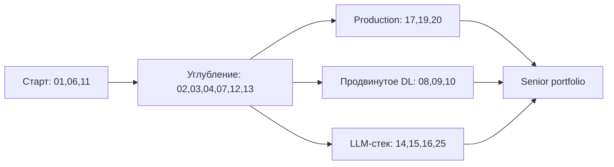

# 🧪 Practice Labs — практические лаборатории

Коллекция самостоятельных мини-проектов с упором на практику. Каждая лаба — это законченный артефакт: данные, код, метрика, отчёт. Цель — набить руку и собрать портфолио, которое не стыдно показать на собеседовании.

## Как пользоваться

1. Выбери лабу по уровню и теме.
2. Сделай форк или новый репозиторий на GitHub.
3. Следуй критериям приёмки — это твой definition of done.
4. Закоммить с понятным README, графиками и финальным отчётом.
5. Опубликуй ссылку в портфолио.

## Структура каждой лабы

- **Цель** — что строим и зачем.
- **Датасет** — где взять, как загрузить.
- **Минимальный пайплайн** — что должно работать end-to-end.
- **Метрики и baseline** — числа, ниже которых нельзя.
- **Расширения** — что добавить для среднего/продвинутого уровня.
- **Критерии приёмки** — checklist для самопроверки.
- **Анти-паттерны** — типичные ошибки.

## Уровни

| Уровень | Время | Что качаем |
|---|---|---|
| 🟢 Junior | 4–8 часов | Базовый пайплайн, понимание задачи |
| 🟡 Middle | 1–3 дня | Качество, валидация, инженерия |
| 🔴 Senior | 1–2 недели | Production, мониторинг, edge cases |

## Каталог лаб

### Классический ML

- [Лаба 01: Predict house prices (табличка)](./01-house-prices.md) 🟢
- [Лаба 02: Customer churn с интерпретируемостью](./02-churn-shap.md) 🟡
- [Лаба 03: Credit scoring под смещение классов](./03-credit-scoring.md) 🟡
- [Лаба 04: Time-series forecasting спроса](./04-demand-forecast.md) 🟡
- [Лаба 05: Anomaly detection в логах](./05-anomaly-logs.md) 🔴

### Deep Learning и компьютерное зрение

- [Лаба 06: Классификатор картинок с нуля (PyTorch)](./06-image-classifier.md) 🟢
- [Лаба 07: Fine-tune детектора объектов на своём датасете](./07-finetune-detector.md) 🟡
- [Лаба 08: Semantic segmentation для медицины](./08-medical-segmentation.md) 🔴
- [Лаба 09: Face anti-spoofing с метриками FAR/FRR](./09-face-antispoofing.md) 🔴
- [Лаба 10: Real-time трекер людей на видео](./10-realtime-tracker.md) 🔴

### NLP и LLM

- [Лаба 11: Sentiment-классификатор (HF transformers)](./11-sentiment-hf.md) 🟢
- [Лаба 12: Извлечение сущностей (NER) для документов](./12-ner-docs.md) 🟡
- [Лаба 13: RAG over PDF с цитированием источников](./13-rag-pdf.md) 🟡
- [Лаба 14: LLM-агент с инструментами и памятью](./14-llm-agent.md) 🔴
- [Лаба 15: Fine-tune Llama под доменную задачу (LoRA)](./15-llm-finetune.md) 🔴
- [Лаба 16: Evaluation harness для LLM (LLM-as-judge + golden set)](./16-llm-eval.md) 🔴

### MLOps и production

- [Лаба 17: ML-сервис на FastAPI + Docker + CI](./17-ml-service.md) 🟡
- [Лаба 18: Feature store + retraining pipeline](./18-feature-store.md) 🔴
- [Лаба 19: Мониторинг дрейфа модели в проде](./19-drift-monitoring.md) 🔴
- [Лаба 20: A/B-тест ML-фичи end-to-end](./20-ab-test.md) 🔴

### Рекомендации и поиск

- [Лаба 21: Collaborative filtering на implicit feedback](./21-recsys-implicit.md) 🟡
- [Лаба 22: Hybrid recsys с two-tower моделью](./22-two-tower.md) 🔴
- [Лаба 23: Семантический поиск с reranker'ом](./23-semantic-search.md) 🟡

### Speech и мультимодальность

- [Лаба 24: Распознавание речи (Whisper) + диаризация](./24-asr-diarization.md) 🟡
- [Лаба 25: Multimodal RAG (текст + картинки)](./25-multimodal-rag.md) 🔴

## Маршрут прохождения

## Общие правила оформления

- README с разделами: задача, данные, метрики, как запустить, результаты, выводы.
- Код разбит на модули: data/, models/, training/, inference/, tests/.
- Зафиксированы версии библиотек (requirements.txt или pyproject.toml).
- Минимум 1 unit-тест на критичную функцию.
- Графики обучения и метрик сохранены в reports/.
- Финальный отчёт: 1 страница, цифры + 2–3 вывода.

## Анти-паттерны

- ❌ Jupyter-ноутбук без структуры и тестов как единственный артефакт.
- ❌ Метрика измерена на трейне.
- ❌ Нет фиксированного random seed.
- ❌ README без раздела «как воспроизвести».
- ❌ Гигантские картинки/датасеты залиты в git.

---

[← Назад к Roadmap](../README.md)
